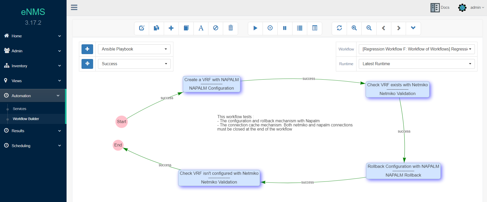

<h1 align="center">eNMS</h1>
<h2 align="center">An enterprise-grade vendor-agnostic network automation platform.</h2>

___

<table>
    <thead>
        <tr>
            <th>Branch</th>
            <th>Status</th>
            <th>Coverage</th>
            <th>Documentation</th>
            <th>Python Style</th>
            <th>JavaScript Style</th>
            <th>License</th>
        </tr>
    </thead>
    <tbody>
        <tr>
            <td>master</td>
            <td><a href="https://travis-ci.org/afourmy/eNMS"></img></a></td>
            <td><a href="https://coveralls.io/github/afourmy/eNMS?branch=master"></img></a></td>
            <td><a href="https://enms.readthedocs.io/en/latest/?badge=master"></img></a></td>
          <td rowspan=2> </td>
          <td rowspan=2> </td>
          <td rowspan=2><a href="https://www.gnu.org/licenses/gpl-3.0"></img></a></td>
        </tr>
        <tr>
            <td>develop</td>
            <td><a href="https://travis-ci.org/afourmy/eNMS"></img></a></td>
            <td><a href="https://coveralls.io/github/afourmy/eNMS?branch=develop"></img></a></td>
            <td><a href="https://enms.readthedocs.io/en/latest/?badge=develop"></img></a></td>
        </tr>
    </tbody>
</table>

___

# Introduction

eNMS is a vendor-agnostic NMS designed for building workflow-based network automation solutions.

It encompasses the following aspects of network automation:
  - **Configuration Management Service**: Backup, change and rollback of configurations (saved in git).
  - **Validation Services**: Retrieve data about the state of a device with Netmiko and NAPALM.
  - **Ansible Service**: Store and run Ansible playbooks.
  - **REST Service**: Send REST calls with variable URL and payload.
  - **Python Script Service**: Any python script can be integrated into the web UI. eNMS will automatically generate
a form in the web UI for the script input parameters.
  - **Workflows**: Services can be combined together graphically in a workflow.
  - **Scheduling**: Services and workflows can be scheduled to start at a later time, or run periodically with CRON.
  - **Event-driven automation**: Services and workflows can be triggered by an external event (REST call, Syslog message, etc).

___

# Main features

## 1. Network creation

Your network topology can be created manually (from the UI or an Excel spreadsheet) or imported from an
external Source of Truth (OpenNMS, LibreNMS, Netbox).
Once created, it is are displayed in a sortable and searchable table.
A dashboard provides a graphical overview of your network with dynamic charts.

Inventory                           |  Dashboard
:----------------------------------:|:-----------------------------------:
 |  

- Online demo: _[Dashboard](http://afourmy.pythonanywhere.com/dashboard)_, _[Inventory](http://afourmy.pythonanywhere.com/objects/device_management)_
- Docs: _[Objects](https://enms.readthedocs.io/en/latest/inventory/objects.html)_

## 2. Network visualization

Once created, eNMS can display your network on a world map with either the Google Map
or the Open Street Map tile layers. Each device is displayed on the map at its GPS coordinates.
Colocated devices can be grouped into geographical sites (campus, dacacenter, ...),
and displayed logically with a force-directed layout.
You can click on a device to display its properties or start a Web SSH terminal session.

Geographical View                             |  Logical View
:--------------------------------------------:|:-------------------------------:
 |  

- Online demo: _[Geographical View](http://afourmy.pythonanywhere.com/views/geographical_view)_, _[Logical View](http://afourmy.pythonanywhere.com/views/logical_view)_
- Docs: _[Geographical View](https://enms.readthedocs.io/en/latest/views/geographical_view.html)_, _[Logical View](https://enms.readthedocs.io/en/latest/views/logical_view.html)_

## 3. Service creation

eNMS comes with a number of "default services" leveraging libraries such as `ansible`, `requests`, `netmiko`, `napalm`  to perform simple automation tasks. However, absolutely any python script can be turned into a "service".
If your python script takes input parameters, eNMS will automatically generate a form in the web UI.

To generate a form that matches your service, eNMS will perform the following conversion:
- python `string` -> Text box (single line or multiline)
- python `list` -> Drop-down list (single or multiselect).
- python `bool` -> Checkbox.
- python `dict` -> Text box expecting a dictionary.

Once created, you can have as many instances of your service as you need. Service instances can be executed, edited and deleted from the web UI.

- Online demo: _[Services](http://afourmy.pythonanywhere.com/automation/service_management)_
- Docs: _[Services](https://enms.readthedocs.io/en/latest/services/service_system.html)_, _[Default Services](https://enms.readthedocs.io/en/latest/services/default_services.html)_

## 4. Workflows

Services (and other Workflows) can be combined into a single workflow.

Within a workflow, services can be connected with two edge types: `Success` edge and `Failure` edge. The `Success` edge (versus `Failure` edge) indicates which path to follow in the graph if the source service is successfully executed (versus failed).

A workflow keeps track of a `payload` dictionary, such that when a service starts, it has access to the results of all previously executed services.

When a workflow is executed, its status will be updated in real-time on the web UI.

- Online demo: _[Workflow Builder](http://afourmy.pythonanywhere.com/automation/workflow_builder/)_
- Docs: _[Workflow System](https://enms.readthedocs.io/en/latest/workflows/workflow_system.html)_, _[Workflow Payload](https://enms.readthedocs.io/en/latest/workflows/workflow_payload.html)_

## 5. Scheduling

While services and workflows can be run directly and immediately from the web UI, you can also schedule them to run at a later time, or periodically by defining a frequency, a start date and an end date. All scheduled tasks are displayed in a calendar.

- Online Demo: _[Calendar](http://afourmy.pythonanywhere.com/scheduling/calendar)_
- Docs: _[Scheduling](https://enms.readthedocs.io/en/latest/scheduling/task_management.html)_

## 6. Configuration Management

eNMS can work as a network device configuration backup tool and replace Oxidized/Rancid with the following features:
- Poll network elements; download configurations when they change
- Easily view the current configuration of a device in the inventory
- Search for any text in any configuration
- View differences between various revisions of a configuration
- Download device configuration to a local text file
- Use the REST API support to return a specified device’s configuration
- Export all device configurations to a remote Git repository (e.g. Gitlab)

## 6. Event-driven automation

Event-driven automation in eNMS has two aspects:
- eNMS has a REST API that can be used to create, update and delete any type of objects (services, workflows, tasks), but also to trigger the execution of a service or a workflow with a GET request to the appropriate URL. 
- eNMS can be configured as a Syslog server: all logs are stored in the database, and rules can be created to trigger the execution of a service or a workflow upon receiving a log matched by the rule.

Docs: _[REST API](https://enms.readthedocs.io/en/latest/event_driven/rest_api.html)_

## Notification system

After a service or a workflow is executed, you can configure eNMS to send a notification with the results.
Three types of notification are available:
- via mail (a brief summary and the full logs attached as a textfile)
- via Slack
- via Mattermost (Open-Source and private alternative to Slack)

Additionally, eNMS can be configured to push the results to a remote Git repository.

___

# Advanced features

## 1. Authentication

- eNMS supports TACACS+ and LDAP/Active Directory authentication: upon logging in, a request will be sent to your TACACS+/LDAP server to validate the credentials and log in the user.
- Authentication with RADIUS is currently under development.

## 2. Network creation with external Network Source of Truth

If you use an NSoT like OpenNMS or Netbox to document your network, eNMS can automatically import the network topology (devices and links), as well as all IP addresses and geographical coordinates.

## 3. Network export

- Networks can be exported as an Excel file. 
- Networks can be exported as a `kmz` file for you to visualize your network on Google Earth.

___

# Getting started

## Installation
    Install python 3.6+ (earlier versions not supported)
    git clone https://github.com/afourmy/eNMS.git
    cd eNMS
    pip3 install -r requirements.txt
    export FLASK_APP=app.py
    flask run --host=0.0.0.0
    Log in (default credentials: admin / admin)

# Contact

For any feedback, advice, feature request, join us on the [Network to Code slack](http://networktocode.herokuapp.com "Network to Code slack"), channel **#enms**.
