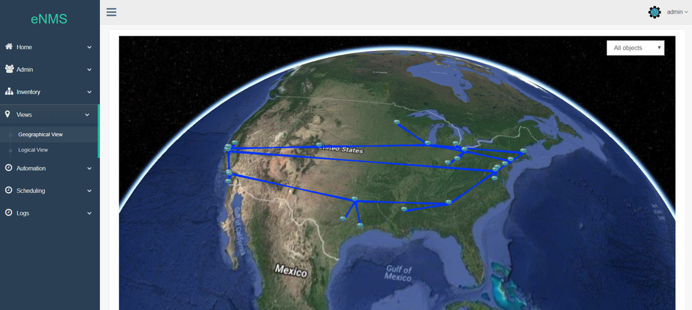
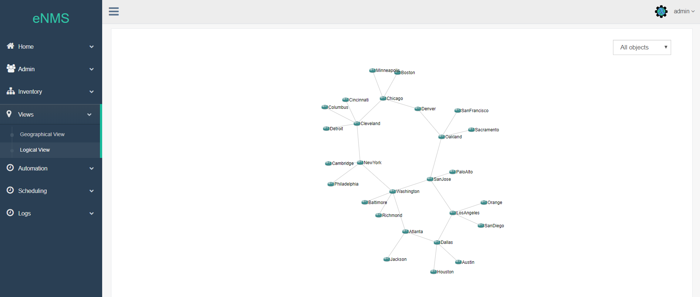
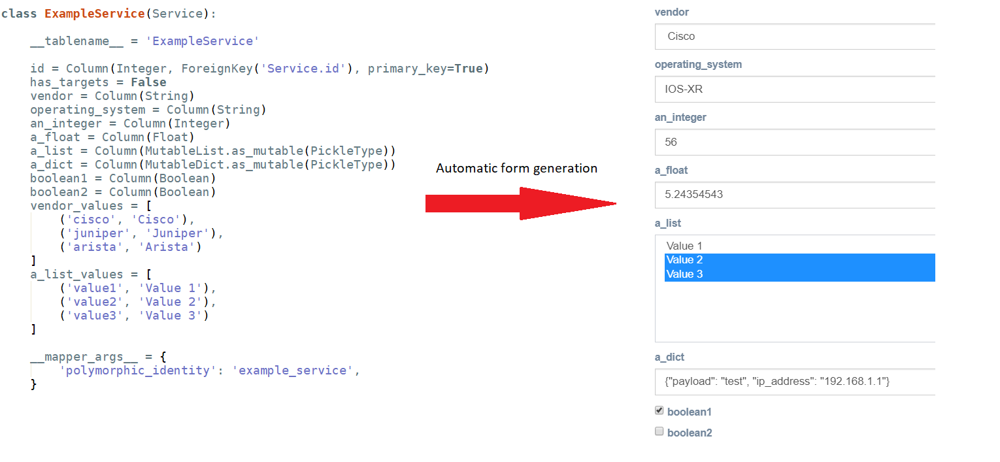

|             | status |
|-------------|------------|
| **master** |  
| **develop** |  

___

# Introduction

eNMS is an Open Source Software entirely focused on network automation.

It encompasses the following aspects of network automation:
- **Configuration Management Service**: Commit / Rollback of a configuration with Napalm.
- **Ansible Service**: Sending and managing Ansible playbooks.
- **ReST Service**: Send a ReST call (GET/POST/DELETE/...) with variable URL and payload.
- **Custom Services**: Any of your python scripts can be automatically integrated into the web UI.
- **Workflows**: Services can be combined together graphically in a workflow.
- **Scheduling**: Services and Workflows can be scheduled to start at a later time, or run periodically.
- **Event-driven automation**: Services and workflows can be triggered by an external event (ReST call or Syslog message).

___

# Main features

## 1. Network creation

Nodes and links can be created either one by one, or all at once by importing an Excel spreadsheet. Once created, all objects are displayed in a sortable and searchable table, from which they can be edited and deleted.
A dashboard provides a graphical overview of all objects with dynamic charts.

Inventory                           |  Dashboard
:----------------------------------:|:-----------------------------------:
  |  

## 2. Network visualization

Once created, eNMS can display your network geographically on a 2D or 3D world map (with the tile layer of your choice: Open Street Map, Google Map...), and logically with `d3.js`.
You can double-click on a node to display its properties, or start a Web SSH session to the device.

Geographical View                             |  Logical View
:--------------------------------------------:|:-------------------------------:
 |  

## 3. Service creation

eNMS comes with a number of "default services" leveraging libraries such as `ansible`, `requests`, `netmiko`, `napalm`  to perform simple automation tasks. However, a service can be any python script.
If your python script, takes input parameters, eNMS will automatically generate a form in the web UI.

To generate a form that matches your service, eNMS will perform the following conversion:
- python `string` -> Text box.
- python `list` -> Drop-down list (single or multiselect).
- python `bool` -> Checkbox.
- python `dict` -> Text box expecting a dictionnary.

Once created, you can create as many instances of your service as you need. Service instances can be executed, edited and deleted from the web UI.

## 4. Workflows

Services can be combined as a workflow. In a workflow, services can be connected with two types of edge: `success edge` and `failure edge`. The success edge (resp. failure edge) indicates which path to follow in the graph if the source script was successfully executed (resp. failed).
When a workflow is executed, its status will be updated in real-time on the web UI.

## 5. Scheduling

Services and workflows can be run directly from the web UI. You can also schedule them to run at a later time, and periodically by defining a start date and an end date. All scheduled tasks are displayed in a calendar.

Check out the docs: _[Scheduling](http://afourmy.pythonanywhere.com/views/geographical_view)_, _[Logical view](http://afourmy.pythonanywhere.com/views/logical_view)_, _[Calendar](http://afourmy.pythonanywhere.com/tasks/calendar)_

## 6. Event-driven automation

Event-driven automation in eNMS is twofold:
- eNMS has an internal ReST API that can be used to create, update and delete any type of objects (services, workflows, tasks), but also to trigger the execution of a service or a worflow with a POST request to the appropriate URL.
- eNMS can be configured as a Syslog server: all logs are stored in the database, and rules can be created to trigger the execution of a service or a workflow upon receiving a log matched by the rule.

___

# Advanced features

## 1. Authentication

- eNMS can act as a TACACS+ authentication server: upon authentication, a request will be sent to the server to check the credentials and log in the user.
- Authentication with RADIUS and Active Directory is currently under development.

## 2. Network creation with external Network Source of Truth

## 3. Network export

- 
- Networks can also be exported to Google Earth (as a `.kmz` file).

# Getting started

_[Installation](https://enms.readthedocs.io/en/latest/base/installation.html)_

# Contact

For any feedback, advice, feature request, join us on the [Network to Code slack](http://networktocode.herokuapp.com "Network to Code slack") (channel **#enms**)

# Other projects you might be interested in

- _[Flask Gentelella](https://github.com/afourmy/flask-gentelella)_: The Flask/Bootstrap template eNMS is built upon.
- _[pyNMS](https://github.com/afourmy/pyNMS)_: A PyQt software for network simulation and optimization.
- _[SWAP](https://github.com/afourmy/SWAP)_: A solver for the Wavelength Assignment Problem in optical networks.