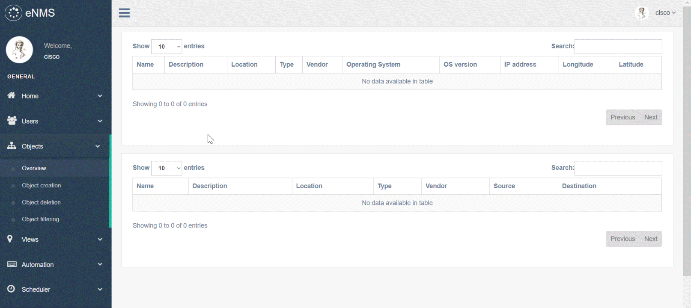
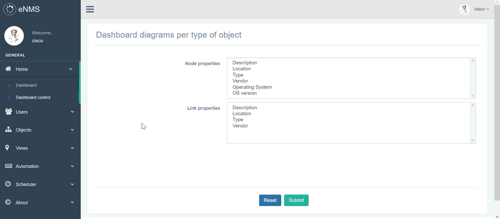
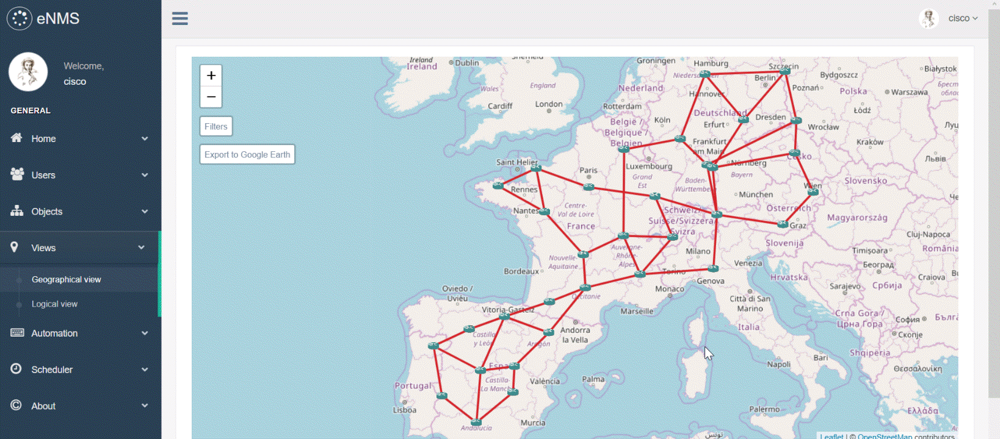
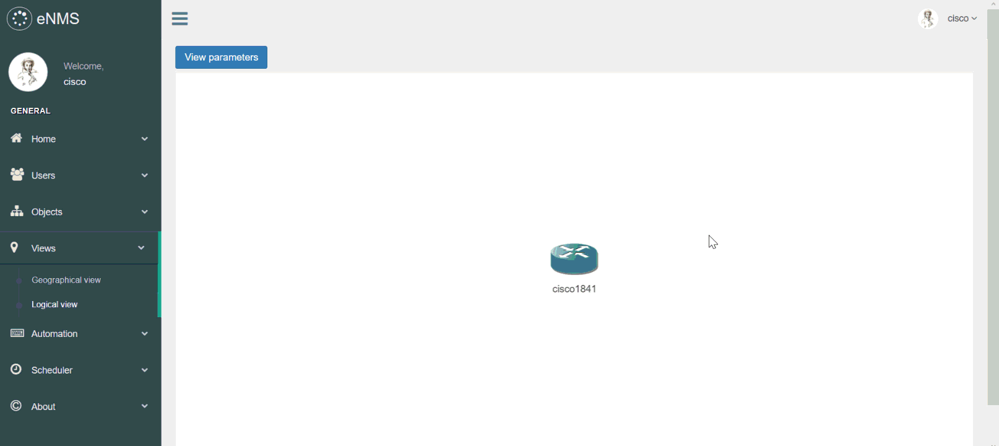
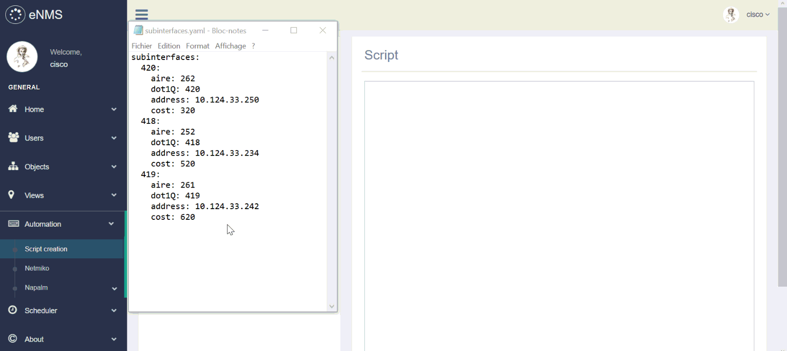
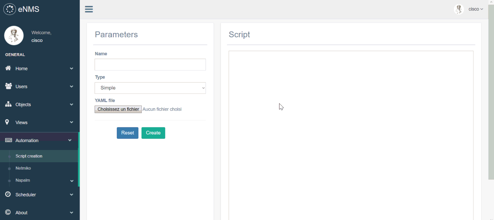
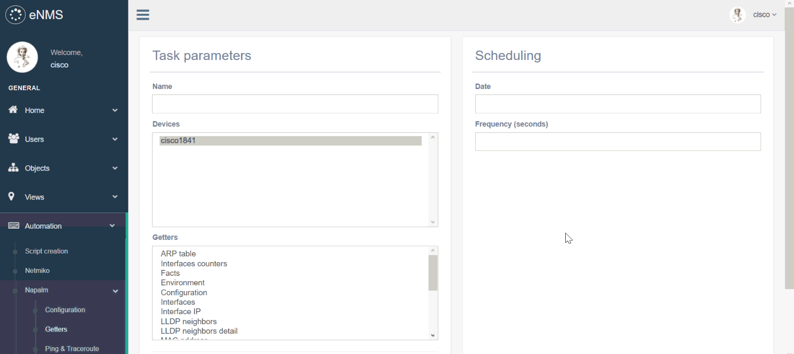
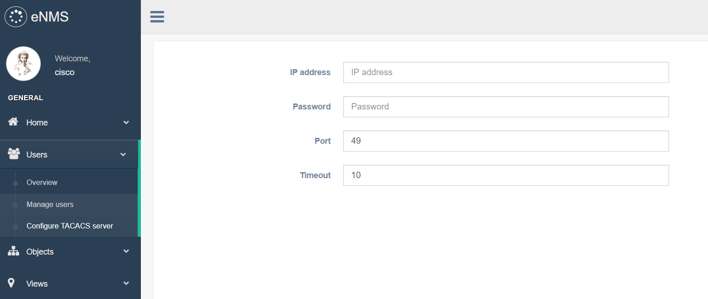

[](https://coveralls.io/github/afourmy/eNMS?branch=master)

# Introduction

eNMS is a network visualization, inventory and automation web platform. Please note that it is still in beta version and the master branch is undergoing major changes, which are not yet reflected in the readme.
Join us on the [Network to Code slack](http://networktocode.herokuapp.com "Network to Code slack"), channel #enms for the latest updates !

**You can find a demo of eNMS _[here](http://afourmy.pythonanywhere.com/)_ !** (most functionalities are disabled)


# Features

## Object creation

Nodes and links can be created in two ways: 
- one by one by specifying all properties manually, in the _Object creation_ page.
- by importing an Excel file with one sheet per type of object.
Examples of such Excel files are available in the **_/project folder_**.

Once your objects have been created, you can go to the _Overview_ page.
All objects are displayed in a sortable and searchable table.



## Dashboard

The dashboard displays pie charts for any property. You can select, for both nodes and links,
which properties are displayed as pie charts in the dashboard.



## Network visualization

Network visualization is of paramount importance for quickly understanding the network topology.
There are two ways of visualizing the network in eNMS:
- **Geographical view**: you can display the network in 2D or 3D, with Open Street Map or Google Map. A clusterized view is also available for large networks (> 10K nodes), for scalability.
- **Logical view**: the geographical view only makes sense if we have all GPS coordinates: it is not always the case. The logical view uses a graph-drawing algorithm to display the network in an aesthetically pleasing way.


## Export to Google Earth

Networks can be exported on Google Earth from the geographical view: the resulting file is stored in the **_/kmz_** folder.


## Embedded SSH client

eNMS uses PuTTY to automatically establish an SSH connection to any SSH-enabled device from the web interface.
Your credentials are automatically provided to PuTTY for faster login.



## Network automation

There are four types of task in eNMS:
- **Netmiko _configuration_ task**: list of commands to configure the device (plain text or Jinja2 template).
- **Netmiko _show commands_ task**: list of “show commands” which output will be displayed in the task logs.
- **NAPALM _configuration_ task**: partial or full configuration (plain text or Jinja2 template).
- **NAPALM _getters_**: list of getters which output will be displayed in the task logs.

For each task, you can select a list of target devices. A script is sent to all target devices at the same time, with multiple processes (`multiprocessing` library).

**Note**: netmiko has a _linux_ driver, which means that eNMS can also be used on Unix servers.

eNMS also provides some scheduling functions:
- **Start date**: instead of running the task immediately, the task will start at a specific time.
- **Frequency**: the task will be run periodically. This is especially useful for tasks that pull some information from the device, i.e netmiko **_show commands_** / **_NAPALM getters_** tasks.

### Simple configuration script with Netmiko

- Create a script in the _Script creation_ page.
- Set the script parameters (netmiko driver, global delay factor, target devices).



### Template-based configuration

For complex scripts, it is best to use Jinja2 templating language:
- Write a Jinja2 template in the _Script creation_ page.
- Import a YAML file that contains all associated variables.
eNMS will take care of converting the template to a real text-based script.



### NAPALM configuration

NAPALM is an automation framework that provides a set of functions to interact with different network device Operating Systems using a unified API.
NAPALM can be used to change the configuration (merge or replace), either via a plain text script or a Jinja2-enabled template.

**Note**: the NAPALM driver used by eNMS is the one you configure in the "Operating System" property of a node.
For NAPALM to work, you should respect NAPALM drivers syntax: `ios, iosxr, nxos, junos, eos`


### Netmiko _show commands_ periodic retrieval

You can schedule a task to retrieve the output of a list of commands (show, ping, traceroute, etc) periodically. The result is stored in the database and displayed in the logs of the task, in the _Task management_ page.



### NAPALM _getters_ periodic retrieval

You can also schedule a task to retrieve a NAPALM getter periodically.



### Comparison

For all periodic tasks, you can compare the results between any two devices, at two different times.

The comparison result is displayed with two methods:
- A **_unified diff_**: show just the lines that have changed plus a few lines of context, in an inline style. (like Git)
- A **_ndiff_**: list every line and highlights interline changes.


## Display control with filters

The user can filter the objects available in the GUI by searching for specific value for each property. 
For each property, the user can choose to use a _regular expression_ instead of a hardcoded value:
regexes allows for specific search like a location or an IP subnet.

In the following example, we use the regexes `[france|spain]` for `location` to filter all objects that are not in France or in Spain, as well as the regex `[Router|Switch]` for `type` to filter all nodes that are neither a router, nor a switch.


Note that **_filters apply to everything_** in eNMS that uses objects: dashboard, object deletion,
geographical and logical views, task scheduling, etc. You can use them to visualize or send to script
to a specific subset of devices.

### Filtering use case

Let's imagine that you want to send a script to all routers with IOS 12.4(24)T or IOS 12.4(11)T. By default, all devices will be displayed in the _netmiko / napalm script scheduling_ page.

The first step will be to filters the nodes:
- go to the _Object filtering_ page
- set the "Operating System" to `IOS`
- set the "OS version" to `12.4\((24|11)\)T`
- tick the regex box for the "OS version" parameter
- apply the filter

After that, in the netmiko / napalm scheduling page, **_only the devices that match those criteria will be displayed_**: all devices in the multiple selection box can therefore be selected as target devices.

## TACACS+ authentication

It is possible to configure a TACACS+ server in eNMS: upon authentication, a request will be sent to the server to check the credentials and log in the user.



## Add a new property

- Open /eNMS/source/objects/models.py and add a Column to the appropriate model (Object, Node or Link)
Example: description = Column(String) in the Object class.
- Open /eNMS/source/objects/properties.py and add the property in the appropriate tuple.
- Open /eNMS/source/base/properties.py and add the property and it's user-friendly name in the "pretty_names" dictionnary.
- (Optional) If you want the new property to be displayed as a diagram in the dashboard, open /eNMS/source/objects/properties.py and add the property in the appropriate diagram tuple.
- Delete the database.db file, and restart the application.

# Getting started

The following modules are used in eNMS:
```
flask (web framework)
flask_migrate (database migration)
flask_wtf (forms)
flask_sqlalchemy (database)
flask_login (login system)
jinja2, pyyaml (used for sending complex template-based scripts)
netmiko, NAPALM (used for network automation)
passlib (used for hashing passwords)
simplekml (used for exporting project to Google Earth)
tacacs_plus (used for enabling TACACS+ authentication)
xlrd (used for creating objects from an Excel file)
```

In order to use eNMS, you need to:
    
- (optional) set up a virtual environment.
[Python official doc on virtual environments](https://docs.python.org/3/library/venv.html) 
    
- clone eNMS (or download as a zip archive from github)
```
git clone https://github.com/afourmy/eNMS.git
```
    
- install the requirements
```
cd eNMS
pip install -r requirements.txt
```

- run **/source/flask_app.py**.
```
cd source
python flask_app.py
```

- go the http://127.0.0.1:5100/.

- create an account and log in.

# Contact

You can contact me at my personal email address:
```
''.join(map(chr, (97, 110, 116, 111, 105, 110, 101, 46, 102, 111, 
117, 114, 109, 121, 64, 103, 109, 97, 105, 108, 46, 99, 111, 109)))
```

or on the [Network to Code slack](http://networktocode.herokuapp.com "Network to Code slack"). (@minto, channel #enms)

# Credits

[Bootstrap](https://getbootstrap.com/ "Bootstrap"): Front-end HTML/CSS framework.

[Bootstrap Date/Time Picker](https://github.com/Eonasdan/bootstrap-datetimepicker "Bootstrap Date/Time Picker"): Date/time picker widget based on twitter bootstrap.

[Datatables](https://datatables.net/ "Datatables"): Advanced interaction controls to any HTML table with jQuery.

[eCharts](https://github.com/ecomfe/echarts "eCharts"): Interactive charting and visualization javascript library.

[Flask](http://flask.pocoo.org/ "Flask"): A microframework based on the Werkzeug toolkit and Jinja2 template engine.

[Flask Gentelella](https://github.com/afourmy/flask-gentelella "Flask Gentelella"): Gentelella template powered by Flask.

[Flask Login](https://flask-login.readthedocs.io/en/latest/ "Flask Login"): Provides user session management for Flask.

[Flask Migrate](https://flask-migrate.readthedocs.io/en/latest/ "Flask Migrate"): Handles SQLAlchemy database migrations for Flask applications using Alembic.

[Flask SQLAlchemy](http://flask-sqlalchemy.pocoo.org/ "Flask SQLAlchemy"): Adds support for SQLAlchemy to Flask.

[Flask WTForms](https://github.com/lepture/flask-wtf "Flask WTForms"): Simple integration of Flask and WTForms, including CSRF, file upload, and reCAPTCHA.

[Font awesome](http://fontawesome.io/ "Font awesome"): Font and CSS toolkit.

[FullCalendar](https://fullcalendar.io/ "FullCalendar"): JavaScript drag-n-drop event calendar.

[Jinja2](https://github.com/pallets/jinja "Jinja2"): A modern and designer-friendly templating language for Python.

[Jquery](https://jquery.com/ "Jquery"): JavaScript library designed to simplify the client-side scripting of HTML.

[Leaflet](http://leafletjs.com/ "Leaflet"): JavaScript library for mobile-friendly interactive maps.

[Moment](https://momentjs.com/ "Moment"): JavaScript library to Parse, validate, manipulate, and display dates and times.

[NAPALM](https://github.com/napalm-automation/napalm "NAPALM"): A library that implements a set of functions to interact with different network device Operating Systems using a unified API.

[Netmiko](https://github.com/ktbyers/netmiko "Netmiko"): A multi-vendor library to simplify Paramiko SSH connections to network devices.

[Nprogress](https://github.com/rstacruz/nprogress "Nprogress"): Slim progress bars in JavaScript.

[OpenStreetMap](https://www.openstreetmap.org/ "OpenStreetMap"): Collaborative project to create a free editable map of the world.

[Parsley](http://parsleyjs.org/ "Parsley"): JavaScript form validation library.

[Passlib](https://passlib.readthedocs.io/en/stable/ "Passlib"): Password hashing library for Python 2 & 3.

[pyYAML](https://github.com/yaml/pyyaml "pyYAML"): YAML parser and emitter for Python.

[simplekml](http://simplekml.readthedocs.io/en/latest/ "SimpleKML"): Library to generate KML files (Google Earth).

[TACACS+](https://github.com/ansible/tacacs_plus/ "TACACS+"): A TACACS+ client that supports authentication, authorization and accounting.

[Vis](http://visjs.org/ "Vis"): JavaScript visualization library to display dynamic, automatically organised network views.

[WebGL Earth](http://www.webglearth.org "WebGL Earth"): 3D digital globe for web and mobile devices.

[xlrd](https://github.com/python-excel/xlrd): Library to extract data from Microsoft Excel (tm) spreadsheet files.
