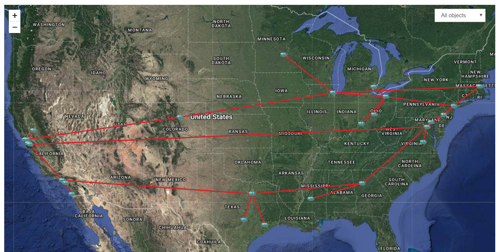

|             | status |
|-------------|------------|
| **master** |  
| **develop** |  

# Introduction

eNMS is an Open Source Software entirely focused on network automation.

It encompasses the following aspects of network automation:
- **Configuration Management Service**: Commit / Rollback of a configuration with Napalm.
- **Ansible Service**: Sending and managing Ansible playbooks.
- **Custom Services**: Any of your python scripts can be automatically integrated into the web UI.
- **Workflows**: Services can be combined together graphically in a workflow.
- **Scheduling**: Services and Workflows can be scheduled to start at a later time, or run periodically.
- **Event-driven automation**: Services and workflows can be triggered by an external event (ReST call or Syslog message).

Automate your network in a few simple steps:

# 1. Network creation

Nodes and links can be created either one by one, or all at once by importing an Excel spreadsheet. Once created, all objects are displayed in a sortable and searchable table, from which they can be edited and deleted.
A dashboard provides a graphical overview of all objects with dynamic charts.

Dashboard                           |  Inventory
:----------------------------------:|:-----------------------------------:
  |  

Try it out yourself: _[Object management](http://afourmy.pythonanywhere.com/objects/object_management)_, _[Dashboard](http://afourmy.pythonanywhere.com/dashboard)_

# 2. Network visualization

Once created, eNMS can display your network geographically on a 2D or 3D world map (with the tile layer of your choice: Open Street Map, Google Map...), and logically with `d3.js`.
You can double-click on a node to display its properties, or start a Web SSH session to the device.

Geographical View                             |  Logical View
:--------------------------------------------:|:-------------------------------:
      |  

Try it out yourself: _[Geographical view](http://afourmy.pythonanywhere.com/views/geographical_view)_, _[Logical view](http://afourmy.pythonanywhere.com/views/logical_view)_

# 3. Creation of scripts and workflows

The following types of script can be created:
- **Netmiko _configuration_**: list of commands to configure the device (plain text or Jinja2 template).
- **Netmiko _validation_**: list of command which output must contain a specific pattern.
- **NAPALM _configuration_ task**: partial or full configuration (plain text or Jinja2 template) of the device.
- **NAPALM _getters_**: list of getters which output is displayed in the task logs.
- **Ansible playbook**: send an ansible playbook with optional arguments.
- **ReST Call**: issue a GET/POST/PUT/DELETE ReST call.
- **Custom script**: any python script you create is automatically detected and added to the web UI.

Scripts can be combined to form a **workflow**. A workflow is a directed graph which vertices are scripts.
There are two types of edge in a workflow: `success edge` and `failure edge`. The success edge (resp. failure edge) indicates which path to follow in the graph if the source script was successfully executed (resp. failed).

Try it out yourself: _[Script creation](http://afourmy.pythonanywhere.com/scripts/script_creation)_, _[Script management](http://afourmy.pythonanywhere.com/scripts/script_management)_, _[VRF configuration workflow](http://afourmy.pythonanywhere.com/workflows/manage_configure_vrf)_ (double-click on a script to display its properties)

# 4. Scheduling

Once a script / workflow has been created, a task can be scheduled from the graphical view.
The targets are selected graphically. Filters can be used to schedule a task on a specific subset of device.

The following parameters are available:
- **Frequency**: the task is executed periodically. This is especially useful for tasks that pull some information from the device, i.e netmiko **_show commands_** / **_NAPALM getters_** tasks.
- **Start date**: instead of running the task immediately, the task will start at a specific time.
- **End date**: used for a periodic task to stop at a specific time.

Try it out yourself (`Scheduling` button): _[Geographical view](http://afourmy.pythonanywhere.com/views/geographical_view)_, _[Logical view](http://afourmy.pythonanywhere.com/views/logical_view)_, _[Calendar](http://afourmy.pythonanywhere.com/tasks/calendar)_

# 5. Comparison of the results

The results of a periodic task can be compared between two different times, devices or tasks.
eNMS displays a dynamic line-by-line diff of the outputs.

Try it out yourself: _[Task management](http://afourmy.pythonanywhere.com/tasks/task_management)_

# Miscellaneous

- eNMS can act as a TACACS+ authentication server: upon authentication, a request will be sent to the server to check the credentials and log in the user.
- eNMS can act as a Syslog server: all logs are stored in the database, and can be filtered with regular expressions. Eventually, the idea is to use the logs for event-driven automation, i.e trigger the execution of a script upon receiving a specific type of log.
- From the geographical view, networks can be displayed on the earth with a 3D map. They can also be exported to Google Earth.

# Getting started

_[Installation](https://enms.readthedocs.io/en/latest/base/installation.html)_

# Contact

For any feedback, advice, feature request, join us on the [Network to Code slack](http://networktocode.herokuapp.com "Network to Code slack") (channel **#enms**)

# Other projects you might be interested in

- _[Flask Gentelella](https://github.com/afourmy/flask-gentelella)_: The Flask/Bootstrap template eNMS is built upon.
- _[pyNMS](https://github.com/afourmy/pyNMS)_: A PyQt software for network simulation and optimization.
- _[SWAP](https://github.com/afourmy/SWAP)_: A solver for the Wavelength Assignment Problem in optical networks.