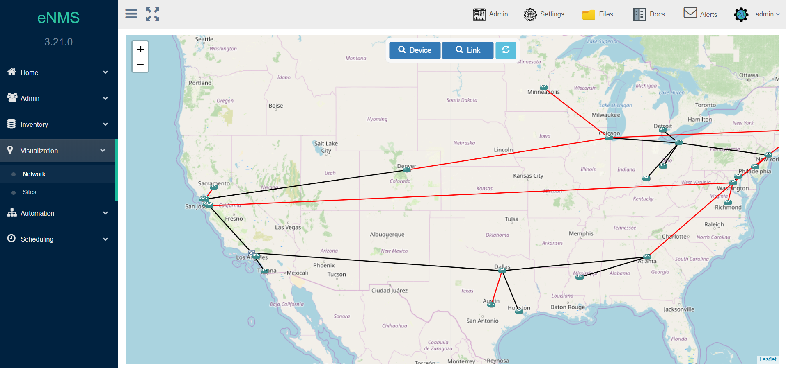
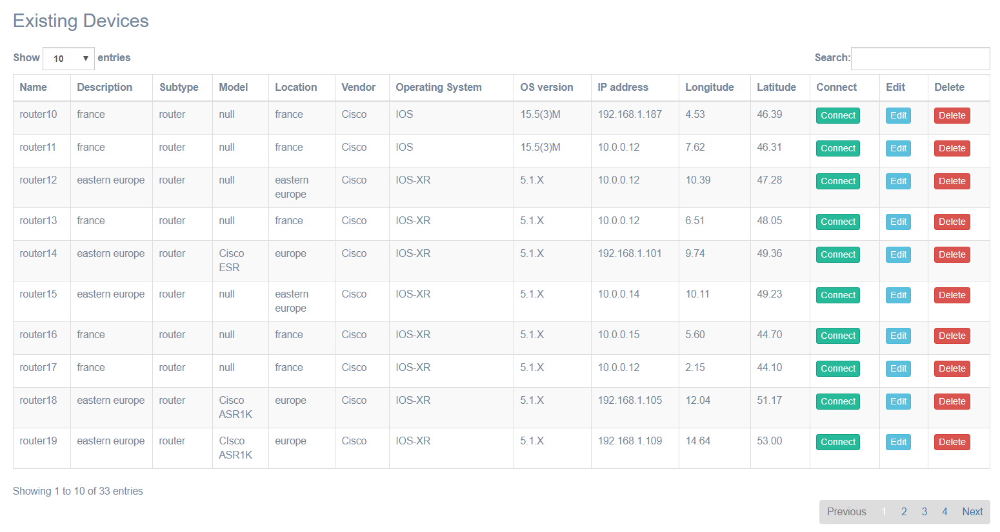
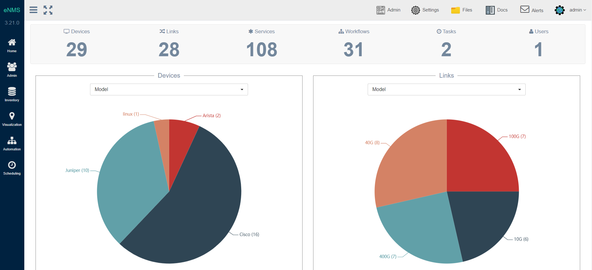
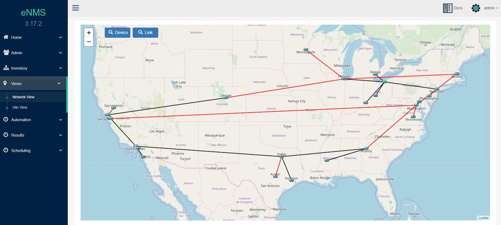
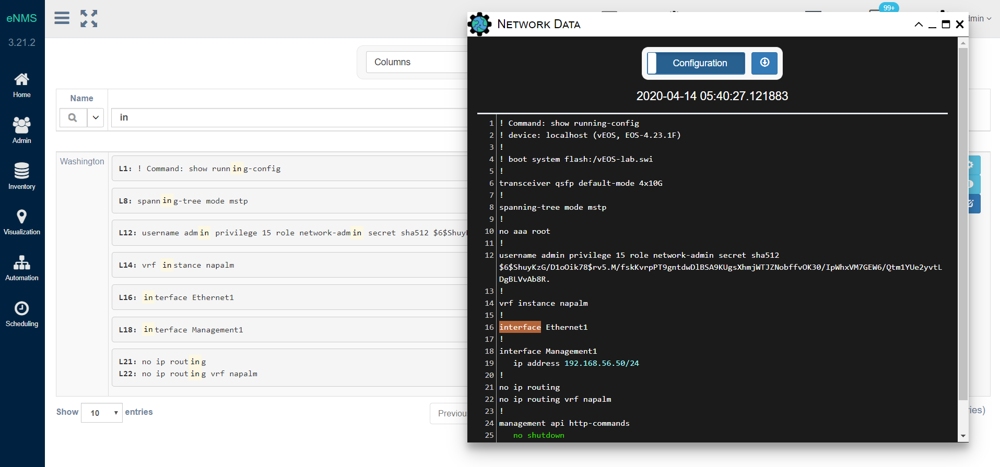
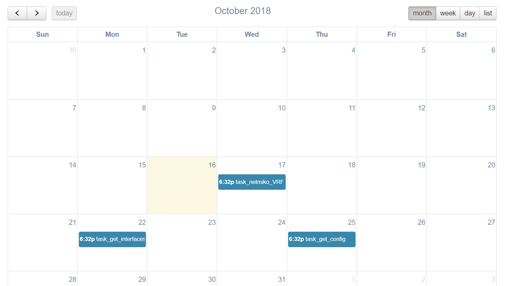

<h1 align="center">eNMS</h1>
<h2 align="center">An enterprise-grade vendor-agnostic network automation platform.</h2>

___

<table>
    <thead>
        <tr>
            <th>Branch</th>
            <th>Status</th>
            <th>Coverage</th>
            <th>Documentation</th>
            <th>Python Style</th>
            <th>JavaScript Style</th>
            <th>License</th>
        </tr>
    </thead>
    <tbody>
        <tr>
            <td>master</td>
            <td><a href="https://travis-ci.org/eNMS-automation/eNMS"></img></a></td>
            <td><a href="https://coveralls.io/github/afourmy/eNMS?branch=master"></img></a></td>
            <td><a href="https://enms.readthedocs.io/en/latest/?badge=master"></img></a></td>
          <td rowspan=2> </td>
          <td rowspan=2> </td>
          <td rowspan=2><a href="https://www.gnu.org/licenses/gpl-3.0"></img></a></td>
        </tr>
        <tr>
            <td>develop</td>
            <td><a href="https://travis-ci.org/eNMS-automation/eNMS"></img></a></td>
            <td><a href="https://coveralls.io/github/afourmy/eNMS?branch=develop"></img></a></td>
            <td><a href="https://enms.readthedocs.io/en/latest/?badge=develop"></img></a></td>
        </tr>
    </tbody>
</table>

___

# Introduction

eNMS is a vendor-agnostic NMS designed for building workflow-based network automation solutions.

It encompasses the following aspects of network automation:
  - **Configuration Management Service**: Backup with Git, change and rollback of configurations.
  - **Validation Services**: Validate data about the state of a device with Netmiko and NAPALM.
  - **Ansible Service**: Store and run Ansible playbooks.
  - **REST Service**: Send REST calls with variable URL and payload.
  - **Python Script Service**: Any python script can be integrated into the web UI. eNMS will automatically generate
a form in the UI for the script input parameters.
  - **Workflows**: Services can be combined together graphically in a workflow.
  - **Scheduling**: Services and workflows can be scheduled to start at a later time, or run periodically with CRON.
  - **Event-driven automation**: Services and workflows can be triggered by an external event (REST call, Syslog message, etc).

___

# Main features

## 1. Network creation

Your network topology can be created manually or imported from an
external Source of Truth (OpenNMS, LibreNMS, or Netbox).
Once created, it is displayed in a sortable and searchable table.
A dashboard provides a graphical overview of your network with dynamic charts.

Inventory                           |  Dashboard
:----------------------------------:|:-----------------------------------:
 |  

- Docs: _[Objects](https://enms.readthedocs.io/en/develop/inventory/network_creation.html)_

## 2. Network visualization

eNMS can display your network on a world map (Google Map or Open Street Map).
Each device is displayed at its GPS coordinates.
You can click on a device to display its properties, configuration, or start an SSH terminal session.
Colocated devices can be grouped into geographical sites (campus, dacacenter, ...),
and displayed logically with a force-directed layout.

Network View                                  |  Sites View
:--------------------------------------------:|:-------------------------------:
 |  

- Docs: _[Geographical View](https://enms.readthedocs.io/en/develop/inventory/network_visualization.html)_

## 3. Service creation

eNMS comes with a number of "default services" leveraging libraries such as `ansible`, `requests`, `netmiko`, `napalm`  to perform simple automation tasks. However, absolutely any python script can be turned into a service. If your python script takes input parameters, eNMS will automatically generate a form in the web UI.

Services can be combined into a workflow.

- Docs: _[Workflow System](https://enms.readthedocs.io/en/develop/automation/workflows.html)_, _[Workflow Payload](https://enms.readthedocs.io/en/latest/workflows/workflow_payload.html)_

## 5. Configuration Management

eNMS can be used as a device configuration backup tool, like Oxidized/Rancid, with the following features:

  - Poll network devices and store the latest configuration in the database
  - Store any operational data that can be retrieved from the device CLI (e.g ``show version``, ``get facts`` etc.)
  - Search for any text or regular-expression in all configurations
  - Download device configuration to a local text file
  - Use the REST API support to return a specified device’s configuration
  - Export all configurations to a remote Git repository (e.g. Gitlab)
  - View git-style differences between various revisions of a configuration

Search Configuration                          |  Compare Configuration
:--------------------------------------------:|:-------------------------------:
 |  

## 6. Event-driven automation

While services can be run directly and immediately from the UI, you can also schedule them to run at a later time, or periodically by defining a frequency or a CRON expression. All scheduled tasks are displayed in a calendar.

Services can also be executed programmatically:
  - eNMS has a REST API and a CLI interface that can be used to create, update and delete any type of objects,
    but also to trigger the execution of a service.
  - eNMS can be configured as a Syslog server, and rules can be created for syslog messages
    to trigger the execution of a service.

- Docs: _[Scheduling](https://enms.readthedocs.io/en/develop/automation/execution.html)_, _[REST API](https://enms.readthedocs.io/en/develop/advanced/rest_api.html)_

___

# Getting started

## Online content

- You can follow us on _[Twitter](https://twitter.com/AutomationEnms)_ or _[Linkedin](https://www.linkedin.com/company/enms-automation)_ to receive notifications about new training content and releases.
- You can join the `#enms` channel on the _[networktocode slack](https://networktocode.herokuapp.com/slack)_ for questions, feedback or feature requests.

## Training Videos

- _[eNMS Installation](https://www.youtube.com/watch?v=Zu2iLNaZDQc)_
- _[Overview of eNMS](https://www.youtube.com/watch?v=XwU0yom_aY0&t=1205s)_

## Podcasts

- A _[podcast about eNMS and network automation](https://www.pythonpodcast.com/enms-network-automation-episode-232/)_

## Quick Install
    Install python 3.6+ (earlier versions not supported)
    git clone https://github.com/afourmy/eNMS.git
    cd eNMS
    pip3 install -r build/requirements/requirements.txt
    export FLASK_APP=app.py
    flask run --host=0.0.0.0
    Log in (default credentials: admin / admin)
