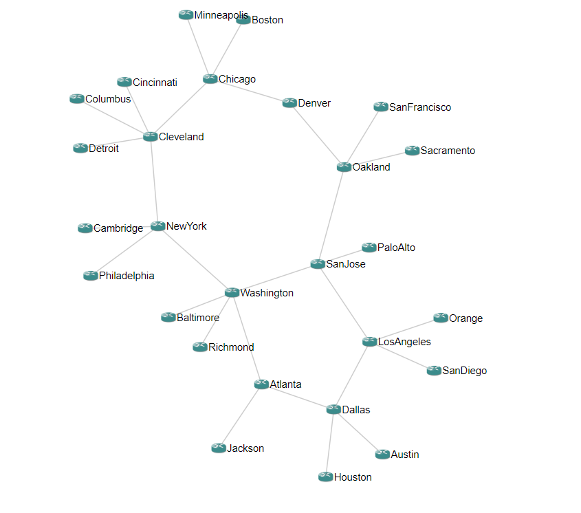

|             | status |
|-------------|------------|
| **master** |  
| **develop** |  

Compatibility: Windows - Unix - Mac / Python 3.6+
___

# Introduction

eNMS is a vendor-agnostic NMS designed for building workflow-based network automation solutions.

It encompasses the following aspects of network automation:
- **Configuration Management Service**: Commit / Rollback of a configuration with Napalm or Netmiko.
- **Ansible Service**: Sending and managing Ansible playbooks.
- **ReST Service**: Sending a ReST call (GET/POST/UPDATE/DELETE) with variable URL and payload.
- **Custom Services**: Any python script can be integrated into the web UI. If the script takes input parameters, a form will be automatically generated.
- **Workflows**: Services can be combined together graphically in a workflow.
- **Scheduling**: Services and workflows can be scheduled to start at a later time, or run periodically.
- **Event-driven automation**: Services and workflows can be triggered by an external event (ReST call or Syslog message).

___

# Main features

## 1. Network creation

Devices and links can be created either one by one, or all at once by importing an Excel spreadsheet.

Once created, all objects are displayed in a sortable and searchable table, from which they can be edited and deleted.

A dashboard provides a graphical overview of all objects with dynamic charts.

Inventory                           |  Dashboard
:----------------------------------:|:-----------------------------------:
  |  

## 2. Network visualization

Once created, eNMS can display your network:
- geographically on a 2D or 3D world map (with the tile layer of your choice: Open Street Map, Google Map...)
- logically with a force-based algorithm (`d3.js`).

You can click on a device to display its properties or start a Web SSH terminal session.

Geographical View                             |  Logical View
:--------------------------------------------:|:-------------------------------:
 |  

## 3. Service creation

eNMS comes with a number of "default services" leveraging libraries such as `ansible`, `requests`, `netmiko`, `napalm`  to perform simple automation tasks. However, absolutely any python script can be turned into a "service".
If your python script takes input parameters, eNMS will automatically generate a form in the web UI.

To generate a form that matches your service, eNMS will perform the following conversion:
- python `string` -> Text box (single line or multiline)
- python `list` -> Drop-down list (single or multiselect).
- python `bool` -> Checkbox.
- python `dict` -> Text box expecting a dictionary.

Once created, you can have as many instances of your service as you need. Service instances can be executed, edited and deleted from the web UI.

## 4. Workflows

Services (and other Workflows) can be combined into a single workflow.

Within a workflow, services can be connected with two edge types: `Success` edge and `Failure` edge. The `Success` edge (versus `Failure` edge) indicates which path to follow in the graph if the source service is successfully executed (versus failed).

A workflow keeps track of a `payload` dictionary, such that when a service starts, it has access to the results of all previously executed services.

When a workflow is executed, its status will be updated in real-time on the web UI.

## 5. Scheduling

While services and workflows can be run directly and immediately from the web UI, you can also schedule them to run at a later time, or periodically by defining a frequency, a start date and an end date. All scheduled tasks are displayed in a calendar.

Check out the docs: _[Scheduling](http://afourmy.pythonanywhere.com/views/geographical_view)_, _[Logical view](http://afourmy.pythonanywhere.com/views/logical_view)_, _[Calendar](http://afourmy.pythonanywhere.com/tasks/calendar)_

## 6. Event-driven automation

Event-driven automation in eNMS has two aspects:
- eNMS has a ReST API that can be used to create, update and delete any type of objects (services, workflows, tasks), but also to trigger the execution of a service or a workflow with a GET request to the appropriate URL. 
- eNMS can be configured as a Syslog server: all logs are stored in the database, and rules can be created to trigger the execution of a service or a workflow upon receiving a log matched by the rule.

___

# Advanced features

## 1. Authentication

- eNMS supports TACACS+ authentication: upon logging in, a request will be sent to your TACACS+ server to validate the credentials and log in the user.
- Authentication with RADIUS and Active Directory are currently under development.

## 2. Network creation with external Network Source of Truth

If you use an NSoT like OpenNMS or Netbox to document your network, eNMS can automatically import the network topology (devices and links), as well as all IP addresses and geographical coordinates.

## 3. Network export

- Networks can be exported as an Excel file. 
- Networks can be exported as a `kmz` file for you to visualize your network on Google Earth.

___

# Getting started

## Quick start
    git clone https://github.com/afourmy/eNMS.git
    cd eNMS
    pip3 install -r requirements.txt
    export FLASK_APP=app.py (on Windows, use `set` instead of `export`)
    flask run --host=0.0.0.0
    Log in (default credentials: `admin`/`admin`)

## Quick start as a docker container
    docker run -d -p 5000:5000 --name enms --restart always afourmy/enms
    Log in (default credentials: `admin`/`admin`)

## Deploy eNMS in production

In production, eNMS is configured to use a PostgreSQL database and a Hashicorp Vault (storage of network credentials).

Check out the `Installation` section of the docs: _[Install eNMS](https://enms.readthedocs.io/en/latest/base/installation.html)_

# Contact

For any feedback, advice, feature request, join us on the [Network to Code slack](http://networktocode.herokuapp.com "Network to Code slack"), channel **#enms**.

# Other projects you might be interested in

- _[Flask Gentelella](https://github.com/afourmy/flask-gentelella)_: The Flask/Bootstrap template eNMS is built upon.
- _[pyNMS](https://github.com/afourmy/pyNMS)_: A PyQt software for network simulation and optimization.
- _[SWAP](https://github.com/afourmy/SWAP)_: A solver for the Wavelength Assignment Problem in optical networks.