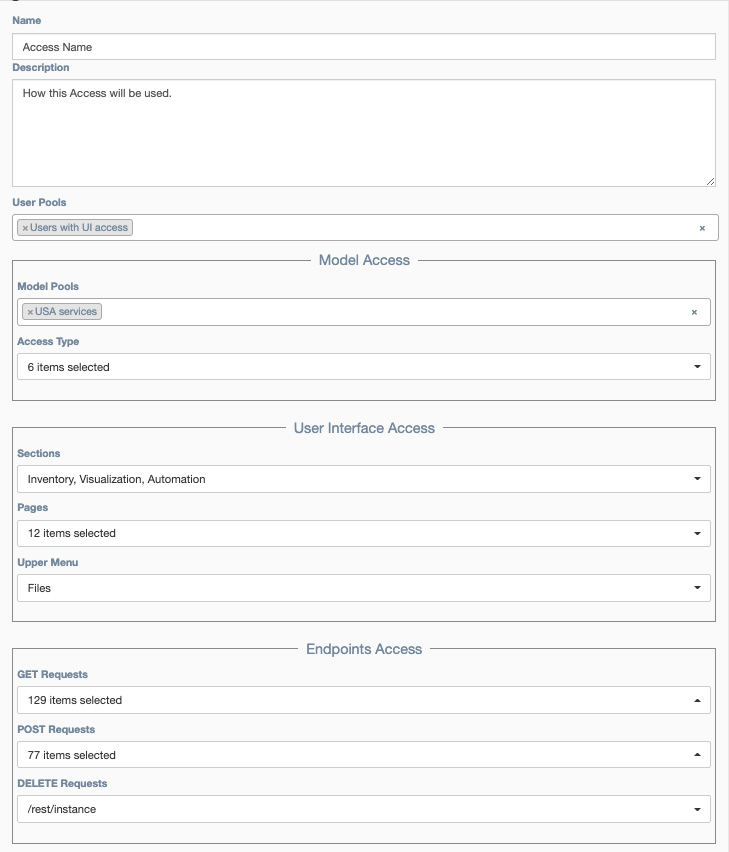

# Access

## Overview

An `Access` defines the access type for an object, such as a `Pool` of users, links,
or services to:

- Pools of devices
- User interface menus, pages, and buttons
- HTTP endpoints, including REST

## Configuration 

Configurable parameters for an Access Object:

- **Name**: The name of the `Access`

- **Description**: Additional documentation on the purpose of the `Access` 

- **User Pools**: One or more `Pool`s defining the users for which this `Access`
  applies.

**Model Access**

- **Model Pools**: Zero or more `Pool`s of application objects (ex: services,
devices, links) for which to manage access.
- **Access Type**: The level of access allowed to application objects defined in
`Model Pools` (ex: Read, Edit, Run, Schedule, Configuration, Connect, Use as target).
Not all access types apply to all object types, for example Run applies to a service
but not a device. 

**User Interface Access** 

- **Sections**: Provides access to the selected sidebar menu items.
- **Pages**: Provides access to the selected application Web UI pages.
- **Upper Menu**: Provices access to the selected buttons in the top menu bar.

**Endpoint Access**

Endpoints refer to both the public REST API and internal endpoints that
implement specific pages or operations.  Endpoints are controlled separately
based on their HTTP request type:

- **GET Requests**
- **POST Reqests**
- **DELETE Requests**
 
These options provide more granular control than `User Interface Access` and
control over which actions a user can take both inside the user interface and
through the REST API. Even if a user can access a page within the user
interface, they must also have `Endpoint Access` to preform the task.
