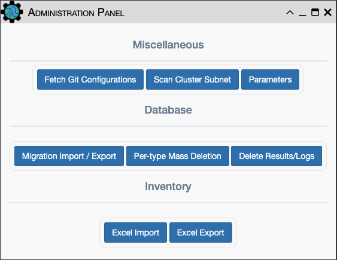
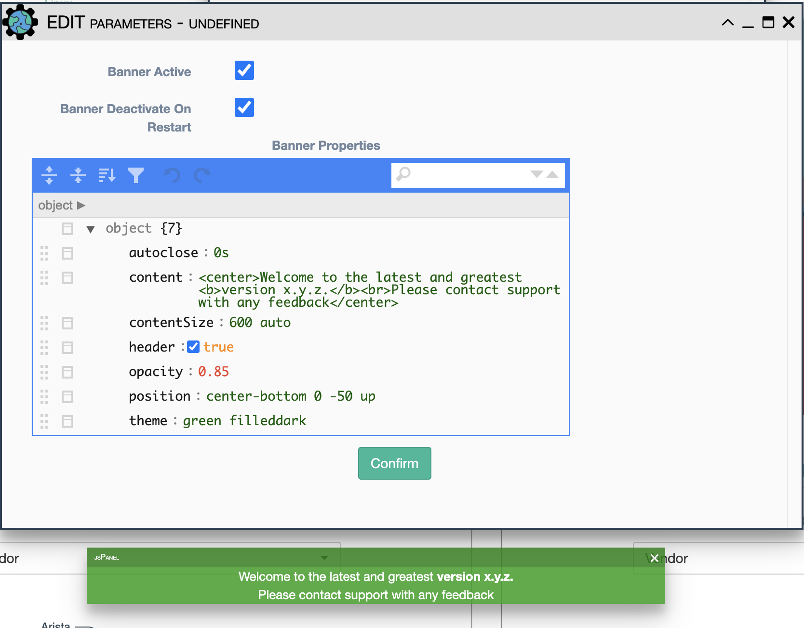

# Admin Panel

The Administration Panel icon is at the top of the application and is 
accessible by users with admin privileges:

## Miscellaneous

- `Fetch Git Configurations`: Loads the latest device configurations from the
  git 'configurations' repository into the database for each matching inventory
  device. This is performed automatically when eNMS starts up: the git
  configurations repository is quietly cloned and loaded into the database.
  This feature allows manual pulling of updated configurations data.
- `Scan Cluster Subnet`: Populates the `Administration -> Servers` table with
  related instances where eNMS has been deployed as a cluster of Servers.
- `Parameters`: Tune the notification banner settings. See
  [Notification Banner](#notification-banner) below for usage.

#### Notification Banner
A notification banner can be used to let users know of application-wide
information. There are a handful of parameters that can be used to display
found in either the `Parameters` section of the `Admin Panel` or in
`settings.json`. 

- `Banner Active`: Whether or not the notification banner will be displayed
- `Banner Deactivate On Restart`: Turn off banner upon app restart
- `Banner Properties`
    - `autoclose`: Time before the banner closes. Values can be specified in
       either seconds(s) or milliseconds(ms). A value of zero will keep the
       banner open indefinitely.
    - `content`: Html element to be displayed in the banner.
    - `contentSize`: Size of the content element.
    - `header`: Add a header to the notification banner, this will allow users
       to close the banner.
    - `position`: Location of the banner on the screen. A shorthand position
       string is supported; see the following excerpt taken from
       [jspanel.de](https://jspanel.de/#options/position).

        > A shorthand string may be composed of values for 'my at offsetX
          offsetY autoposition of'. Each "substring" is separated from the next
          with a space and you should stick to this sequence in order to
          prevent problems. Values for minLeft, maxLeft, maxTop, minTop and
          modify are not supported in shorthand strings.
    - `theme`: Set the color theme of the banner.

## Database: Migration, Backup and Restore

The eNMS migration system handles exporting the complete database
content into YAML files. By providing a directory name and selecting
which eNMS object types to export/backup, eNMS serializes the stored
objects into the directory `eNMS/files/migrations/directory_name`. These
yaml files can then be copied into the same directory on a new instance
of eNMS, where the Import function can be used to
import/restore the configuration and living data of those object types.
These migration files are used for migrating from one version of eNMS to
the next version. They are also used for Backup and Restore of eNMS. The
migration system is accessed from the `Admin` icon at the top of the
UI or from the REST API.

`Migration Import/Export` Restore/Import database on a newly created
  instance of eNMS:

- Launch the GUI and login into a freshly built/installed eNMS system. 
- Ensure that the migration YAML files are present in the desired folder.
- At the top of the UI screen, Click the `Admin` button.
- Click `Migration Import/Export` and select options, all the object
  types from drop down menu and the directory of where the migration
  YAML files are kept and select Import.  The Export button can be used
  to similarly capture the migration files to the directory.
- Alternatively, the REST API section discusses how to import/export
  migration (as well as inventory / topology files) to and from the
  application.

!!! note

    Exported backup files do not contain the secure credentials for each of
    the inventoried devices in plain text. The credentials are considered to
    be stored in a Vault in production mode.

!!! note

    If migrating data onto an existing instance (as opposed to a
    fresh instance) of eNMS, you can select the option
    `Empty Database before Import` to empty the database before starting the
    migration.

!!! note

    See additional discussion of migration in the Installation Section

## `Per-type Mass Deletion`
 
Select object type(s) to be deleted. This is useful for deleting all
Devices and Links from the application, including those embedded/saved into
services, workflows and pools. This feature works with the Import/Export
migration system to transfer the living content of services/workflows to
another instance that might have a different inventory of devices and links.

## `Delete Results/Logs`

Deletes historical results, logs, and changelogs
  
## Inventory Import/Export

eNMS inventory devices and links topology can be exported and Imported into an
Excel based format. When executing the `Excel export` function, the file will
be exported to the `eNMS/files/spreadsheets` folder on the local VM. When
executing the `Excel import` function, the application will request for the
desired file from the browser.
