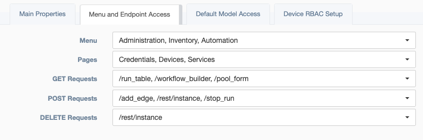
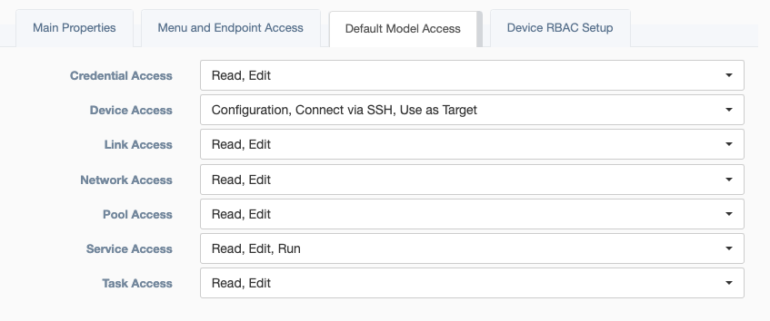
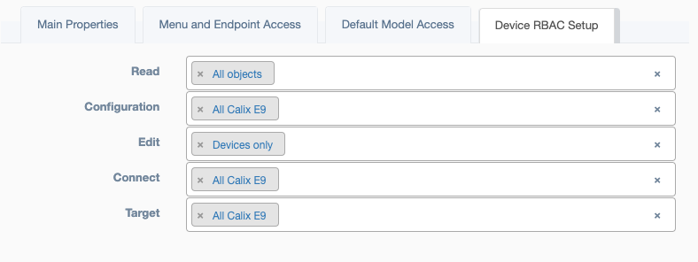

Easily synonymous with teams, `Groups` are a collection of users. `Groups` defines which pages
 and actions a team can take (`Menu and Endpoint Access`), it also defines default access for user created objects 
 (`Default Model Access`), and defines the type of access along with the specific devices they may use 
 (`Device RBAC Setup`). RBAC is an acronym for Role Based Access. 

 
<h4>Main Properties</h4> 

* **Name** - Unique identification for team name
* **Creator** - Auto Populated field based on the user who built the team
* **Description** - Text field for storing notes  
* **Email** - Team email address
* **Admin Only** - An override of `Access Control`, which prevents non-admin users from viewing or editing this object.  
* **Always set 'Read' access**: An override of `Access Control`, which will make this team always have read level 
  access to all services. This is helpful for admin like `Groups` to be able to support other `Groups` help requests, 
  by always granting view access.  
* **Users** - Members of this team
* **LDAP Group Regex** - When users access the application using Lightweight Directory Access Protocol, this 
  regular-expression can be used to evaluate if a user is a part of a team using the directory response. If the regex 
  finds a match the user will be added to `Users` above. 

 
<h4>Menu and Endpoint Access</h4> 
Fine control of actions a team can take.

* **Menu** - Corresponding to the left sidebar, selections here define base level of access. 
* **Pages** - Defining the second level of access, this allows selection of sub-menus from `Menu` above. 
* **Get Requests** - Defining the third level of access, each request for data has a selectable endpoint. 
* **Post Requests** - Further defining the third level of access, each request to modify or run has a selectable endpoint.
* **Delete Requests** - Further defining the third level of access, each request to remove objects has a selectable endpoint. 

 
<h4>Default Model Access</h4> 

Default access for user created objects.

* **Credential Access** - Corresponding to the Access Control menu on a `Credential` object. Options: Read/Edit.
* **Device Access** - Corresponding to the Access Control menu on a `Credential` object. Options: Read/Edit.
> * **Read** - `Groups` allowed view this instance 
> * **Configuration** - `Groups` allowed view the configuration attribute of a device instance 
> * **Edit** - `Groups` allowed to modify this instance
> * **Connect via SSH** - `Groups` allowed to use the `Connection` or web_ssh feature found on the device table. 
> * **Use as Target** - `Groups` allowed to use this device to run services.
* **Link Access** - Corresponding to the Access Control menu on a `Link` object. Options: Read/Edit.
* **Network Access** - Corresponding to the Access Control menu on a `Network` object. Options: Read/Edit.
* **Pool Access** - Corresponding to the Access Control menu on a `Pool` object. Options: Read/Edit.
* **Service Access** - Corresponding to the left sidebar, selections here define base level of access.
> * **Read** - `Groups` allowed view this instance
> * **Edit** - `Groups` allowed to modify this instance
> * **Run** - `Groups` allowed to use this service  
* **Task Access** - Corresponding to the Access Control menu on a `Task` object. Options: Read/Edit.

 
<h4>Device RBAC Setup</h4> 

* **Read** - Select pool of device objects this team may read. 
* **Configuration** - Select pool of device objects, where this team may read a devices 'Configuration` attribute. 
* **Edit** - Select pool of device objects this team may modify. 
* **Connect** - Select pool of device objects, where this team may use the `Connection` or web_ssh feature, found on the device table.  
* **Target** - Select pool of device objects this team may use while running a service. 

!!! Advice
    Each device can be operated on individually to update the RBAC settings. However, the top menu bar for `Groups` 
    has an icon that will `Update Device RBAC from Pools`. This feature uses the settings defined in `Device RBAC Setup`
    and pushes those setting onto the appropriate devices.
