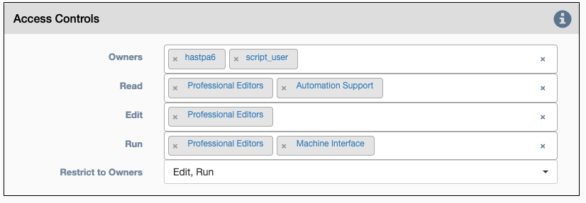
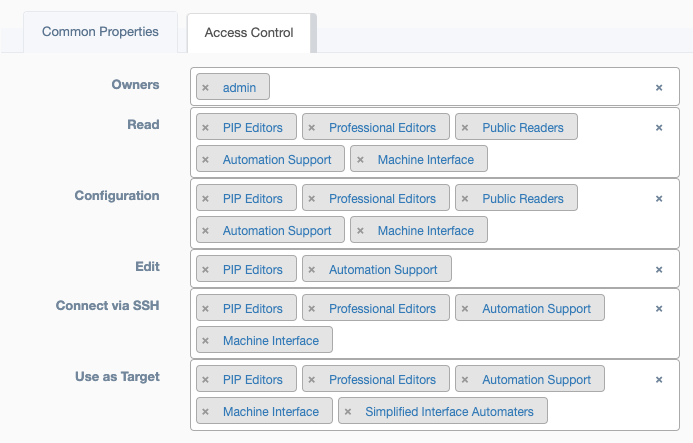
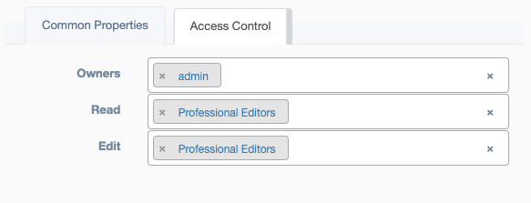

# Access

## Overview

In this section, the word instance refers any of the following objects: `device`, `service`, `credential`, `link`, `network`, `pool`. Each of
these instances have an `Access Control` section that allows the owner(s) to determine which `Groups` are allowed to use
the instance. `Access Control` also allows the owner(s) determine the type of access allowed. 

[Groups are easily synonymous with teams, click for details on how to create and manage.](groups.md) 

 
<h4>Service</h4> 

When viewing or editing a service `Step 1` contains an `Access Control` panel that  has the following properties: 

* **Owners** - Users allowed to modify this `Access Control` panel
* **Read** - `Groups` allowed view this instance
* **Edit** - `Groups` allowed to modify this instance
* **Run** - `Groups` allowed to use this service
* **Restrict to Owners** 
> * **Edit** - When selected prevents anyone other than those listed in the `Owners` section above from modifying this service. 
> * **Run**  - When selected prevents anyone other than those listed in the `Owners` section above from using this service.

 
<h4>Device</h4>

When viewing or editing a device there are two selectable tabs near the top, `Common Properties` & `Access Control`. The
`Access Control` tab  has the following properties: 

* **Owners** - Users allowed to modify this `Access Control` instance
* **Read** - `Groups` allowed view this instance
* **Configuration** - `Groups` allowed view the configuration attribute of a device instance. 
* **Edit` - `Groups** allowed to modify this instance
* **Connect via SSH** - `Groups` allowed to use the `Connection` or web_ssh feature found on the device table. 
* **Use as Target** - `Groups` allowed to use this device to run services. 

 
<h4>Credential, Link, Networks, Pools</h4>

When viewing or editing a link, networks, pool there are two selectable tabs near the top, `Common Properties` & `Access Control`. The
`Access Control` tab  has the following properties: 

* **Owners** - Users allowed to modify this `Access Control` instance
* **Read** - `Groups` allowed view this instance
* **Edit** - `Groups` allowed to modify this instance
