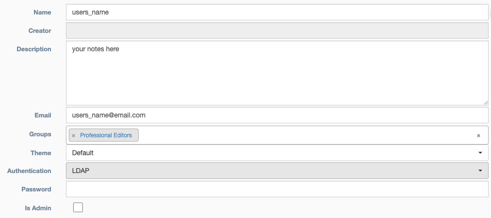

# Users

Table of users, presently restricted to admin users only. Depending on application configuration, the `Groups` column
can be used to enhance Role Based Access (RBAC).

<h4>User Details</h4> 

* **Name** - Identifies the user within the application
* **Creator** - Auto Populated field based on the user who built the credential
* **Description** - Text field for storing notes 
* **Email Address** - The user's email address  
* **Groups** - Group(s) to which this user belongs
* **Theme** - Choose between light or dark themes
* **Authentication**
> * **LDAP** - Uses Lightweight Directory Access Protocol to determine if user can access application 
> * **TACACS+**  - Uses Terminal Access Controller Access-Control System to determine if user can access application 
> * **Local**  - Uses local database to determine if user can access application
* **Password** - If `Authentication` type `Local` is selected, this takes a user password
* **Is Admin** - Checking this box allows the user to bypass Role Based Access controls
