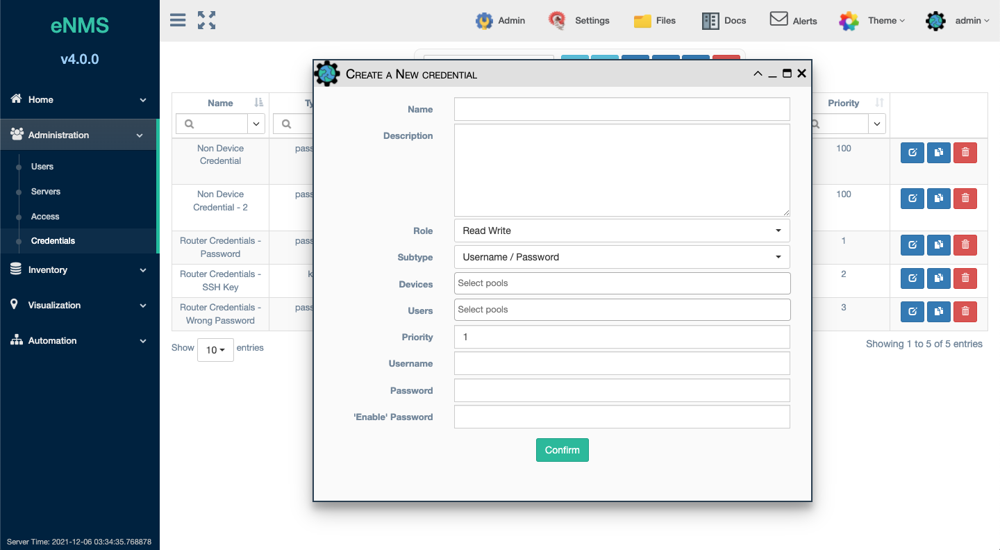
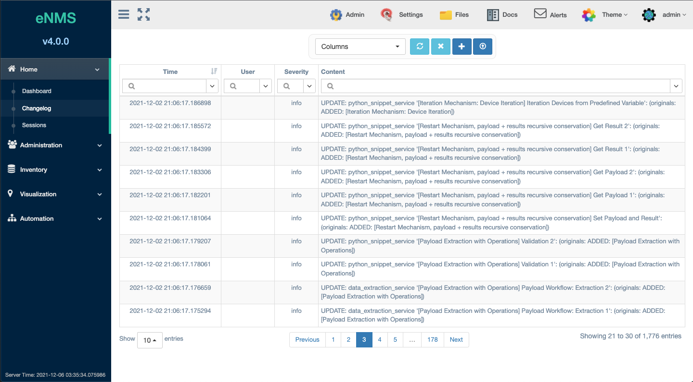
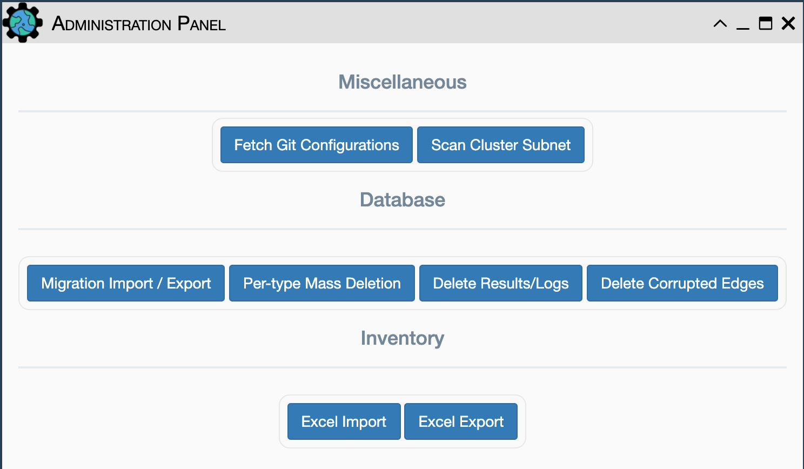
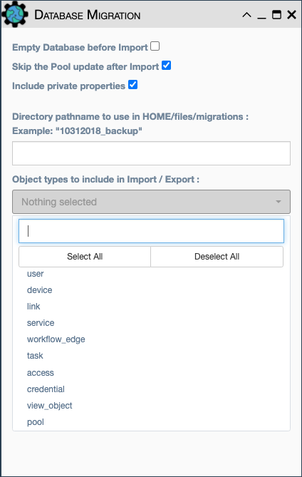

# Administration

## Users
Table of users. Depending on application configuration, the `Groups` column can be used to enhance Role Based Access 
(RBAC).

**Username**: Identifies the user within the application

**Description**: Display-only information regarding the user

**Groups**: A comma separated list of arbitrary names available for matching
a Pool.

RBAC manages collections of users using `Pools`.  User membership in a pool is
based on filters and available for any User property, including `Groups`
(See [Pools](../inventory/pools.md) for more information).

Pools are also used to determine levels of `Access` and available `Credentials`.

When a user creates a service, that user's `Groups` supply the default `Groups`
assigned to the service; meaning users in their group also get access. 

**Email Address**: The user's email address

**Pools**: Clicking this provides a table of all the `Pools` in which this user
is a member.

## Servers
This feature is under development as part of a clustered solution.

## Access
An `Access` defines the access type for a `Pool` of users to:

- Pools of devices
- User interface menus, pages, and buttons
- ReST endpoints (both internal and external)

**Name**: The name of the `Access`

**Description**: Additional documentation on the purpose of the `Access` 

**User Pools**: One or more `Pool`s defining the users for which this `Access`
applies.

**Model Access**

- **Model Pools**: Zero or more `Pool`s of application objects (ex: services,
devices, links) for which to manage access.
- **Access Type**: The level of access allowed to application objects defined in
`Model Pools` (ex: Read, Edit, Run, Schedule, Connect, Use as target). Not all
access types apply to all object types, for example Run applies to a service
but not a device. 

**User Interface Access** 

- **Sections**: Provides access to the selected sidebar menu items.
- **Pages**: Provides access to the selected application Web UI pages.
- **Upper Menu**: Provices access to the selected buttons in the top menu bar.

**Endpoint Access**

Endpoints refer to both the public ReST API and internal endpoints that
implement specific pages or operations.  Endpoints are controlled separately
based on their HTTP request type:

- **GET Requests**
- **POST Reqests**
- **DELETE Requests**
 
These options provide more granular control than `User Interface Access` and
control over which actions a user can take both inside the user interface and
through the REST API. Even if a user can access a page within the user
interface, they must also have `Endpoint Access` to preform the task.

## Credentials

Credentials are used when connecting to a device.  Permissions for device 
access (via an `Access`) are separate from permission to use a `Credential`;
both are required for connection to a device.  `Credential` permissions are
defined directly on the `Credential` and do not involve an `Access`.

Device credentials are stored in either a Vault or in the database
if no Vault is configured. For a production environment, a Hashicorp Vault is recommended. 

**Name**: The `Credential` name.

**Description**: Credential documentation.

**Role**: Read and write, or read only

**Subtype**: Choose between `Username / Password` or `SSH Key`.

**Devices**: Pool of devices which will have access to these credentials

**Users**: Pool of users which will have access to these credentials

**Priority**: When a user has access to multiple credentials for a device,
the credential with the highest priority is chosen.

**Username**: The username for both `Username / Password` and `SSH Key` connections.

**Password**: The password for subtype `Username / Password` credentials.

**Private Key**: The SSH private key for subtype `SSH Key` credentials.

**'Enable' Password**: Used by Netmiko based services when Enable mode is
selected and a password is required.  This is not related to device
connection, but is included on the credential for Vault storage.

## Changelog

The eNMS changelog is found under `Home / Changelog`

Changelog contains the following searchable information:

-   Object creation, deletion, and modification activity
-   Running of services / workflows; when they ran, who ran them
-   Various administration logs, such as database migration,
    parameter updates, etc.
-   Custom logs, defined by users in services / workflows

## Custom Properties

The following objects and application behaviors can be managed or extended
with "custom" properties:

1. Additional custom properties can be added to devices and links. In this way,
eNMS device inventory can be extended to include additional columns/fields.
2. Additional custom parameters can be added to services and workflows.
3. Dashboard parameter and widget visibility can be controlled.
4. Column/field property visibility can be controlled in the device and link
inventory, configuration, and pools tables, as well as the service, results,
and task browsers.

Custom properties are read from the `properties.json` file in the
`setup` folder, with the following variables:

- `type` (**mandatory**): `string`, `integer`, `float`, and `boolean`
- `pretty_name` (**optional**): Custom name of the property in the UI
- `default` (**optional**): Default value
- `add_to_dashboard` (**optional**): Set to `true` to allow the property
  to appear in the dashboard
- `private` (**optional**): If `true`, the value is considered
  sensitive: it will not be displayed in the UI. It will be
  encrypted in the database and stored in the Vault (if the Vault
  has been set up)
- `is_address` (**optional**): Set to `true` if you want to property
  to be usable for connecting to network devices (e.g
  hostnames, IP addresses, etc)

!!! note

    Custom properties are defined ONCE, prior to eNMS starting up for
    the first time, since they are mapped into the database schema. Changes
    to customized properties require the database to be altered or dropped
    and reloaded to allow the object relational mapping to recreate the
    schema.

## Admin Panel

The Administration Panel icon is at the top of the application and is 
accessible by users with admin privileges:

### Miscellaneous

- `Fetch Git Configurations`: Loads the latest device configurations from the
  git 'configurations' repository into the database for each matching inventory
  device. This is performed automatically
  when eNMS starts up: the git configurations repository is quietly
  cloned and loaded into the database. This feature allows manual
  pulling of updated configurations data
- `Scan Cluster Subnet`: Populates the `Administration -> Servers`
  table with related instances where eNMS has been deployed as a cluster of
  Servers

### Database: Migration, Backup and Restore

The eNMS migration system handles exporting the complete database
content into YAML files. By providing a directory name and selecting
which eNMS object types to export/backup, eNMS serializes the stored
objects into the directory `eNMS/files/migrations/directory_name`. These
yaml files can then be copied into the same directory on a new instance
of eNMS, where the Import function can be used to
import/restore the configuration and living data of those object types.
These migration files are used for migrating from one version of eNMS to
the next version. They are also used for Backup and Restore of eNMS. The
migration system is accessed from the `Admin` icon at the top of the
UI or from the REST API.

`Migration Import/Export` Restore/Import database on a newly created
  instance of eNMS:

- Launch the GUI and login into a freshly built/installed eNMS system
- Ensure that the migration YAML files are present in the desired folder
- At the top of the UI screen, Click the `Admin` button
- Click `Migration Import/Export` and select options, all the object
  types from drop down menu and the directory of where the migration
  YAML files are kept and select Import.  The Export button can be used
  to similarly capture the migration files to the directory.
- Alternatively, the REST API section discusses how to import/export
  migration (as well as inventory / topology files) to and from the
  application.

!!! note

    Exported backup files do not contain the secure credentials for each of
    the inventoried devices in plain text. The credentials are considered to
    be stored in a Vault in production mode.

!!! note

    If migrating data onto an existing instance (as opposed to a
    fresh instance) of eNMS, you can select the option
    `Empty Database before Import` to empty the database before starting the
    migration.

!!! note

    See additional discussion of migration in the Installation Section

### `Per-type Mass Deletion`
 
Select object type(s) to be deleted. This is useful for deleting all
Devices and Links from the application, including
those embedded/saved into services, workflows and pools. This feature
works with the Import/Export migration system to transfer the living
content of services/workflows to another instance that might have a
different inventory of devices and links.

### `Delete Results/Logs`

Deletes historical results, logs, and changelogs
  
### `Delete Corrupted Edges`

Scans workflows to find duplicate edges between services or reference
to an edge between services where a service does not exist and then
deletes them. This feature resolves an issue where a workflow was
imported to an existing system where that same workflow already existed,
without first deleting the existing workflow.  It is recommended when
wishing to overwrite a workflow of the same name with a different one
from another instance, first delete the workflow instead of overwriting.

### Inventory/Topology Import/Export

eNMS inventory devices and links topology can be exported and Imported into an
Excel based format. When executing the `Excel export` function, the file will
be exported to the `eNMS/files/spreadsheets` folder on the local VM. When
executing the `Excel import` function, the application will request for the
desired file from the browser.

## Local Server CLI interface

The local instance terminal can be used as a CLI interface that interacts
with the eNMS application. The prerequisite is to ensure that you are in
the correct application directory and to deactivate any specific proxy
settings. The proxy settings are company specified and will prevent
commands from running. The user can now "ssh" into the instance and perform
the following operations:

### Run a service

If an eNMS service has been created on the application, the user can run a
service via this CLI Interface.

General syntax:

    `flask run_service <service_name> --devices <list_of_devices> --payload '{json dict}'`

Options:

    --devices = List of comma separated device names (Optional)
    --payload = JSON dictionary of key/values, serving as starting data
                for the service to be used later (Optional)

Examples:

    `flask run_service get_facts`
    `flask run_service get_facts --devices Washington,Denver`
    `flask run_service get_facts --payload '{"a": "b"}'`
    `flask run_service get_facts --devices Washington,Denver --payload '{"a": "b"}'`

### Delete old log entries

This command removes logs, changelogs or results. By default, logs older
than 15 days will be removed from their respective tables

General syntax:

    `flask delete_log --keep-last-days <value> --log <value>`

Options:

    --keep-last-days = Number of days to keep the logs (Optional: default to 15)
    --log = The log information to remove the logs from, either "changelog" or
            "result" (Required)

Examples:

    `flask delete_log --keep-last-days 10 --log result`    # Retains the last 10 days of result
    `flask delete_log --log changelog`                     # Retains the last 15 days of changelogs

### Refresh Network Configuration Data

The Network Configuration data can be gathered and then stored in a
central location, namely the git repository. eNMS can be used to fetch
the Network Configuration from git and have it stored locally in  `network_data/`

General syntax:

    `flask pull_git`

Options:

    None
