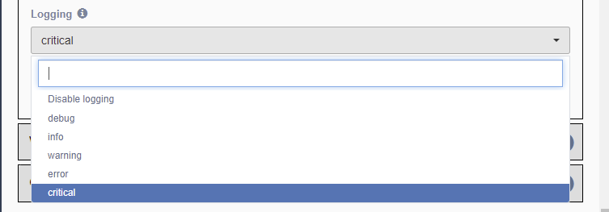
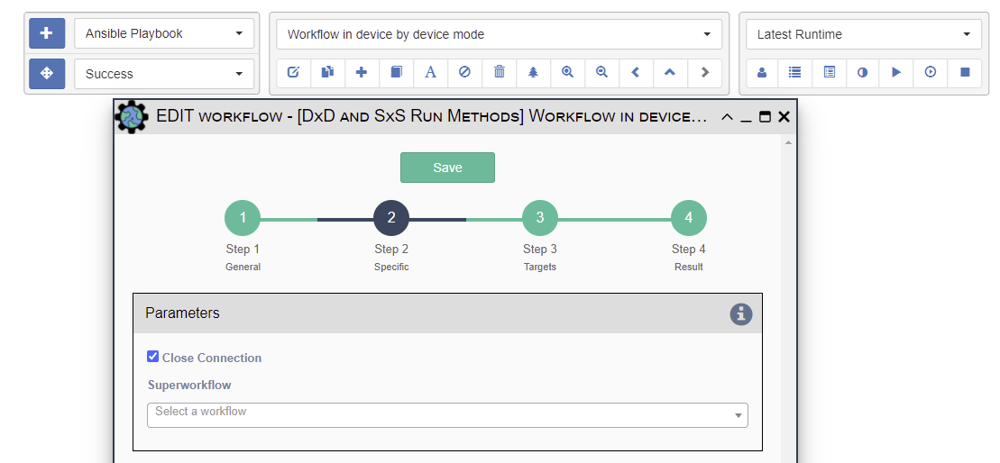

# Recommended Practices

This section includes useful tips or techniques derived from common support
questions.  Some topics are covered elsewhere as well.  

## Adding your own Logging 

During workflow development, additional debug logging can be helpful to
understand what is happening in a workflow.

```python
log("info", f"Your custom message with {some_variable} goes here.")
```

See for the [Variables section](../../automation/service_python_code/#variables) a full
description of the `log()` function.

!!! note

    This is generally done during development only.  After initial development, 
    we encourage removal of these log() statements.
        
    Alternatively, the log level can be adjusted on <b>each service</b> to
    prevent spurious logs from filling the database.
    
    The general guideline to keep in mind is: if the logs are not routinely used,
    the information should probably not be logged; either remove the log statements
    or reduce the logging level in the Service Editor Step 1 panel.



## Logging to an external system

In the [Variables section](../../automation/service_python_code/#variables), the description of
the log() function includes the optional keyword parameter **logger**.

If you have multiple loggers configured in your 
[logging.json](../../base/installation/#loggingjson), you can select a specific 
logger to receive the log data: 
```python
log("info", logger="send_to_external_logger")
``` 

While not covered here, `rsyslog` can be configured to forward logs to external
systems. 

## Run Method Tips  

### Device-by-device Run Method - Sub-workflow(s)  

When using a sub-workflow with a Run Method of `Device by Device`,  
strongly consider checking the `Close Connection` option on Step 2 of the
sub-workflow.

Motivation: You want to release (close) a device connection when you are done using it.
Otherwise, the connection may not be closed until the end of the workflow!  This is just
a good practice to be considerate of resource usage on devices as well as the eNMS 
server(s).



!!! note
     
     Note: This is critically important when you have a large number of target devices
     in a workflow.

### Service-by-Service Run Method  

!!! note
     Service-by-service workflows are most useful as the top-level workflow when
     some services must be run-once, for example to send a single notification
     email that reports on the status of all devices from the workflow.

     Service-by-service workflow can be problematic when working against a large
     number of devices, because the service must run for all devices before the
     next service runs.  This delay between uses of the connection causes many
     devices to timeout and drop their connections, or worse get errors on the
     connection.

     The solution is to push operations against the devices into a device-by-device
     subworkflow.
     
     Closing connections in a timely manner can also ease resource usage on devices.

## Preprocessing and Postprocessing 

Please refer to this description of the different Run methods for a Service
or Workflow. This section will help share service/workflow design
considerations for pre- and post-processing Python code. 

Please check the **Preprocessing** description in 
[Workflow parameters](../../automation/service_editor/#advanced-parameters) and the 
**Postprocessing** description in 
[Conversion and Postprocessing](../../automation/service_editor/#conversion-and-postprocessing)
for overview information.

### Common Tips 

The number of times that Preprocessing and Postprocessing are run depends on the 
Run Method of the Service. 

When Run Method is Device-by-Device these code sections run once per Device.
This can cause issues if the same variable is initialized or changed.

When writing either preprocessing or postprocessing Python code, you should generally 
avoid using functions like the "global" `set_var(variable name, value)` when your 
Run Method is Device-by-Device.  Instead, device-specific operations, e.g.
`set_var(variable name, value, device=device.name)`, or using the device name as a
key within an existing dictionary prevents unintentional data overwrites.

### Postprocessing Tips 

The Postprocessing Mode determines whether the script is:

- Always run.
- Run on success only.
- Run on failure only.

If the Postprocessing logic expects a successful result (e.g., a text result from 
a Netmiko Commands Service command), then the Postprocessing Mode should be set to 
**Run on success only**.

When using mode **Always run**, add a guard condition around a failure result:

```python
# Note: log() statements are examples only ; try to avoid extraneous logging. 
if not results['success']:
    log("error", f"Device {device.name} had an error: {results['result']}")
    exit() # this will stop postprocessing 

# Postprocessing continues with the "success"  
log("info", f"Device {device.name} had an good result: {results['result']}")
```    

### Postprocessing - Large Data and/or Changing the Result 

There is a size limit of what an individual service can store in the database.

For example, if you are running a Netmiko Commands service that returns a result 
of more than 16 MB, you should:

- Try to adjust that command so that it produces a smaller result, or 
- Change (filter) the result in post-processing.

There can be other reasons why you might want to change the result.

To change the Service's result in postprocessing:
```python
# Our initial result: 
initial = results['result']
# Do some operation(s) on the initial to filter them.
revised = ...   
# Update result at the end; this will replace initial result with the revised one.
results['result'] = revised 
```

## Retrieving Work from Prior Services

In workflow design, there are two ways to retrieve the results of work done by 
previous Services:

- `get_var()`: Retrieve a variable previously stored using `set_var()`.
- `get_result()`: Retrieve the result of a previous Service.
    
For full descriptions of these functions, see the 
[Variables section](../../automation/service_python_code/#variables).

Both of these functions can be used to extract data

Considerations:

- Using `set_var()` in previous services requires a little more work - at least, 
  to call `set_var()` with a value.
- If a previous service has stored some key information using `set_var()`, using 
  `get_var()` is faster than calling `get_result()`, as `get_result()` requires
   database access.
- `set_var()` / `get_var()` protects against a user changing the name of a service
  which would cause `get_result()` to fail unless its service name target is also
  updated.
- If the data is large (especially when running against many devices), then 
  `get_result()` may be the only option.  Always consider using postprocessing
  to extract the desired data when retrieved, instead of holding large data when
  only a portion of it is needed.

Familiarity with both of these functions helps you be flexible in the workflow design.  

## Shared Services 

### Organizing Shared Services 

One option for trying to organize a set of related **Shared** Services is to put them 
into a "container" Workflow.  This "container" (library) Workflow serves as 
a common location in which to organize a group of shared services.

While this has little to do with how the eNMS system operates, it is something that 
larger workflow developers have used to help organize Shared services that are reused
across multiple Workflows.  

## Netmiko Commands 

### BASH shell commands 

Some systems support multiple types of shells, including a BASH command shell. 
Usually, the management shell also provides a way to invoke the BASH shell commands.

This option is simpler than running a series of Netmiko Commands services to run 
commands to enter/exit the bash shell.  However, you may have to figure out how to 
escape some characters in the command string. 

Examples:  

- Cisco NX OS - `run bash <command>`.
- F5 BIG-IP - `run /util bash -c "<command>"`.