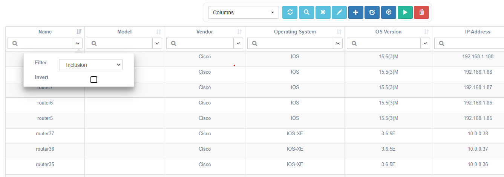
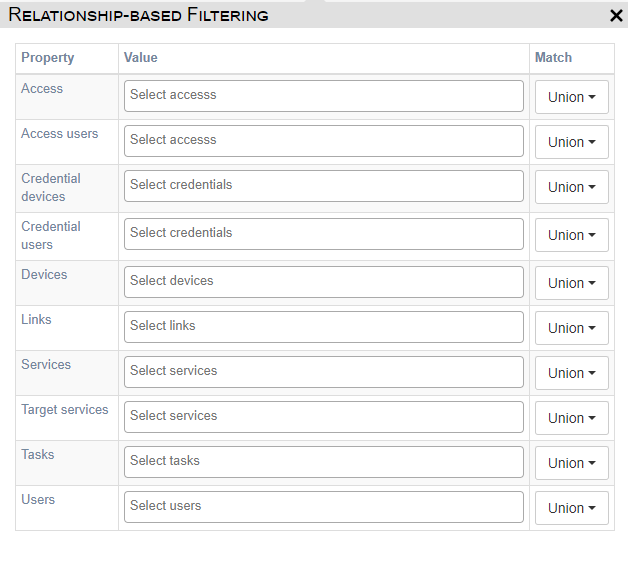

# Quick Search

For a quick search, use the text boxes displayed in the column headers of any 
table displayed, the text box contains a magnifying glass image. After a table 
is displayed for the first time, as characters are typed into the text box, the 
content of the table will update with entries that contain the characters 
entered.  This type of searching is called `Inclusion` and is one of several 
ways to search/filter records displayed.  The different modes of searching are 
accessed using the dropdown button on the right side of the text box.

The different search/filter options are available through the `Filter`
dropdown list.  The options available are:

- `Inclusion`: (**default**) Records, where the column data includes 
  the characters entered, will be shown in the table.  This option is not 
  case-sensitive.
- `Equality`: This option will display records where the column data is an exact 
  match for the characters entered.  This option is not case-sensitive.
- `Regular Expression`: The records displayed are those where the column 
  data matches the regular expression entered.
- `Empty`: The records displayed are those where the column data is empty or 
  null.

The options also include an `Invert` check box.  When this box is checked, the
records displayed include records where the column data does **not** match
the characters or expression entered and the filter type selected.

!!! Note
	If several of these fields are populated with values the results will be 
	based on all fields where input was provided. (i.e. it uses the Boolean 
	operator `AND`).
 
When changing the `Filter` type or `Invert` selection, the `Refresh` button 
 in the 
control components at the top of the display must be clicked. To clear all 
search/filter criteria click the `Clear Search` button 
 
in the same collection of controls.

# Advanced search

This search feature is relationship-based; it focuses on the relationships 
between objects.  It is accessed by clicking the `Advanced Search` button

A dialog opens presenting criteria options based on the object type being
searched.  Options for Device searches will be different from options for Pool
searches.

Based on the `Property` identified in the first column, enter an appropriate 
`Value` for the property.  For example, enter one or more device names for the 
`Devices` property.  The `Match` column selections control which results to 
show:

- `Union`: Includes results where one or more of the criteria is met.  If two
  device names are provided, this selection will display results where either 
  device is present.
- `Intersection`: Includes results where all criteria are met.  If two device
  names are provided, it will return results that contain both devices.
- `Empty`: Includes results where none of the criteria is met.  If two device
  names are provided, and this option is selected, the results will be that 
  neither of the devices are present.

