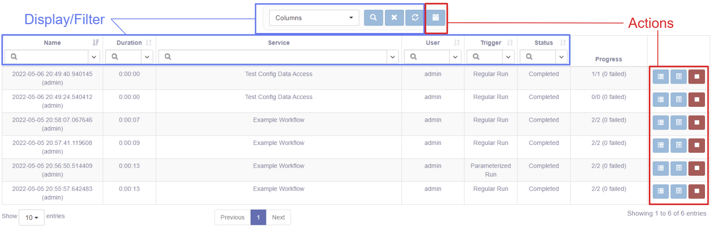
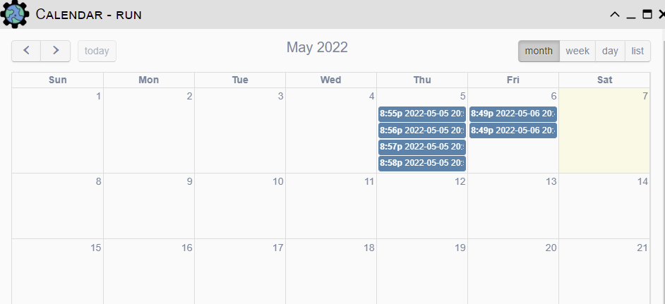
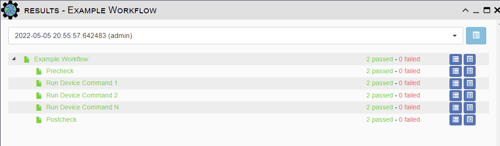
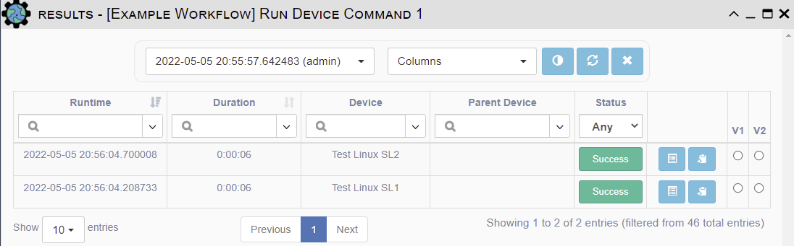
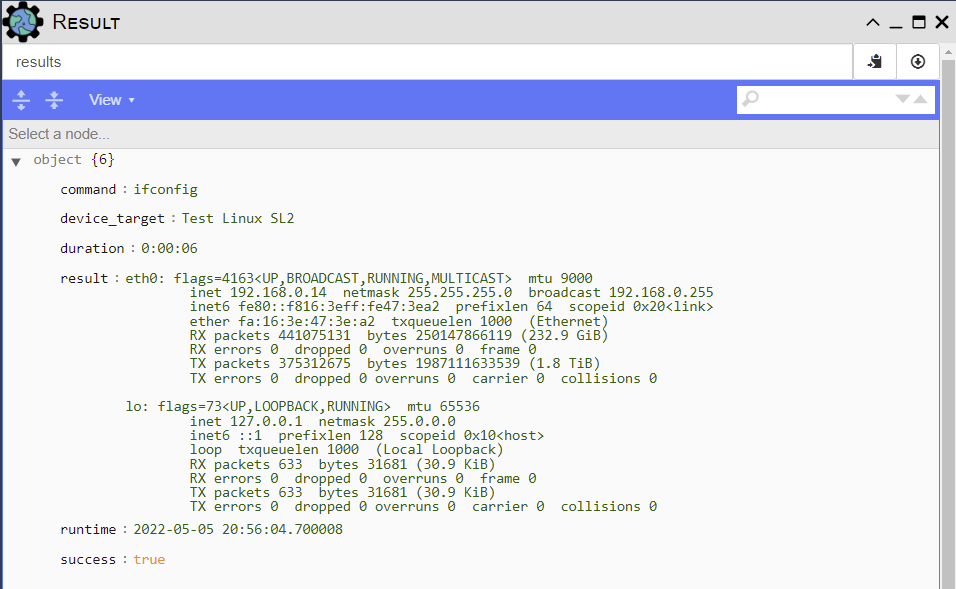

# Overview 

Results represent an automation outcome from running a Service (or Workflow) against
one or more Device targets.

!!! tip 

    In the eNMS system, Run and Result objects store different information. A Run is a 
    container for individual Service and/or Device Results.   
     
    In the `Results table`, eNMS first displays the Run-level objects - which correlate
    the start of an automation activity (i.e., running a service or workflow). 
    By drilling down further, the Results Viewer will display the per-Service and/or 
    per-Device Results.

The table has selectable columns for browsing the Run properties like Name, Duration, 
Service, User, Trigger, Status and Progress.

## Displaying and Filtering Results

Use the Columns pull-down to select which table columns to display.
Refer to the [Search System](../../advanced/search_system/) for instructions on 
how to filter this table.
 
## Results Management

These actions apply to all results selected by the current Result filter: 

- *Calendar* - view the results by runtime.

These actions apply to single result: 

- *Logs* - show the logs for the service or workflow. 
- *Results* - view of results.
- *Stop* - stop the service or workflow after the current device completes
  the current service.

## Result Viewer(s) - Example

Clicking on the `Results` will open the Results Viewer; a tree-based display of the 
individual Services with summary information.

Clicking on the `Results` button here will show next level of Results details - 
this typically is the outcomes for all Devices for a single service.

Clicking on the `Results` button will show the detailed, specific result data for a
single Service and Device.

## Other ways to view results 

Results can be also be viewed from: 

- Inside the [Workflow Builder](../../automation/workflow_builder/). 
- From the [Inventory => Devices](../../inventory/devices/) table.

