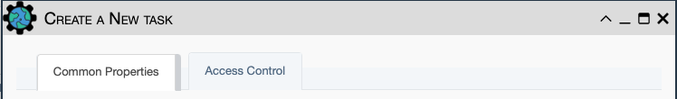
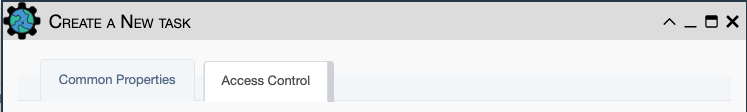
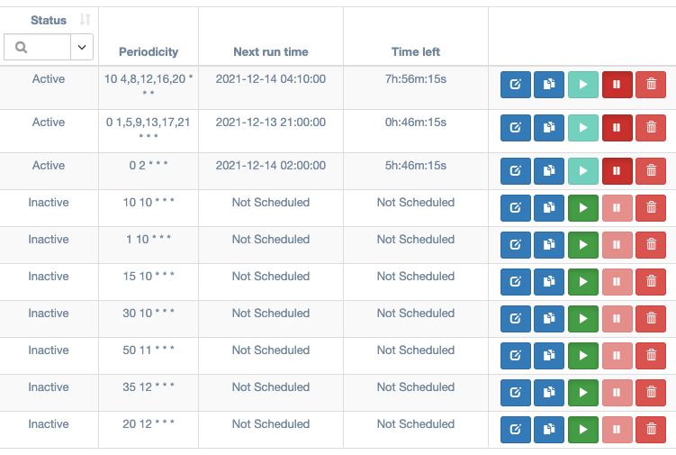
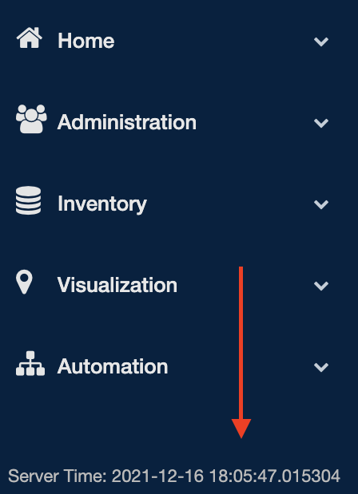
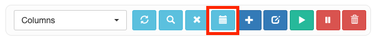
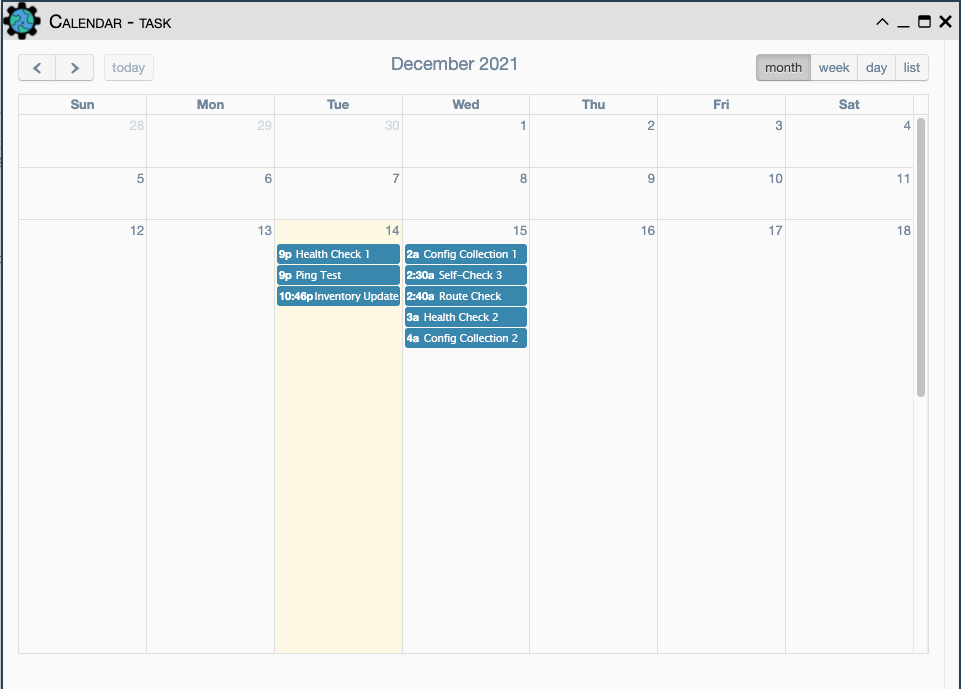

# Scheduling

The ability to schedule eNMS services to run without user input
is a key feature of the platform. Services can be configured to trigger at
a certain time, repeat at a given frequency, and even stop recurring after a 
specified date, allowing the user to limit the number of times
the task is repeated.

## Creating Tasks

Instead of having to run services on-demand, they can be scheduled by
creating a task from `Automation / Scheduling`. Depending on what one would like 
to do with a scheduled task, the user may need to provide data for several parameters.
Below are all the input fields that can be filled, with brief descriptions of 
what they do:



| Field | Required? | Description |
| - | - | - |
| Name | Yes | The name by which eNMS will refer to the task |
| Creator | (Read-only) | User that created this Task |
| Admin Only | No | True to allow only admins to view, edit, or run/pause the Task  |
| Scheduling Mode | Yes | Either "Standard" or "Crontab"; see [Scheduling Modes](#scheduling-modes) for more |
| Description | No | A brief description of what the task does |
| Start Date | Only in [Standard Mode](#standard-scheduling) | the calendar date on which the task will begin running at the specified interval |
| End Date | No | The calendar date on which eNMS will stop running the task | 
| Frequency | No | A numerical value used to determine how often the task will repeat after its initial trigger is met |
| Frequency Unit | Yes | Assigns a unit of time to the Frequency field. Can be "Seconds", "Minutes", "Hours", or "Days", and defaults to "Seconds" |
| Crontab Expression | Only in [Crontab Mode](#crontab-scheduling) | the expression used to calculate the frequency of the task |
| Payload | No | The initial payload to be supplied to the scheduled service at runtime; more information can be found [in the Services documentation.](./services.md) |
| Devices | No | A selection of individual devices the Service will be run on each time the task is triggered |
| Pools | No | A group (or groups) of devices the Service will be run on each time the task is triggered - useful for large selections of devices |  
| Service | Yes | The Service that the task will run at its specified time or frequency |

!!! note

    If both the Devices and Pools fields are left empty, the service will run using its own 
    default targets. Otherwise, the task targets (all selected devices, plus all devices
    of all selected pools) override the service targets when the service runs.



User maintained `Access Control` is available for this object. This allows the `Owners` to select desired access.
[Check out this page for more details on modifying `Access Control`.](../administration/overview.md) 

## Scheduling Modes

Currently, eNMS offers two scheduling modes:

### Standard Scheduling

Standard, or "Date" Scheduling mode relies on the user specifying a start date,
frequency, frequency unit, and (optionally) an end date. Once the start date is 
reached, the task will begin repeating at the given interval until it reaches the
end date. If no end date is specified, the service will keep repeating until manually
stopped. 

### Crontab Scheduling

This mode relies on a *Crontab Expression* in the task's parameters. Crontab
expressions use numerical values, whitespace, and wildcards to specify moments or
periods of time. [Reference information on the format can be found here.](https://en.wikipedia.org/wiki/Cron#Overview)

As an example, the following expression applied to a Crontab Scheduling mode task
would result in a service that runs every 15 minutes (`*/15`), but *only* on Tuesdays
and Thursdays (`2,4`):

```
*/15 * * * 2,4
```

## Managing Tasks

All tasks can be paused and resumed using the controls in the task table.
**Newly created tasks are set to paused by default.** Active tasks display 
the date that they will be run next by the scheduler, as well as the amount 
of time left until then.

|  |
| -- |
| The task table from the `Automation / Scheduling` page. Note that the *active* tasks cannot be made active, and the *inactive* tasks cannot be made inactive. |

!!! note

    If a task is **Active** without a next run date, it
    is likely that the scheduled job database was lost. Try editing the task
    and saving it. This will restore the scheduled portion of the task.

### Timezone Considerations

When specifying a start time, one must take into account the server's
time zone configuration, as it may not match the user's local time zone. 
Often in network administration, the server will be set to UTC (Coordinated
Universal Time), but for verification, the current server time will always be
displayed in the bottom-left corner of eNMS in the navigation panel:



To run a scheduled task at a specific local time, ensure that the start time
or crontab expression is adjusted to the server time.

## Task Calendar

In addition to displaying the next runtime of a task and the time remaining, once
a task is scheduled and active eNMS also sends the event information to an in-app
calendar. This view can be accessed from the main controls of the task table:



In the calendar view one will be able to see the next runtime of each active 
task as a calendar event. Only the *next* runtime will be visible for tasks. Once
the task runs again and the next runtime is re-calculated, the calendar will
also be updated.

The controls in the top right of the window allow the user to select between 
levels of granularity: month, week, day, and list. The month, week, and day
options maximize the view according to the selected time period. The list view 
replaces the calendar with a sequence of all next runtimes starting with the event 
that will occur the soonest. 

