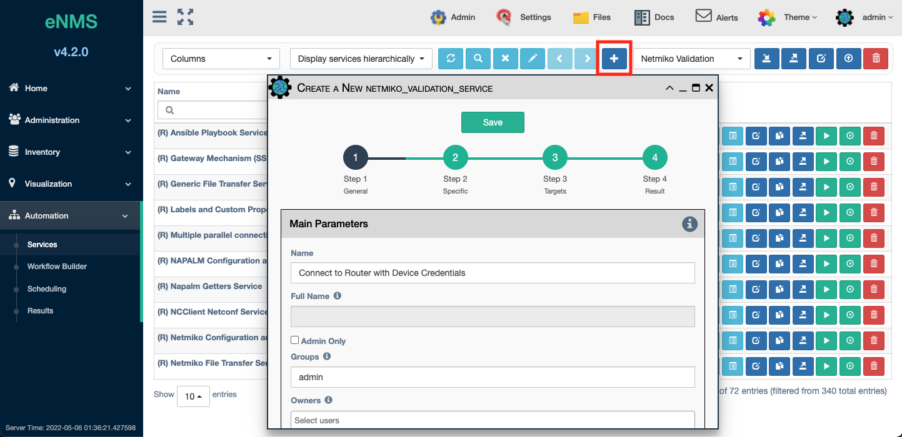
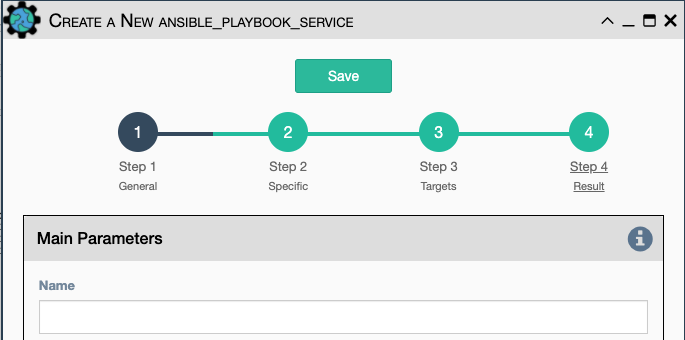
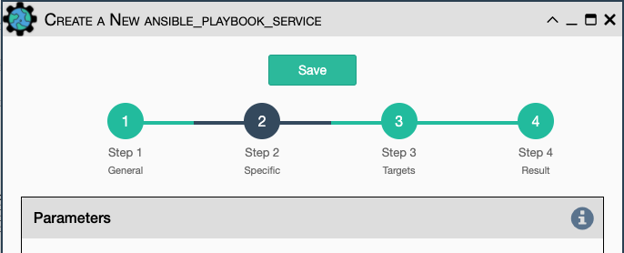
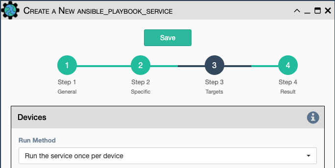
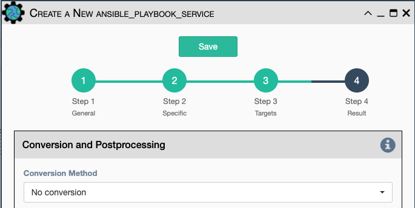

## Service Editor Panel

The Service Editor Panel is accessible from the following locations:

- `Automation -> Services` button bar for existing services.
- `Automation -> Workflow Builder` by double clicking an existing service
  or using the `Edit` button to edit a workflow (Workflows are services too).
  Also right mouse click on an existing Service, and then select `Edit`.
- `+` button in both `Automation -> Services` and `Workflow Builder` to create
  new Services from the Service Types pull-down.
  

### Section `Step 1: General`

#### Main Parameters

-   `Name` - (**mandatory**) Must be unique either within the
    enclosing workflow or unique among top-level services.
-   `Full Name`: (**display only**) Fully qualified service name including all
    workflow nesting or a **\[Shared\]** tag.
-   `Creator` - User that created the service.
-   `Admin Only` - Only admin users are allowed to edit or run.
-   `Service Type` - (**display only**) The service type of the current
    service instance.
-   `Disabled` - Prevents the workflow or service from running.
-   `Disabled Time & User` - (**display only**) Shows the user and time that the
    service was disabled.
-   `Shared` - Checked for **Shared** services. 

!!! Note

	Services can be standalone, shared, or scoped within a workflow. Shared
	services (or subworkflows) can exist inside multiple workflows, and a
	change to a shared service affects all workflows that use it. A service
	which is scoped within a workflow, either by creating the service inside
	the workflow or by deep copying the service into the workflow, exists
	only inside that workflow, so changes to it only affect its parent
	workflow. A standalone service exists outside of any workflow. A
	superworkflow acts as a template or wrapper around another workflow and
	allows for services to be run before and after the main workflow (which
	exists inside the superworkflow as a `Placeholder`). Because multiple
	workflows can specify the same superworkflow, the superworkflow acts as
	if it is shared.

- `Workflows` - (**display only**) Displays the list of workflows that
    reference the service.
- `Description` / `Vendor` / `Operating System` - Useful for filtering
    services in the table.
- `Initial Payload` - User-defined dictionary that can be used anywhere
    in the service.
- `Parameterized Form is Mandatory` - Force display of the 
    Parameterized Form before execution whenever the service is run
    interactively.
- `Parameterized Form` - (default is configurable in `setup/automation.json`)
    A user defined input form 
    that pops up before a Parameterized Run of the service. Values entered 
    to this form at runtime are available within running services and can
    override properties of the "Run" class.  Forms defined on nested
    services or subworkflows are not displayed.
    
    The following properties can be overridden using Parameterized Form:
    
    | Property | Description |
    | - | - |
    | target_devices | list of target devices names. |
    | target_pools | list of target pool names. |
    | device_query | string; Python expression for which devices to select. |
    | device_query_property | string; either `"name"` or `"ip_address"`. |
    | max_processes | integer; how many threads to run, cannot exceed recommended max. |
    | multiprocessing | boolean; turn multiprocessing on/off. |
    | mail_recipient | string; comma-separated list of email addresses. |
    | send_notification | boolean; turn notification on/off. |
    | custom | Example: `custom_field = StringField('Custom Field', default='desired_default_value')`  This field can be referenced via:  `payload["form"]["custom_field"]`  OR  you may refer directly to the variable name `custom_field`   Other WTForm components can be used to define a variety of properties. |

- `Priority` - (default: `1`) Allows the user to determine the order a
    service runs when two services are ready to run at the same time.
    The service with a higher priority number is run first.
- `Number of retries` - (default: `0`) Number of retry attempts when the
    service fails. If the service has device targets, this is the number
    of retries for each device.
- `Time between retries (in seconds)` - (default: `10`) Number of
    seconds to wait between each attempt.
- `Maximum number of retries` - (default: `100`) Used to prevent infinite
    loops in workflows.  Users are able to manipulate the `retries`
    variable in `post processing` for service results.  Once this 
    number of retries is reached, the service will fail.
    
!!! Note

	The retry will affect only the devices for which the service failed.
	Let's consider a service configured to run on 3 devices D1, D2, and D3
	with 2 "retries". If it fails on D2 and D3 when the service runs for
	the first time, eNMS will run the service again for D2 and D3 at the
	first retry. If D2 succeeds and D3 fails, the second and last retry will
	run on D3 only.    
    
- `Type of Credentials` - (default: Any) Allows the user to limit the type
    of credential used when running the 
    service to Read versus Read-Write credentials, assuming both credentials
    are accessible by the user. 
- `Logging` - (default: `Info`, configurable in `setup/logging.json`) 
    The log level to use when running the service; it governs logs written
    to the log window in the UI, as well as the logs that are written to
    the log files.
- `Save only failed results` - (default: False) If enabled, the service
    will not generate a result unless there was a failure. This saves
    database space and improves performance. Beware if a subsequent service
    needs to rely on this service's result.
- `Update pools after running` - (default: False) Update all pools after
    this service runs. Note that updating all pools is performance intensive.

#### Workflow Parameters 

While the parameters in this section can be used by stand-alone Services, they 
generally provide more benefits for Service(s) that run inside of a Workflow. 

-   `Preprocessing` - A python script that
    runs before the service is executed. If the service has device
    targets, the code will be executed for each device independently,
    and a `device` global variable is available. Preprocessing is
    executed for standalone services and for those within a workflow. This
    feature is useful for setting initial condition variables using
    `set_var()` that can be used for conditional processing within the
    service or workflow elsewhere; for example using the same workflow
    to perform pre- and post- check tests on a device.
    -	NOTE: When using `Iteration Devices` each of those target devices 
    	will run a copy of `Preprocessing`.
-   `Skip Query` - This field expects a python expression that evaluates
    to either `True` or `False`. The service will be skipped if `True`
    and will run otherwise. 
    -	NOTE: When using `Iteration Devices`, this 
    skip query will evaluate both the service's targets from Targets/Devices
    and Targets/Iteration, if either is not skipped the workflow will
    attempt to follow the appropriate success or failure edge. 
-   `Skip Value` - Defines the success value of the service when skipped
    (in a workflow, the success value defines whether to follow the
    success path (success edge), the failure path (failure edge), or be
    discarded (in which case no result is created and the workflow graph
    will not proceed for that device). Note that another parallel part of
    the workflow might still generate a result for the device if discarded
    in one path (when parallel paths are used in the workflow).
-   `Maximum number of runs` - (default: `1`) Number of times a service is
    allowed to run in a workflow.
-   `Time to Wait before next service is started (in seconds)` - (default:
    `0`) Number of seconds to wait after the service is done running.

#### Custom Properties

The eNMS administrator can add extra properties to the service form that
are saved on the service instance.  These Custom Property definitions are added
in `setup/properties.json`.  A field for entry of Custom Property values is
included in the [Custom Properties section](../../advanced/customization/#custom-properties).

Additional information for these fields
may be available using the help icon next to the field label.

The location for the help files can specified in the `setup/properties.json`,
for example:

		"help": "custom/impacting"

#### Access Controls

User maintained `Access Control` is available for services. This allows the
`Owners` to select desired access.
[Check out this page for more details on modifying `Access Control`.](../administration/overview.md)  

### Section `Step 2: Specific`

This section contains all parameters that are specific to the service
type. For instance, the "Netmiko Configuration" service that uses
Netmiko to push a configuration will display Netmiko parameters (delay
factor, timeout, etc) and a field to enter the configuration to push to
the device.

The content of this section is described for each service in the
`Service Types` section of the docs.

### Section `Step 3: Targets`

#### Devices
`Run method` on a workflow: Defines whether the workflow runs a device at a
time or a service at a time, and whether device targets are taken from the
workflow or each service.

`Run Method` on a service: Defines whether the service should run exactly once,
or if it should run once per device. Most service types are designed to
run once per device.

The run method, targets, and multiprocessing defined on a workflow and nested
services work together in a complex way.  The table below describes each combination:

<table href="doctable.css" rel="stylesheet" type="text/css">
<thead>
  <tr>
    <th>Enclosing Workflow  Run Method</th>
    <th>Child Service Run Method</th>
    <th>Behavior</th>
  </tr>
</thead>
<tbody>
  <!-- Standalone Service -->
  <tr class="tr-doctable" rowname="standalone">
    <td rowspan="2" rowname="standalone">Standalone Service (No enclosing workflow)</td>
      <td>Run the service once per device</td>
      <td>The service runs once for each device.   Devices come from the service.   Multiprocessing allows multiple instances of the service to run concurrently, each for a different device. </td>
  </tr>
  <tr class="tr-doctable" rowname="standalone">
      <td>Run the service once</td>
      <td>The service runs exactly once.  Devices come from the service.  Multiprocessing has no effect.</td>
  </tr>

  <!-- Device by Device -->
  <tr class="tr-doctable" rowname="devicebydevice">
    <td rowspan="2" rowname="devicebydevice">Run the workflow device by device</td>
      <td>Run the service once per device</td>
      <td>Each device flows through the workflow independently.  Run Method on nested services is irrelevant because the workflow is run for a single device at a time. Devices come from the workflow.  Multiprocessing on the workflow allows multiple devices to run the entire workflow concurrently and is ignored on nested services.</td>
  </tr>
  <tr class="tr-doctable" rowname="devicebydevice">
      <td>Run the service once</td>
      <td>This combination is misleading because each device runs the workflow independently.  Do not use this combination of Run Methods.</td>
  </tr>

  <!-- Service by Service with Workflow Targets -->
  <tr class="tr-doctable" rowname="sxs_wftargets">
    <td rowspan="2" rowname="sxs_wftargets">Run the workflow service by service using workflow targets</td>
      <td rowname="sxs_wftargets">Run the service once per device</td>
      <td rowname="sxs_wftargets">Each service runs for all devices before moving to the next service.   Devices come from the workflow and are ignored on the service.   Multiprocessing on the service allows multiple devices to run the service concurrently.  Multiprocessing on the workflow is ignored.</td>
  </tr>
  <tr class="tr-doctable" rowname="sxs_wftargets">
      <td>Run the service once</td>
      <td>The service runs exactly once.  Devices come from the workflow and are ignored on the service.  Multiprocessing on the workflow or service has no effect as the service runs once.</td>
  </tr>

  <!-- Service by Service with Service Targets -->
  <tr class="tr-doctable" rowname="sxs_stargets">
    <td rowspan="2" rowname="sxs_stargets">Run the workflow service by service using service targets</td>
      <td>Run the service once per device</td>
      <td>Each service runs for all devices before moving to the next service.   Devices come from the service and are ignored on the workflow.   Multiprocessing on the service allows multiple devices to run the service concurrently.  Multiprocessing on the workflow is ignored.</td>
  </tr>
  <tr class="tr-doctable" rowname="sxs_stargets">
      <td>Run the service once</td>
      <td>The service runs exactly once.  Devices come from the service and are ignored on the workflow.  Multiprocessing on the workflow or service has no effect as the service runs once.</td>
  </tr>
  
</tbody>

</table>

- `Devices`: individually select devices from inventory to run on.

!!! Note

    The python variables `device` and `devices` provide access to the current device
    and the full set of devices.  No concept of a current device exists for services
    with run method `Run the service once`; therefore the `device` variable may be
    `None`.

- `Pools` - pools of Devices from inventory to run on.
- `Update target pools before running` - Initiate a pool recalculation on the
  target pools before running the automation.
- `Device Query` - Use a python expression to identify the target devices.
- `Query Property Type` - Does the above expression evaluate to Device Names or
  IP Addresses.
- `Multiprocessing` - Enables parallel processing on devices.
- `Maximum number of processes` - The limit to control simultanous parallel
  processes (configurable via settings.json).

!!! Note

    The above parameters are cumulative: the automation runs on the combined
    list of targets from Devices, Pools and the Device Query.

#### Iteration

Multiple actions are sometimes necessary when the service is triggered
for a target device. Use iteration devices when those actions should be
performed on a set of devices related to the current target device. Use
iteration values when the actions should be performed on the current
target device.

-   `Iteration Devices` - Query that returns an **iterable** (e.g. Python
    list) of **strings (either IP addresses or names)**.
    -   The service is run for each device as the target device,
        allowing operations against a set of devices related to the
        original target.
    -   `Iteration Devices Property` - Indicates whether iterable
        `Iteration Devices` contains IP addresses or names, for eNMS to
        look up actual devices from the inventory.
    -   NOTE: When using `Iteration Devices` and  `Skip Query` the skip query
        will evaluate both the service's targets from Targets/Devices and 
	    Targets/Iteration, if either is not skipped the workflow will
    	attempt to follow the appropriate success or failure edge.
    -   NOTE: When using either `Preprocessing` or `Postprocessing` each
    	will be run using each of the `Iteration Devices` targets.	
-   `Iteration Values` - Query that returns an **iterable** (e.g. Python
    list) of **strings**.
    -   The service is run for each value.
    -   `Iteration Variable Name` Python variable name to contain each
        successive value from the `Iteration Values` query. The resulting
        `Iteration Variable` is a global variable and can be accessed anywhere
        in the workflow directly to get the list of values without needing
        get_var().

`Iteration Devices` and `Iteration Values` can be used together.  Conceptually,
this is like three levels of nested loops where the service is run for each
combination of target device, iteration device, and iteration value.

### Section `Step 4: Result`

The `Result` section defines operations on the service result. Each form
group offers a different type of results operation. These operations are
performed **in the order found on the `Result` page**. Result operations are
executed for each device for `Run method` **Run the service once per device**,
and are executed only once for `Run method` **Run the service once**.

#### Conversion and Postprocessing

-   `Conversion Method` - The type of automatic conversion to perform on
    the service result.
    -   `No conversion` - (default) Use the result with no modification.
    -   `Text` - Convert the result to a python string.
    -   `JSON` - Convert a string representing JSON data to a python
        dictionary.
    -   `XML` - Convert a string representing XML data to a python
        dictionary.

Python can be used to inspect or modify the service result. This is
typically used to perform complex validation or to extract values from
the result for use in subsequent services.

-   `Postprocessing Mode` - Control whether or not the `Postprocessing`
    script is executed.
    -   `Always run` - The `Postprocessing` script will
        execute for each device.
    -   `Run on success only` - (**default**) 
    -   `Run on failure only` -
-   `PostProcessing` - A python script to inspect or update the current
    result.
    -   Variable **results**.
        -   Contains the full results dictionary for the current device,
            exactly as seen in the results view.
            - Changes to this dictionary are reflected in the final
                result of the service.
            - The user can use python code to even change the value of the
                `success` key.
        -   **results["success"]** The overall service status.
        -   **results["result"]** The resulting data from running
            the service.
    -   See [Using Python in the Service Editor](../service_python_code/) for the full
        list of variables and functions.
    -   A log is generated any time postprocessing is skipped.
    -   NOTE: When using `Iteration Devices` each of those target devices 
    	will run a copy of `Postprocessing`.

#### Validation

Validation can consist of 

- **Text matching**: looking for a string in the result, or matching
the result against a regular expression.

- **Dictionary matching**: Check that a dictionary is included or
equal to the result.

- `Validation Condition` - When to run Validation on the result:
    -   `No validation` - No validation is performed.
    -   `Run on success only`.
    -   `Run on failure only`.
    -   `Always run`.
- `Validation Method` - The validation method depends on whether the
    result is a string or a dictionary.
    -   `Validation by text match` - Matches the result against `Content Match`
        (string inclusion, or regular expression if
        `Match content against Regular expression` is selected).
    -   `Validation by dictionary inclusion` - Check that all `key` : `value`
        pairs from the dictionary provided in `Dictionary Match` can be found
        in the result.
    -   `Validation by dictionary equality` - Check for equality against the
        dictionary provided in `Dictionary to Match Against`.
- `Section to Validate` - (default: `results['result']`) Which part of the
    payload dictionary to perform validation on.
- `Content Match` - Text to Match against when `Validation by text match`
    is selected above.
- `Content Match is a regular expression` - Treat the match text as a regular
    expression for `Validation by text match`.
- `Dictionary to Match Against` - Provide a dictionary in `{}` for performing
    dictionary inclusion and equality matches.
- `Delete spaces before matching` - (`Text` match only) All whitespace
    is stripped from both the output and `Content Match` before
    comparison to prevent these differences from causing the match to
    fail.
- `Negative Logic` - Reverses the `success` boolean value in the
    results: a success becomes a failure and
    vice-versa. This provides a simpler solution than using negative
    look-ahead regular expressions.

#### Report
The Report feature allows the developer to present a formatted report to the user
at the end of execution.

- `Report Template` - Copy the report from a predefined template.  By default `Empty report`
   leaves the developer to define the report.  One sample template is provided (`report_results.j2`)
   that produces an HTML report with one section for each device; once copied feel free to modify
   this default as needed.
- `Report Display Format` - Choose `Text` or `HTML` to specify the report output format.
- `Interpret Report as Jinja2 Template` - When checked, the contents of the `Report` field is
  processed as a Jinja2 template.
- `Report` - Use text with variable substituion or a Jinja2 template to format the desired
   report output.
- `Display Report Instead of Results` - When checked, the report is displayed instead of
   the results table at service completion.  While reports can be created on any service,
   only the report from the top-level service or workflow can be displayed automatically.
- `Send Report in Mail Notification` - When checked, the report will be included in any email
   notification sent by the service.

#### Notifications

When a service finishes, the user can choose to receive a notification with
the results. There are three types of notifications:

**Mail notification** - eNMS sends an email to provided address(es)

**Slack notification** - eNMS sends a message to a provided Slack channel

**Mattermost notification** - eNMS sends a message to a provided Mattermost
channel

Configure the following parameters:

-   `Send Notification` - Enable sending results notification.
-   `Notification Method` - Mail, Slack or Mattermost.
-   `Notification Header` - A header displayed at the beginning of the
    notification. (Variable Substitution is supported.)
-   `Include Device Results` - for service (not workflow) level notifications.
-   `Include Result Link in summary` - Whether the notification contains
    a link to the results.
-   `Mail Recipients` - Must be a list of email addresses, separated by
    comma.  (Variable Substitution is supported.)
-   `Reply-to Email Address` - Must be a list of email addresses, separated by
    comma.
-   `Display only failed nodes` - The notification will not include
    devices for which the service ran successfully.

To set up the mail system, the parameters in the `mail`
section of the settings must be configured: `server`, `port`, `use_tls`,
`username`, `sender`, `recipients`, and the password must be set via the
`MAIL_PASSWORD` environment variable.

The `Mail Recipients` parameter must be set for the mail system to work;
the `Admin > Administration` panel parameter can also be
overridden from Step 2 of the Service Instance and Workflow configuration
panels. For Mail notification, there is also an option in the Service
Instance configuration to display only failed objects in the email
summary versus seeing a list of all passed and failed objects.

In Mattermost, if the `Mattermost Channel` is not set, the default
`Town Square` will be used.
