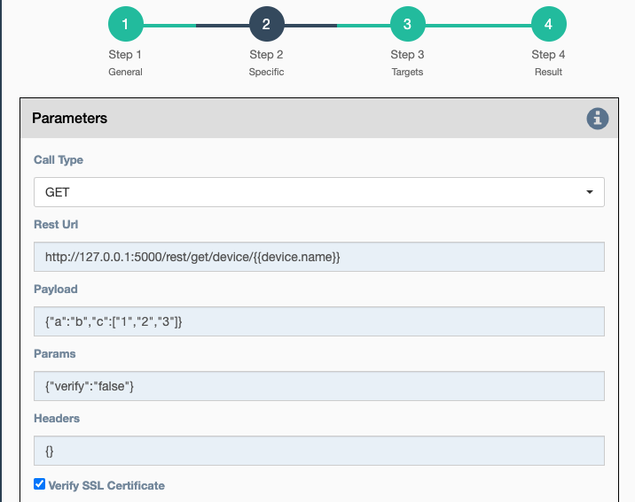

## Overview

There are two types of fields in the service panel where the user is
allowed to use pure python code: substitution fields (light blue
background) and python fields (light red background). In these fields,
the user can use any python code, including a number of **variables** that
are made available to the user.

### Variables

- `delete()`
    -   **Meaning**: Allows for deleting one of the following object types
        in the database: `device`, `link`, `pool`, `service`. Calling
        this from a workflow requires the user to have edit access to the
        object type; otherwise it will fail.
        **Type**: Function.
        **Available**: Always.
    -   **Return Type**: Object that was created or None.
    -   **Parameters**:
        -   `model`: (**mandatory string**) `device`, `link`, `pool`, or `service`.

- `device`
    -   **Meaning**: This is the current device on which the service is
        running. `device` is not defined in contexts without a concept
        of a current device.
    -   **Type**: Database Object.
    -   **Available**: When the service is running on a device.
    -   **Properties**: Member attributes which can be referenced as
        `{{device.property}}`, such as `{{device.name}}` or
        `{{device.ip_address}}`, inside of forms. The following base
        properties are supported:

        - device.name.
        - device.creator.
        - device.last_modified.
        - device.last_modified_by.
        - device.subtype.
        - device.description.
        - device.model.
        - device.location.
        - device.vendor.
        - device.operating_system.
        - device.os_version.
        - device.ip_address.
        - device.latitude.
        - device.longitude.
        - device.port.
        - device.configuration.
        - device.last_failure (last failure timestamp for
          configuration collection).
        - device.last_status (last status timestamp for configuration
          collection).
        - device.last_update (last update timestamp for configuration
          collection).
        - device.last_runtime (last runtime timestamp for
          configuration collection).
        - device.last_duration (last time duration for configuration
          collection).
        - [Custom device properties, if implemented](custom_device_properties.md).

- `devices`
    - **Meaning**: The set of target devices for the service or workflow,
        i.e., the union of devices, pools, and the device query. Device by
        device workflows run one device at a time therefore `devices`
        contains only one device, not the full list.
    - **Type**: Set of Database Objects.
    - **Available**: In service by service workflows.

-   `dict_to_string()` - convert a dictionary to a string form with
    indentation.
        **Type**: Function.
        **Available**: Always.
    -   **Return Type**: string
    -   **Parameters**:
        - `input`: (**`dict` or `any`, mandatory**)
        - `depth`: (**optional**) tab characters used to indent the output (Default=0)

    ``` 
    # Variable substitution example
    {{dict_to_string(get_var("the_variable_name"))}}
    ```

    ``` 
    # General example
    test = {'key': 'value', 'key2': [45, 1135, 544]}
    print(dict_to_string(test))
    # output:
    key: value
    key2:
            - 45
            - 1135
            - 544
    ```
    
- `factory()`
    -   **Meaning**: Allows for creating one of the following object types
        in the database: `device`, `link`, `pool`, `service`. Calling
        this from a workflow requires the user to have edit access to the
        object type; otherwise it will fail.
        **Type**: Function.
        **Available**: Always.
    -   **Return Type**: Object that was created or None.
    -   **Parameters**:
        - `model`: (**mandatory**) `device`, `link`, `pool`, or `service`.
        - `commit`: (**optional**) `True` or `False`(Default).
        - Model properties: Specify values for the new instance: 
          ip_address="1.2.3.4" when creating a new device. 
           
- `fetch()`
    -   **Meaning**: Allows for retrieving one of the following object types
        from the database: `device`, `link`, `pool`, `service`. Calling
        this from a workflow requires the user to have edit access to the
        object; otherwise it will fail.
        **Type**: Function.
        **Available**: Always.
    -   **Return Type**: Database Object or List of Database Objects.
    -   **Parameters**:
        - `model`: (**mandatory**) `device`, `link`, `pool`, or `service`.
        - `allow_none`: (**optional**) `True` or `False`(Default).
        - `allow_matches`: (**optional**) `True` or `False`(Default).
        - Model properties: (**mandatory**) Property values to identify
          the desired object: ip_address="1.2.3.4".
  
- `fetch_all()`
    -   **Meaning**: Allows for retrieving all instances for one of the
        following object types from the database: `device`, `link`, `pool`,
        `service`. Calling this from a workflow requires the user to have
        edit access to the object; otherwise it will fail.
        **Type**: Function.
        **Available**: Always.
    -   **Return Type**: Database Object or List of Database Objects.
    -   **Parameters**:
        - `model`: (**mandatory**) `device`, `link`, `pool`, or `service`.
        - `allow_none`: (**optional**) `True`(Default) or `False`.
        - `allow_matches`: (**optional**) `True`(Default) or `False`.
        - Model properties: (**optional**) Filter values to limit the set of
          returned objects: vendor="Cisco".
            
- `get_neighbors()`
    -   **Meaning**: Used to return links or devices connected to the target
        device.
    -   **Type**: Function.
    -   **Available**: When the service is running on a device, this function
        must be called on a `device` object.
    -   **Parameters**:
        -   `object`: (**mandatory**) `device` or `link`.
        -   `direction`: (**optional**) `source` or `destination`.
        And optionally, any number of the Link **properties** can be passed as
        parameters as well. The following base properties are supported:
        -   `name`.
        -   `description`.
        -   `subtype`.
        -   `model`.
        -   `source_name` (source device name).
        -   `destination_name` (destination device name).
        -   [Custom link properties, if implemented](custom_link_properties.md).
        
- `get_result()`
    -   **Meaning**: Fetch the result of a service in the workflow that
        has already been executed.
    -   **Type**: Function.
    -   **Return Type**: Dictionary.
    -   **Available**: When the service runs inside a workflow.
    -   **Parameters**:
        -   `service_name`: (**mandatory**) Name of the service.
        -   `device`: (**optional**) Name of the device, when you want to
            get the result of the service for a specific device.
        -   `workflow`: (**optional**) If the workflow has multiple
            subworkflows, a subworkflow can be specified to get the
            result of the service for a specific subworkflow.
        -   `all_matches`: (**optional**, default=False) When True, returns
            a list with results for all devices.  Otherwise only the first
            result is returned.

- `get_var()`
    -   **Meaning**: Retrieve a value by `name` that was previously
        saved in the workflow. Use `set_var()` to save values. Always use
        the same `device` and/or `section` values with `get_var()` that
        were used with the original `set_var()`.
    -   **Type**: Function.
    -   **Return Type**: None.
    -   **Available**: Always.
    -   **Parameters**:
        -   `name`: Name of the variable.
        -   `device`: (**optional**) The value is stored for a specific
            device.
        -   `section`: (**optional**) The value is stored in a specific
            "section".

- `log()`
    -   **Meaning**: Write an entry to a log file.
    -   **Type**: Function.
    -   **Return Type**: None.
    -   **Available**: Always.
    -   **Parameters**:
        -   **severity**: (**string**) Valid values in escalating
            priority order: **debug**, **info**, **warning**, **error**,
            **critical**.
        -   **message**: (**string**) Verbiage to be logged.
        -   **device**: (**string**, **optional**) Associate log message
            to a specific device.
        -   **app_log**: (**boolean**, **optional**) Write log message
            to application log in addition to custom logger.
        -   **logger**: (**string**, **optional**) When specified, the
            log message is written to the named custom logger instead of
            the application log. Set **app_log** = True to send log
            message to both the custom and application logs. Loggers are
            defined in the `setup/logging.json` configuration file.

- `parent_device`
    -   **Meaning**: Parent device used to compute derived devices.
        `parent_device` is useful when using iteration devices where
        `device` is the current iterated device and `parent_device` is
        the current device from (service or workflow) targets. When not
        using device iteration, `device` and `parent_device` are equal.
    -   **Type**: Database Object.
    -   **Available**: When the iteration mechanism is used to compute
        derived devices.

- `payload`
    -   **Meaning**: This is the entire dictionary of variables defined by
        `set_var()` and populating the `initial_payload` field for a workflow.
    -   **Type**: Dictionary.
    -   **Available**: Always.
    
- `placeholder`
    -   **Meaning**: This is the reference inside a superworkflow for the main
        workflow that the superworkflow wraps around. A superworkflow must have
        the `placeholder` service added to its graph in order to function.
    -   **Type**: Database Object of type Service.
    -   **Available**: When a service is running inside a superworkflow.

- `results`
    -   **Meaning**: The results of the current service.
    -   **Type**: Dictionary.
    -   **Available**: After a service has run.
        
- `set_var()`
    -   **Meaning**: Save a value by `name` for use later in a workflow.
        When `device` and/or `section` is specified, a unique value is
        stored for each combination of device and section. Use `get_var`
        for value retrieval.
    -   **Type**: Function.
    -   **Return Type**: None
    -   **Available**: Always.
    -   **Parameters**:
        -   `name`: Name of the variable.
        -   `device`: (**optional**) The value is stored for a specific
            device.
        -   `section`: (**optional**) The value is stored in a specific
            "section".

!!! note

    Variables saved globally (i.e. set_var("var1", value) and for a device
    (i.e. set_var("var2", device=device.name)) are made available as global
    python variables within
    every Python code-field within the forms. This allows users to reference
    values as `var1` and `var2` in subsequent services.  get_var is required
    for access
    to values set for a device other than the current device and for those
    using a section scope. 
    
!!! note
  
    If both a global and device specific set_var variable is defined with the
    same name, only the device specific is made available as a global Python
    variable.  Use get_var() to access the same name set at a different scope.

!!! warning

    The payload (including all set_var variables) is rendered as JSON and saved
    in the database as part of the result.  JSON does not support recursive
    data structures, i.e. data structures with loops.  Saving a reference
    within the payload (or set_var variable) to a value from a higher level
    in the payload will result in a `Recursion Error`.  For example,
    `payload['mydict']['another_dict'] = payload` or
    `set_var("my_payload", payload)` each result in a loop from within the
    payload to a higher level in the payload. 

-   `settings`

    -   **Meaning**: eNMS settings, editable from the top-level `Settings`
        Icon. It is initially set to the content of `settings.json`, and
        it stays synchronized if the option to write changes back to 
        `settings.json` is used.
    -   **Type**: Dictionary.
    -   **Available**: Always.

-   `send_email()` allows for sending an email with optional attached file. It
    takes the following parameters:

    -   `title`: (**string, mandatory**).
    -   `content`: (**string, mandatory**).
    -   `sender`: (**string, optional**) Email address of the sender.
        Defaults to the sender address in eNMS settings.
    -   `recipients`: (**string, optional**) Mail addresses of the
        recipients, separated by comma. Defaults to the recipients'
        addresses in eNMS settings.
    -   `reply_to`: (**string, optional**) Single mail address for
        replies to notifications.
    -   `filename`: (**string, optional**) Name of the attached file.
    -   `file_content`: (**string, optional**) Content of the attached
        file.

    ``` 
    send_email(
        title,
        content,
        sender=sender,
        recipients=recipients,
        reply_to=reply_to,
        filename=filename,
        file_content=file_content
    )
    ```

- `username`
    -   **Meaning**: The username that created the run
    -   **Type**: string
    -   **Available**: Always
            
-   `workflow`

    -   **Meaning**: current workflow.
    -   **Type**: Database Object.
    -   **Available**: when the service runs inside a workflow.

### Substitution fields

Substitution fields, marked in the interface with a light blue
background, lets the user include python code inside double curved brackets
(`{{user python code}}`). For example, the URL of a REST call service is
a substitution field. If the service is running on device targets, use 
the global variable `device` in the URL. When the service is
running, eNMS will evaluate the python code in brackets and replace it
with its value. See [variables](#variables)
for the full list of variables and functions available within substitution
fields.



Running the service on two devices `Device1` and `Device2`, for example, will
result in sending the following GET requests:

``` 
"GET /rest/get/device/Device1 HTTP/1.1" 302 219
"GET /rest/get/device/Device2 HTTP/1.1" 302 219
```

### Python fields

Python fields, marked with a light red background, accept valid python
code (without the double curved brackets '{{}}' of the above Substitution
fields). Some examples of where Python fields are used:

-   In the `Device Query` field of the "Devices" section of a service.
    An expression that evaluates to an iterable containing the name(s)
    or IP address(es) of the desired inventory devices.
-   In the `Skip Query` field of the "Workflow" section of a
    service. The expression result is treated as a boolean.
-   In the `Variable` field of the `Data Processing Service`.
    The expression result is used as the extracted value.
-   In the code of a Python Snippet Service, or the `Preprocessing` and
    `Postprocessing` field of every service.

  