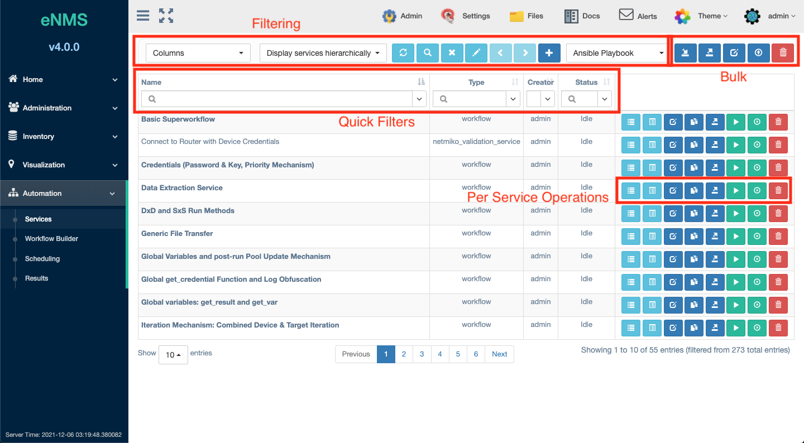
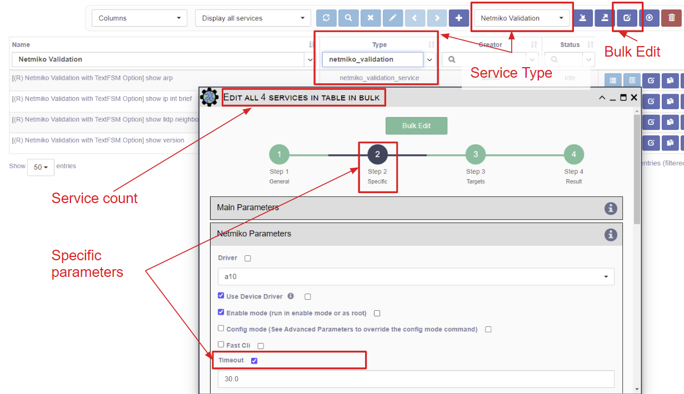

## Services are Units of Work

Services provide the smallest unit of automation in eNMS. Each service
type provides unique functionality that is easily configured to perform
complex operations in the network. Examples: remote command execution,
REST API calls, Ansible playbook execution, and many more.

Services can be powerful on their own, (e.g. ping all devices in the
network and send a status email). They can also be combined within
workflows to automate complex operations such as device upgrades.

Each service type provides a form for configuring its unique
functionality. Common forms are available on every service for defining
device targets, iteration, retries, pre and post processing, result
validation, notifications, etc.

eNMS comes with a number of service types based on network
automation frameworks such as `netmiko`, `napalm` and `ansible`, but
custom service types can be created. Each service type must return a python
dictionary as a result, and dictionaries are the primary means by which
services exchange data.  See the [Service Types](../service_types/)
section for details on each of the different service types.

## Service Management Panel

All services are displayed in the Service Management Panel in 
`Automation / Services`, where new services can be created and edited,
duplicated, deleted, and existing services run.

The Service Management Panel has a number of controls at the top for
Filtering and Bulk operations:

- `Columns` Selector - Choose which columns to display in the table.
- `Display Services hierarchically` (using hyperlinks in the scope of
   the workflow that they are contained in) or Display All Services.
- `Refresh` the Table.
- `Advanced Search:` for complex filtering of the table.
- `Clear Search` criteria.
- `Copy the Selection` of currently displayed Services to the clipboard.
- `New`: Create Service with Service Type pull-down Selector: This opens
   the Service Editor Panel discussed below with a new instance of the 
   selected Service Type.
- `Import Service`: Opens a panel to allow drag and drop of service
   .tgz files (created using the Export service feature) from the user's
   browser. One or multiple services can be uploaded / imported in this way.
   
!!! note
    When importing a workflow .tgz file from another instance of eNMS, and
    that workflow already exists on this instance, first delete the existing
    workflow.  This will prevent eNMS from merging the services and edges from
    the two workflows, which could result in an unintended workflow graph.

!!! note
    Do not attempt to import a workflow .tgz file from an instance of eNMS
    that is running a different eNMS version.  Contact your system administrator
    regarding any necessary conversion.

The following features operate on Bulk Services that are currently
filtered in the table display.

- `Export Service as .TGZ`: Bulk export the filtered set of Services; stored on
   the server in the `files/services` folder. 
- `Bulk Edit`:  Makes the same config change to all currently filtered
   services in the table display.
- `Export as CSV`: Export the current filtered list of services in the
   table display to a .csv file that downloads to the user's browser.
- `Bulk Deletion`: Deletes all services that are currently filtered in the
   table display.

Below the top button bar are the Quick Filter controls for filtering the table.

Each Service Name listed in the table is a hyperlink to the workflow builder panel
for workflows, otherwise the standalone service name.  Each service has its own
button bar on the right that includes:

- `View Logs`: View the service logs.
- `View Results`: View the service results.
- `Edit Service`: Opens the Service Editor Panel with default parameters when
   creating a new service and with saved service parameters when editing an
   existing service.
- `Duplicate Service`: Opens the Service Editor Panel with all parameters
   duplicated to the original service; create a new Service Name to complete.
- `Export Service`: Downloads that Service to the browser in a .tgz file
   containing a YAML file representation of the service profile. 
- `Run Service`: with the saved parameters inside the Service.
- `Parameterized Run`: Run the service after soliciting input fields from the
   user. Input field selection is controlled by the selection of parameters
   in the Step 1 Service Editor Panel.
- `Delete Service`: Deletes this service. 

!!! Note

	Exporting services: In addition to the .tgz file that is downloaded to
    the browser, a copy of the .tgz file is stored in the `files/services`
    directory. This is intended for administrators migrating services from
    one instance of eNMS to another when deploying multiple instances.

## Managing Service Access
User maintained `Access Control` is available for service objects. This allows the `Owners` to select desired access.
[Check out this page for more details on modifying `Access Control`.](../administration/overview.md)  

## Running a Service

Services can be run from the following locations:

- `Automation -> Services` table `Run` button beside each service.
- `Automation -> Workflow Builder` button bar to `Run` or `Parameterized Run` 
  the entire workflow, or right mouse click menu `Run` or `Parameterized Run`.
- `Automation -> Scheduling`: Activated services will run when their scheduled
  time arrives.
- `Visualization`:  A service can be selected to run on the filtered
  list of devices shown - for both the `Geographical View` and the `Network Builder`.
- `Inventory` Devices and Pools tables: A service can be selected to run
  on a device, all filtered devices, a pool, or the filtered pools in the table.
  This same table is also available from the `Dashboard` by clicking on a category
  of devices in the graph.
- Using the `REST API`: the same flexibility provided by the UI is also available 
  via a REST API. 

There are two types of runs:

- Regular run: Uses the saved properties inside the service during the run.
- Parameterized run: A window is displayed with select properties to be 
  provided by the user without saving those properties inside the service.
  Properties selected for display in the parameterized run form are controlled
  in the `Step 1: Main Parameters` section of the `Service Editor Panel`. 

## Inspecting Results

A separate result is stored for each run of a workflow, plus a
unique result for every device and for every service and
subworkflow / superworkflow within that workflow. Each result is displayed
as a JSON object dictionary. In the event that retries are configured, the
results dictionary will contain an overall results section, as well as a
section for each attempt, where failed and retried devices are shown in
subsequent sections starting with attempt2.

Results can be viewed in the following locations:

- `Automation -> Results`: Shows the list of all results.
- `Automation -> Services`: See the `Results` button on the button bar.
- `Automation -> Workflow Builder`:

    - See the `Results` button on the button bar. 
    - The right mouse click menu has a `Results` option for the entire workflow
      or for a particular service depending on click location.
    - The `Result Tree` button opens a tree view panel of service results,
      each with a `Results` button, as well as an `All Results` button that 
      opens the results view table for all runtime results.
    - The `Result Comparison` button opens a filterable list of service
      and device results, which can be selected for comparison.
     
- Remote viewing: the `setup/logging.json` configuration can be modified to
  include a remote syslog endpoint for sending service results using the `log`
  function above. This option allows results to be integrated with a 
  time-series database and dashboard reporting software.

!!! note
    
    Results can be disabled, except for failures, with the `Save only failed
    results` option in `Step 1 Main Parameters` of the Service Editor Panel.
    This allows service and workflow data to be reduced and thus saves database
    space, but beware if subsequent services need to rely on these results.
    
!!! note
    
    When viewing the table of service and device results, a button exists to
    copy the get_result() path to the clipboard. This makes it convenient to
    paste the get_result() path into a variable substitution or python field
    elsewhere in the application to retrieve that result.
    
!!! note

    When viewing an individual result, a download button exists to download
    a json file with the result content to the user's browser.
  
## Inspecting Logs

Viewing device and service Logs is available at all the above 
same results locations. The Log view panel automatically pops up when a service
or workflow is manually initiated via the Services Management table or via
Workflow Builder, and the log window automatically scrolls as logs occur.
Logs for scheduled tasks or REST API initiated automation
jobs produce logs, but they do not cause the Log view panel to open.

The Log view panel allows for the selection of a historical runtimes to view logs
for, and the panel has a `Download Logs` button to download the text logs to
the user's browser.

## Custom Service Types

To define additional, custom Service Types not included in the built-in eNMS Service 
Types, please refer to [Customization](../../advanced/customization/#custom-service-types).

### Bulk Edit example 

!!! tip

    When using the Bulk Edit to edit `Step 2, Specific` properties, one should use the 
    Service Type pull-down to select the Service Type (e.g., Netmiko Commands Service)
    and provide some appropriate filtering (e.g., `type -> netmiko_commands`).
    
    See the example below for changing the Timeout for several Netmiko Commands 
    services.
    
      