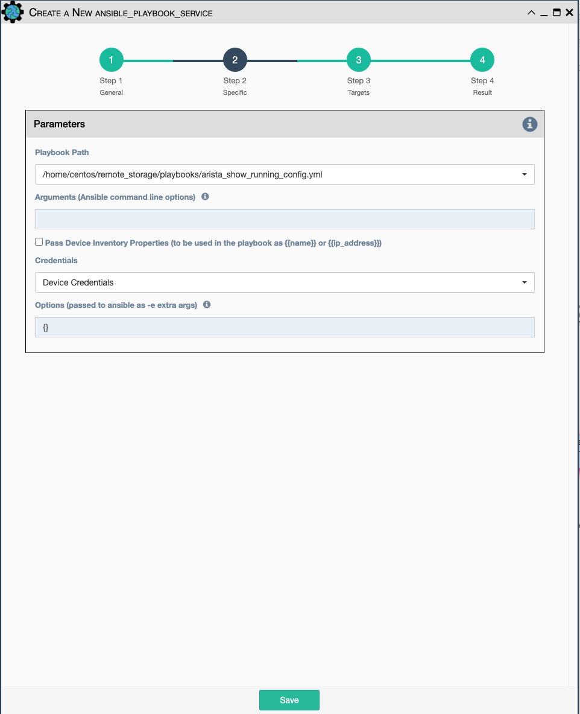

An `Ansible Playbook` service runs an ansible playbook on a set of target
devices and returns a JSON formatted result. The output can be validated
with a command / pattern mechanism, like the `Data Validation Service`.

Configuration parameters for creating this service instance:

- `Playbook Path`: path and filename to the Ansible Playbook. The
  location for displaying playbooks is configurable in eNMS settings.
- `Arguments`: ansible-playbook command line options, which are
  documented **[here](https://docs.ansible.com/ansible/latest/cli/ansible-playbook.html)**.
- `Pass device properties to the playbook`: Pass inventory properties
  using --extra-vars to the playbook if checked (along with the
  options dictionary provided below). All device properties are passed
  such as `device.name` or `device.ip_address`.
- `Credentials` 

    - `Device Credentials`: Currently, only the application managed device
       credentials are allowed to be passed to an ansible playbook.
  
- `Options` Additional --extra-vars to be passed to the playbook
  using the syntax `{'key1':value1, 'key2': value2}`. All inventory
  properties are automatically passed to the playbook using
  --extra-vars (if pass_device_properties is selected above). These
  options are appended.
- Ansible itself supports a number of standard return codes; these are
  returned in the results of the service and include:
    -   0 : OK or no hosts matched.
    -   1 : Error.
    -   2 : One or more hosts failed.
    -   3 : One or more hosts were unreachable.
    -   4 : Parser error.
    -   5 : Bad or incomplete options.
    -   99 : User interrupted execution.
    -   250 : Unexpected error.

!!! note

    This service supports variable substitution in the `arguments` and
    `options` input fields of its configuration form.

