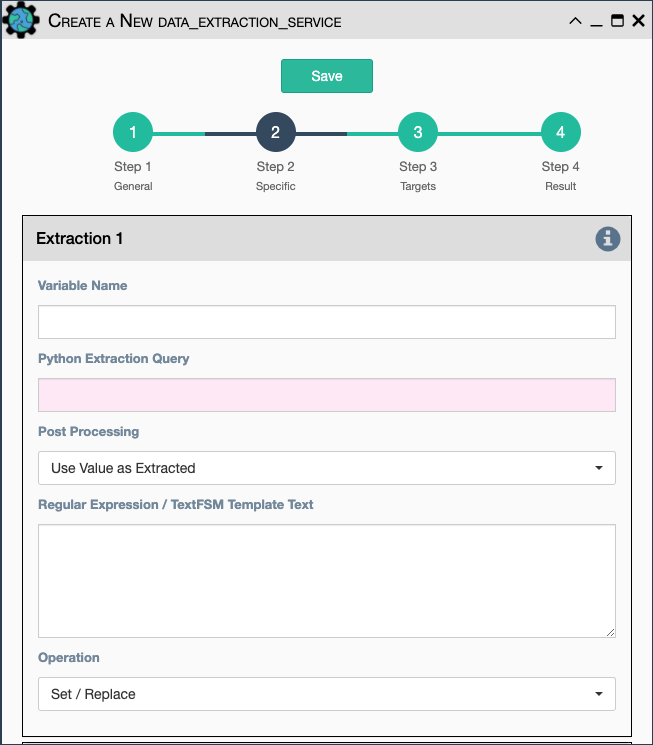

Extract some data from the payload with a python query, and optionally
post-process the result with a regular expression or a TextFSM template.

Configuration parameters for creating this service instance: 

- `Variable Name`: name to give the resulting variable in the results. 

- `Python Extraction Query`: a python query to retrieve data from the
   payload. 

- `Processing`: choose the type of processing: 

    - `Use Value as Extracted`.
    - `Apply Regular Expression (findall)`.
    - `Apply TextFSM Template`.
    
- `Regular Expression/ TestFSM Template Text`: regular expression or
  TextFSM template, depending on the value of the "Processing" field. 

- `Operation` Choose the operation type: 

    - `Set/Replace`: Set the variable value.
    - `Append to a list`: Append the value to an existing list.
    - `Extend List`: Append each value to an existing list.
    - `Update dictionary`: Update each key/value into an existing dictionary.
    
!!! note
    The above list and dictionary operations allow for accumulated results
    through a workflow, such as each service adds something to the result
    variable that is then reported on at the end.

!!! note
    These same fields are replicated twice more, since the service can
    extract / post-process up to 3 variables

