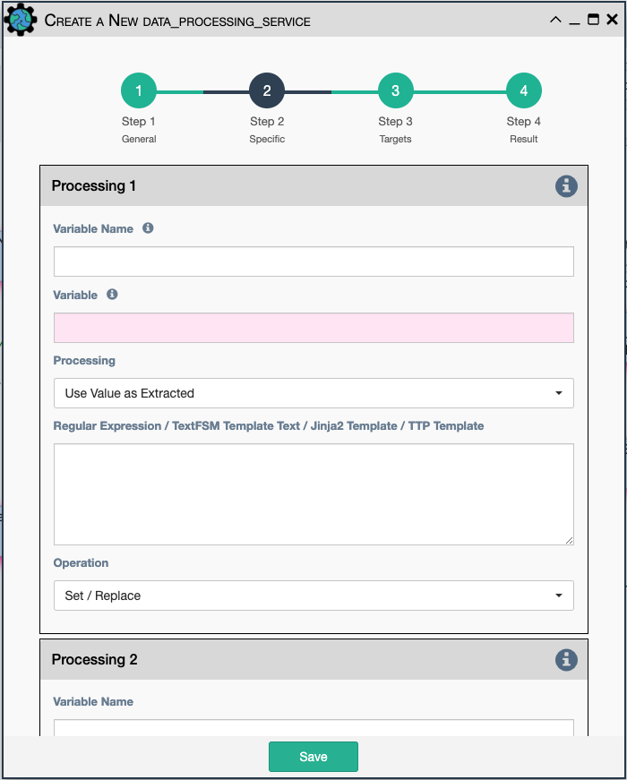

Extract some data from the payload with a python query, and optionally
post-process the result with a regular expression, TextFSM template, Jinja2
Template, or TTP Template.

Configuration parameters for creating this service instance include up to three
data processing operations, which will be executed in sequential order with the
following attributes:

- `Variable Name`: name to give the resulting variable in the results. 

- `Variable`: a python query to retrieve data from the payload. 

- `Processing`: choose the type of processing: 

    - `Use Value as Extracted`.
    - `Apply Regular Expression (findall)`.
    - `Apply Jinja2 Template (text output)`.
    - `Apply TTP Template (JSON output)`.
    - `Apply TextFSM Template (list output)`.
    - `Apply TextFSM Template`.
    
- `Regular Expression / TestFSM Template Text / Jinja2 Template / TTP Template`-
  regular expression, TextFSM template, Jinja2 template, or TTP template
  depending on the value of the "Processing" field. The text of the expression
  or template goes here.

- `Operation`-Choose the operation type: 

    - `Set/Replace`: Set the variable value.
    - `Append to a list`: Append the value to an existing list.
    - `Extend List`: Append each value to an existing list.
    - `Update dictionary`: Update each key/value into an existing dictionary.
    
!!! note
    The above list and dictionary operations allow for accumulated results
    through a workflow, such as each service adds something to the result
    variable that is then reported on at the end.

