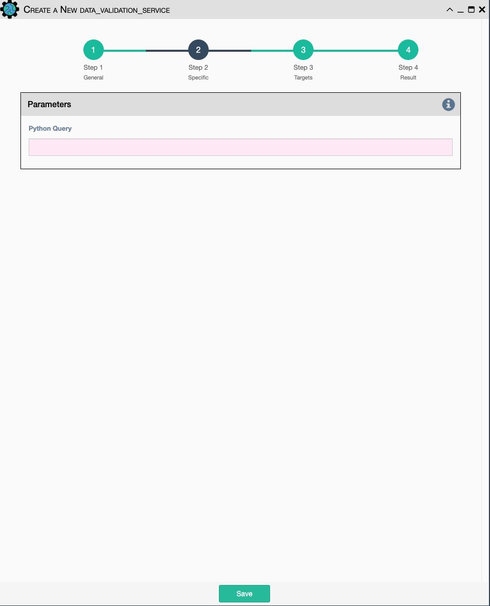

Extract some data from anywhere, such as the payload, a result, or a variable,
and validate it against a string or a dictionary. This is used for conducting
extra validations of a prior service's result later in a workflow.

Configuration parameters for creating this service instance:

- `Python Query`- a python query to retrieve data from the payload.
