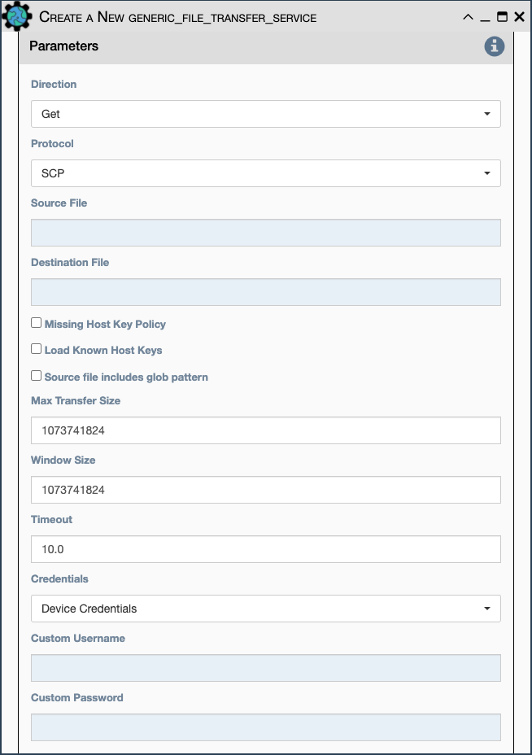

Transfer a one or multiple files to/from the eNMS server to the device using
either SFTP or SCP.

Configuration parameters for creating this service instance:

- `Direction` Get or Put the file from/to the target device's
  filesystem
- `Protocol` Use SCP or SFTP to perform the transfer
- `Source file` For Get, source file is the path-plus-filename on the
  device to retrieve from the eNMS server. For Put, source file is the
  path-plus-filename on the eNMS server to send to the device.
- `Destination file` For Get, destination file is the
  path-plus-filename on the eNMS server to store the file to. For Put,
  destination file is the path-plus-filename on the device to store
  the file to.
- `Missing Host Key Policy` If checked, auto-add the host key policy
  on the ssh connection
- `Load Known Host Keys` If checked, load host keys on the eNMS serve
  before attempting the connection
- `Source file includes glob pattern (Put Direction only)` Flag
  indicates that for Put Direction transfers only, the above Source
  file field contains a [Glob pattern match](https://en.wikipedia.org/wiki/Glob_(programming))
  for selecting multiple files for transport. When Globbing is used, the
  Destination file directory should only contain a destination directory,
  because the source file names will be re-used at the destination.
- `Max Transfer Size` This is that maximum packet size that will be
  used during transfer. This may adversely impact transfer times.
- `Window Size` This is the requested windows size during transfer.
  This may adversely impact transfer times.
- `Credentials`: Select between:
    - `Device Credentials` - eNMS will select the most appropriate credential
      object for each device. If there are multiple credentials available, eNMS
      will use the `Type of Credential` and `Priority` properties as a tie
      breaker.
    - `User Credentials` - Use the user's currently logged in credentials to
      access the device.
    - `Custom Credentials` - The user provides the credentials below:
- `Custom Username` - User provided username
- `Custom Password` - User provided password

!!! note

    This Service supports variable substitution (as mentioned in the
    previous section) in the source and destination file input fields,
    as well as the credentials fields, of its configuration form.
