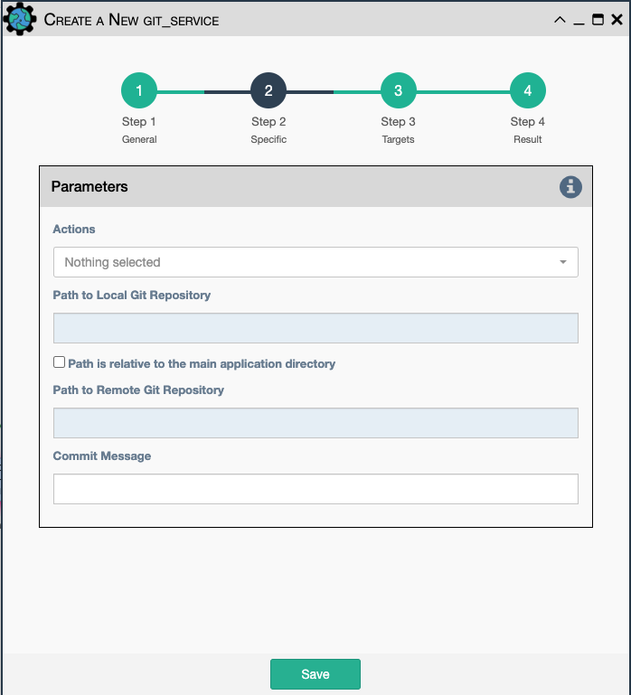

Perform a GIT action on a set of files used or created by a workflow.

- `Actions`: Select between:

    - `Clone`: Creates a fresh copy of a git repository in a new directory, located in the
       `Path to the Local Git Repository` option below
    - `Shallow Clone`: Creates a fresh copy of a git repository in a new directory without
       revision history, located in the `Path to the Local Git Repository` option below
    - `Do 'git add' and commit`: Stores file changes into the local repository path
    - `Pull`: Pulls remote file changes from the server
    - `Push`: Push local repository changes to the remote server

- `Path to Local Git Repository`: Path to store the repository in locally

- `Path is relative to eNMS folder`: True if using a relative path; False for an absolute path

- `Path to Remote Git Repository`: Path to the repository on the remote server

- `Commit Message`: Text to use with the files when performing the `git add and commit`

!!! note
    
    Any combination of the GIT actions are supported. Actions are executed in the order in which
    they are displayed in the drop-down list.
