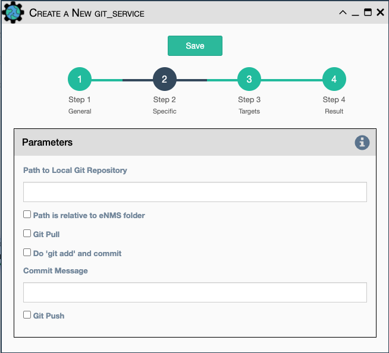

Perform a GIT action on a set of files used or created by a workflow.

- `Actions`: Select between:

    - `Clone`
    - `Shallow Clone`
    - `Do 'git add' and commit`
    - `Pull`
    - `Push`

- `Path to Local Git Repository`

- `Path is relative to eNMS folder`

- `Path to Remote Git Repository`

- `Commit Message`

!!! note
    
    Any combination of the GIT actions are supported. Actions are executed in the order in which
    they are displayed in the drop-down list.
