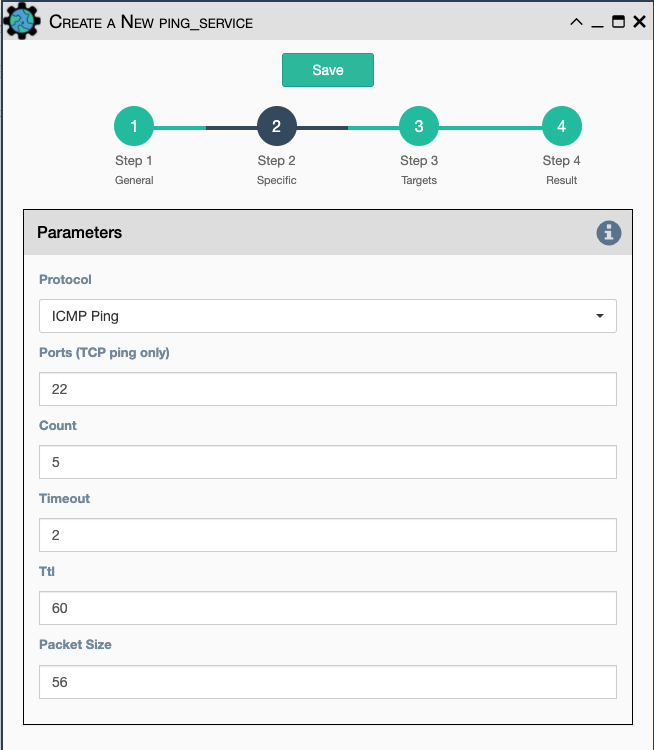

Implements a Ping from this eNMS instance to the selected devices
from inventory using either ICMP or TCP.

Configuration parameters for creating this service instance:

-   `Protocol`: Use either ICMP or TCP packets to ping the devices
-   `Ports (TCP ping only)` Which ports to ping (should be formatted as
    a list of ports separated by a comma, for example "22,23,49").
-   `Count`: Number of ping packets to send
-   `Timeout` Seconds to wait before declaring timeout
-   `Ttl` Time to Live parameter, which tells routers when to discard
    this packet because it has been in the network too long (too many
    hops)
-   `Packet Size` Size of the ping packet payload to send in bytes
