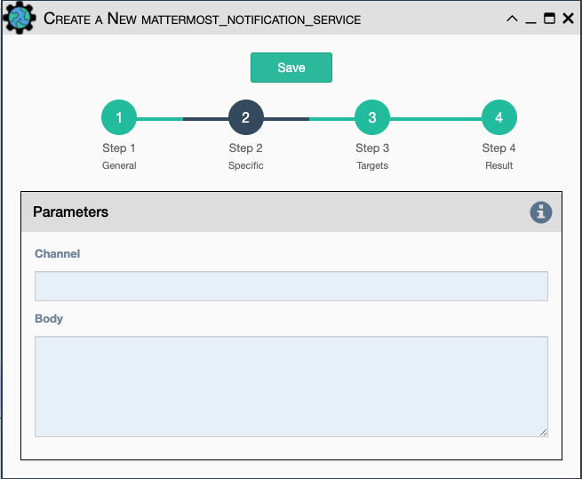

This service will send a message to a mattermost server that is
configured in the eNMS settings.

- `Channel` The channel the message will be posted to.
- `Body` The body of the message that will be posted to the above
  channel.

!!! note

    This Service supports variable substitution in the `Channel` and `Body`
    input fields of its configuration form.