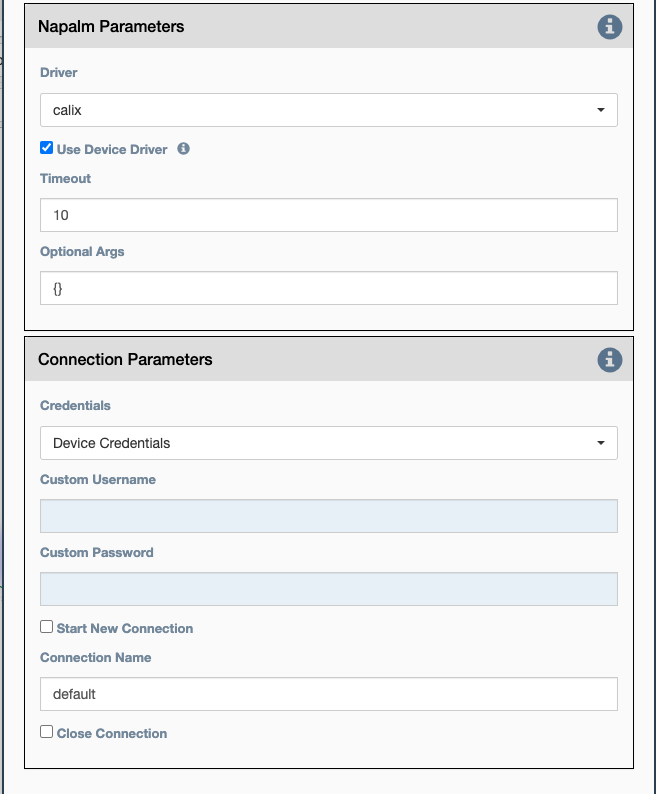

These parameters are common to all Napalm Services.

## Napalm Parameters

- `Driver` Which Napalm driver to use when connecting to the device.
- `Use driver from device` If set to True, the driver defined at
   device level (`napalm_driver` inventory property of the device) is used,
   otherwise the driver defined at service level (`Driver` property of
   the service) is used.
- `Optional arguments` Napalm supports a number of optional arguments
   that are documented 
   [here](https://napalm.readthedocs.io/en/latest/support/index.html#optional-arguments).
     
## Connection Parameters

- `Credentials`: Select between:

    - `Device Credentials` - eNMS will select the most appropriate credential
      object for each device. If there are multiple credentials available, eNMS
      will use the `Type of Credential` and `Priority` properties as a tie
      breaker.
    - `User Credentials` - Use the user's currently logged in credentials to
      access the device.
    - `Custom Credentials` - The user provides the credentials below:

- `Custom Username` - User provided username.

- `Custom Password` - User provided password.

- `Start New Connection`: **before the service runs**, the current
  cached connection is discarded and a new one is started.
    
- `Connection Name`: If changed to something other than `default`, the
  connection will be cached as a separate connection to that same device.
  This allows for multiple simultaneous "named" connections to a single
  device, as in this example:
    
- `Close Connection`: once the service is done running, the current
  connection will be closed.
