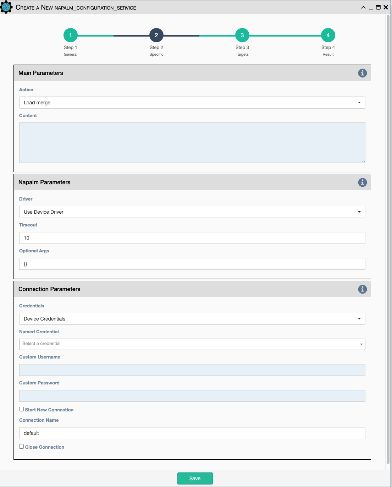

Uses Napalm to configure a device.

Configuration parameters for creating this service instance:

- All [Napalm Service Common Parameters](napalm_common.md). 

- `Action`: There are two types of operations:

    - `Load merge`: add the service configuration to the existing configuration
       of the target.

    - `Load replace`: replace the configuration of the target with the service
       configuration.

- `Content`: Paste a configuration block of text here for applying to
  the target device(s).

!!! note

    This service is supported by a limited set of devices.

    This service supports variable substitution in the `content` input field of its
    configuration form.
