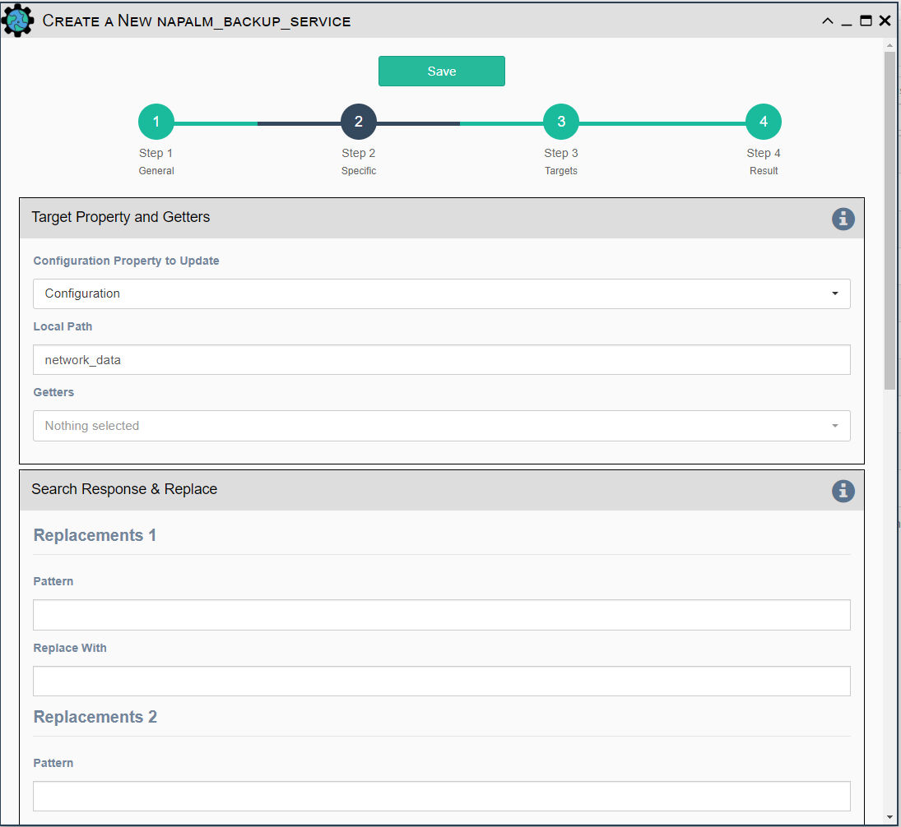

This service uses Napalm to pull data from devices and store it in
`Inventory -> Configuration` for later comparison and for historical tracking.

- All [Napalm Service Common Parameters](napalm_common.md) 

- `Configuration Getters` - Choose the configuration getter named 'Configuration'.

!!! note
 
    This service can be used to store other Napalm Getter's data into the
    Operational Data field for a device.
    
## Search Response & Replace

These fields allow a `Pattern` in the collected data to be `Replaced With` 
some other data. This can be used to remove frequently changing data from 
device output, such as timestamps or dates. It can also be used to remove
sensitive data from the device output, such as passwords.