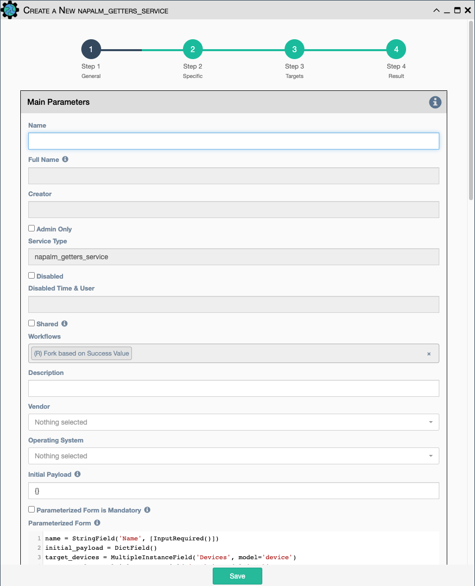

Uses Napalm to retrieve the output of a list of getters. The output can be
validated in Step 4 of the service or later with [Data Validation
Service](data_validation.md).

Configuration parameters for creating this service instance:

- All [Napalm Service Common Parameters](napalm_common.md).

- `Getters`- Choose one or more getters to retrieve. Napalm getters
  (standard retrieval APIs) are documented 
  [here](https://napalm.readthedocs.io/en/latest/support/index.html#getters-support-matrix).

!!! note
 
    The output of all Napalm Getter APIs is a structured dictionary of data.
    Napalm Getters are a convenient way of retrieving structured data from
    devices, as opposed to retrieving unstructured CLI data from a device with
    Netmiko and having to parse it to convert to structured data.
