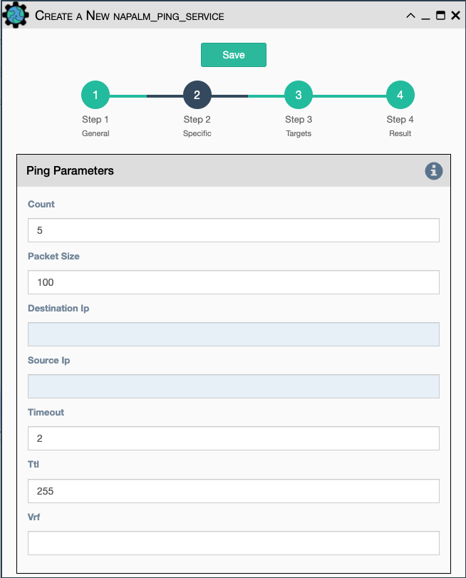

Uses Napalm to connect to the selected target devices and performs a
ping to a designated target. The output contains ping round trip time
statistics. 

    !!! note

    The iosxr driver does not support ping, but the ios driver can be selected instead.

Configuration parameters for creating this service instance:

- All [Napalm Service Common Parameters](napalm_common.md).
- `Count`: Number of ping packets to send.
- `Size` Size of the ping packet payload to send in bytes.
- `Source IP address` Override the source ip address of the ping
  packet with this provided IP.
- `Ping Timeout` Seconds to wait before declaring a ping timeout.
- `Ttl` Time to Live parameter, which tells routers when to discard
  this packet because it has been in the network too long (too many
  hops).
- `Vrf or Router` Ping a specific virtual routing and forwarding interface.
