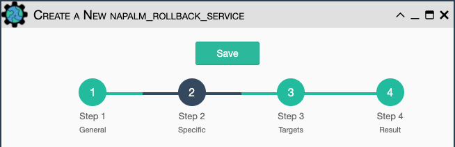

Use Napalm to rollback a configuration.

Configuration parameters for creating this service instance:

- All [Napalm Service Common Parameters](napalm_common.md). 

There are no specific parameters for rollback.