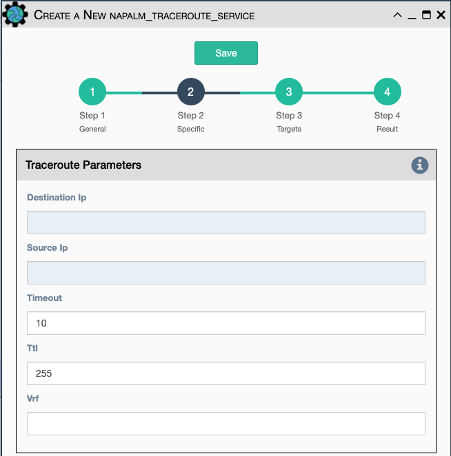

Uses Napalm to connect to the selected target devices and performs a
traceroute to another designated target.

Configuration parameters for creating this service instance:

- All [Napalm Service Common Parameters](napalm_common.md) 
- `Source IP address` Override the source ip address of the ping
  packet with this provided IP
- `Timeout` Seconds to wait before declaring timeout
- `ttl` Time to Live parameter, which tells routers when to discard
  this packet because it has been in the network too long (too many
  hops)
- `vrf` Ping a specific virtual routing and forwarding interface
