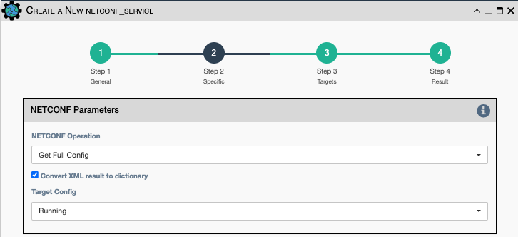
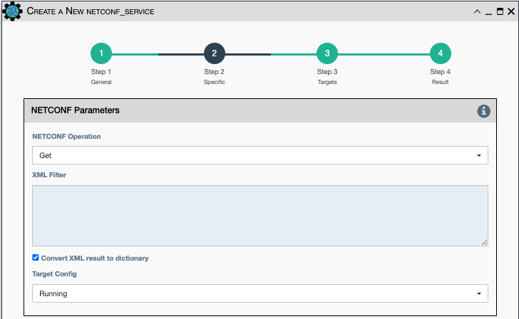
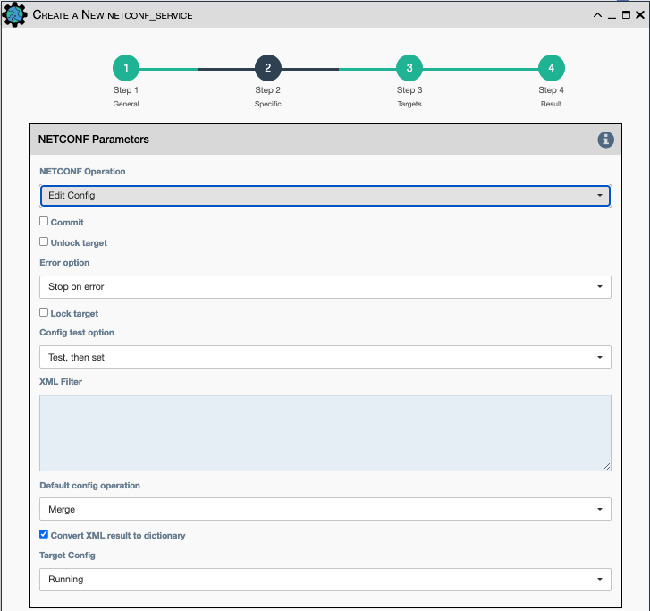
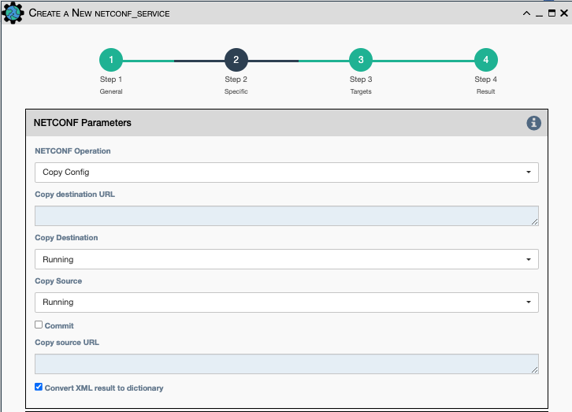
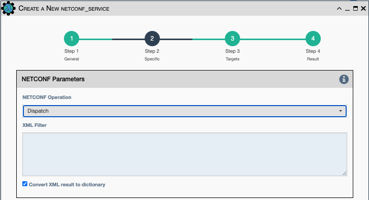

This service sends an XML payload to the selected device's netconf interface
using the ncclient Netconf library, which is based on RFC 6241 Netconf.

## Netconf Parameters

The Netconf Parameters in the UI change depending on which Netconf Operation
is selected:

- `Netconf Operation`:

    - `Get Full Config`
    - `Get`
    - `Edit Config`
    - `Copy Config`
    - `Dispatch`

### Get Full Config Operation

- `Convert XML result to dictionary` - Converts the Netconf xml response to dict
  using `xml2dict`.

- `Target Config` - Which device configuration to impact.

    - `Running`
    - `Candidate`
    - `Startup`

### Get Operation

- `XML Filter` - XML content to send as a filter to the device.

- `Convert XML result to dictionary` - converts the Netconf xml response to dict
  using `xml2dict`.

- `Target Config` - Which device configuration to impact.

    - `Running`
    - `Candidate`
    - `Startup`

### Edit Config Operation

- `Commit` - Commit now? (or make more changes).

- `Unlock target` - Valid only for Edit Config Mode.

- `Error option`:

    - `Stop on error`
    - `Continue on error`
    - `Rollback on error`
    - `None`

- `Lock target` - Valid only for Edit Config Mode.

- `Config test option` - 

    - `Test, then set`
    - `Set`
    - `None`

- `XML Filter` - XML content to send as a filter to the device.   
 
- `Default config operation`:

    - `Merge`
    - `Replace`
    - `None`

- `Convert XML result to dictionary` - converts the Netconf xml response to dict
  using `xml2dict`.

- `Target Config` - Which device configuration to impact.

    - `Running`
    - `Candidate`
    - `Startup`
    
### Copy Config Operation

- `Copy Destination URL` - URL string.

- `Copy Destination` - where to put destination config.

    - `Running`
    - `Candidate`
    - `Startup`
    - `Destination URL`

- `Copy Source` - where to obtain source config.

    - `Running`
    - `Candidate`
    - `Startup`
    - `Source URL`
    
- `Commit` - Commit now? (or make more changes).
 
- `Copy Source URL` - URL string.

- `Convert XML result to dictionary` - converts the Netconf xml response to dict
  using `xml2dict`.

### Dispatch Operation

- `XML Filter` - XML content to send as a filter to the device.

- `Convert XML result to dictionary` - Converts the Netconf xml response to dict
  using `xml2dict`.

## Connection Parameters

- `Credentials` - Select between:
    - `Device Credentials` - The application will select the most appropriate credential
      object for each device. If there are multiple credentials available, the 
      `Type of Credential` and `Priority` properties become a tiebreaker.
    - `Named Credentials` - Allows users to reference a specific credential for all targets. Selecting this 
      option requires additional selections below.
    - `Custom Credentials` - Allows users to store a credential against this service. Selecting this 
      option requires additional selections below.
      
!!! Advice

    `Named Credentials` selections will persist through duplicating a service, unlike `Custom Credentials`. 
    [For details on creating a `Named Credential` take a look at this page.](../../administration/credentials.md) 

- `Named Credential` - Select from a list of user created credential objects. 
- `Custom Username` - User provided username, stored against this service.
- `Custom Password` - User provided password, stored against this service.

- `Start New Connection` - **before the service runs**, the current
  cached connection is discarded and a new one is started.
    
- `Connection Name` - If changed to something other than `default`, the
  connection will be cached as a separate connection to that same device.
  This allows for multiple simultaneous "named" connections to a single
  device.
    
- `Close Connection` - once the service is done running, the current
  connection will be closed.
