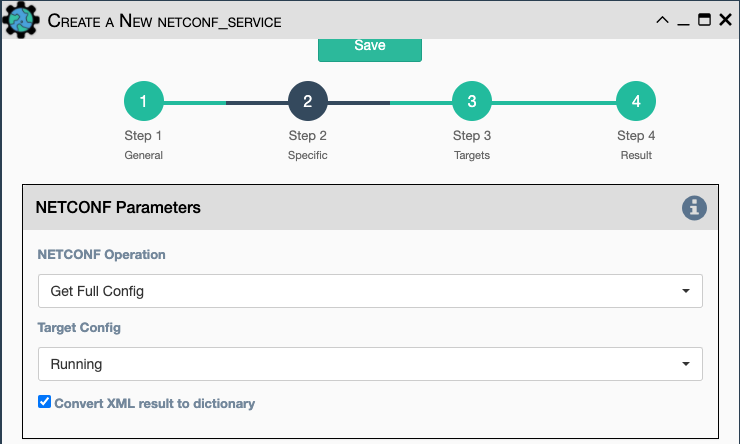
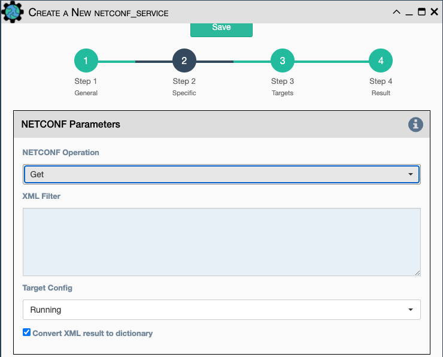
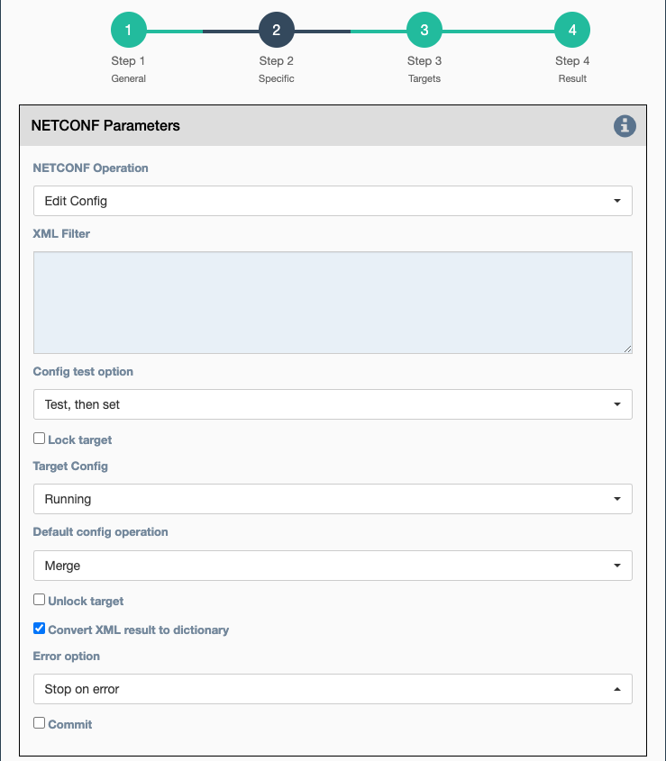
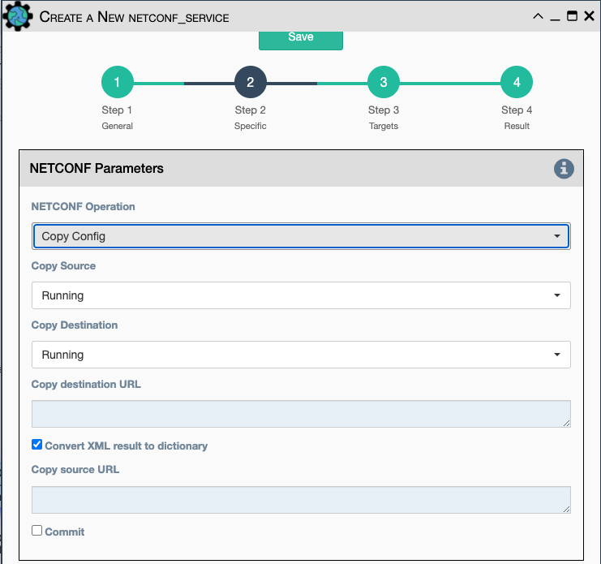
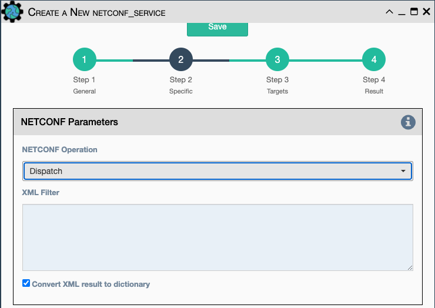

This service sends an XML payload to the selected device's netconf interface
using the ncclient Netconf library, which is based on RFC 6241 Netconf.

## Netconf Parameters

The Netconf Parameters in the UI change depending on which Netconf Operation
is selected:

- `Netconf Operation`:

    - `Get Full Config`.
    - `Get`.
    - `Edit Config`.
    - `Copy Config`.
    - `Dispatch`.

### Get Full Config Operation

- `Target Config`: Which device configuration to impact.

    - `Running`.
    - `Candidate`.
    - `Startup`.

- `Convert XML result to dictionary`: Converts the Netconf xml response to dict
  using `xml2dict`.

### Get Operation

- `XML Filter`: XML content to send as a filter to the device.

- `Target Config`: Which device configuration to impact.

    - `Running`.
    - `Candidate`.
    - `Startup`.

- `Convert XML result to dictionary`: converts the Netconf xml response to dict
  using `xml2dict`.

### Edit Config Operation

- `XML Filter`: XML content to send as a filter to the device.

- `Config test option`: 

    - `Test, then set`.
    - `Set`.
    - `None`.

- `Lock target` : Valid only for Edit Config Mode.
   
- `Target Config`: Which device configuration to impact.

    - `Running`.
    - `Candidate`.
    - `Startup`.
    
- `Default config operation`:

    - `Merge`.
    - `Replace`.
    - `None`.
    
- `Unlock target` : Valid only for Edit Config Mode.

- `Error option` :

    - `Stop on error`.
    - `Continue on error`.
    - `Rollback on error`.
    - `None`.

- `Commit`: Commit now? (or make more changes).
    
### Copy Config Operation

- `Copy Source`: where to obtain source config.

    - `Running`.
    - `Candidate`.
    - `Startup`.
    - `Source URL`.

- `Copy Destination`: where to put destination config.

    - `Running`.
    - `Candidate`.
    - `Startup`.
    - `Destination URL`.

- `Copy Destination URL`: URL string.

- `Convert XML result to dictionary`: converts the Netconf xml response to dict
  using `xml2dict`.
  
- `Copy Source URL`: URL string.

- `Commit`: Commit now? (or make more changes).

### Dispatch Operation

- `XML Filter`: XML content to send as a filter to the device.

- `Convert XML result to dictionary`: Converts the Netconf xml response to dict
  using `xml2dict`.

## Connection Parameters

- `Credentials`.
- `Custom Username`.
- `Custom Password`.

- `Start New Connection`: **before the service runs**, the current
  cached connection is discarded and a new one is started.
    
- `Connection Name`: If changed to something other than `default`, the
  connection will be cached as a separate connection to that same device.
  This allows for multiple simultaneous "named" connections to a single
  device, as in this example:
    
- `Close Connection`: once the service is done running, the current
  connection will be closed.
