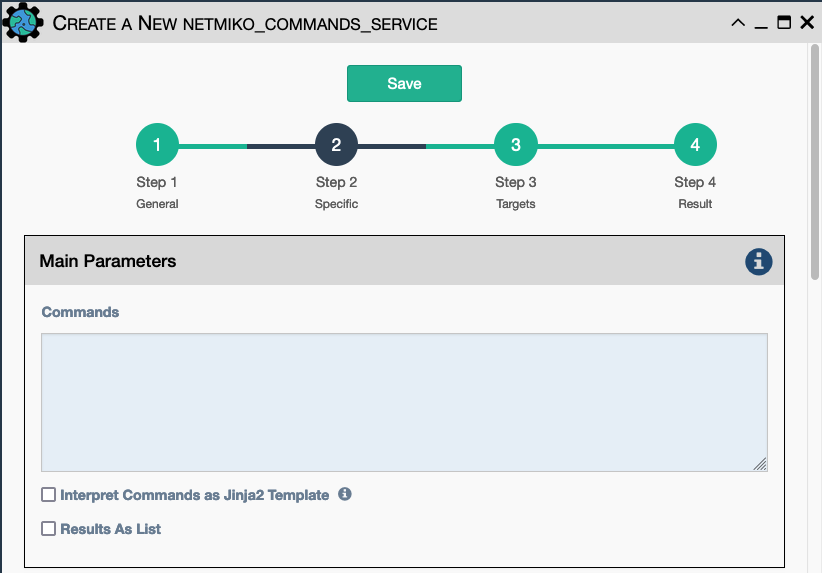
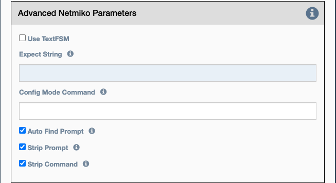

Uses Netmiko to send a command to a device to
determine the state of that device. See the `Workflow` section for
examples of how it is used in a workflow.

There is a `command` field and an `expect string` field in the Advanced
Netmiko Parameters. eNMS will check if the expected pattern can be found
in the output of the command. The values for a `pattern` field can also
be a regular expression.

Configuration parameters for creating this service instance:

- All [Netmiko Service Common Parameters](netmiko_common.md).

- `Commands`: Commands to be send to the device, each command on a separate line.

- `Results as List`: if checked, store the results of the commands as a list of 
   individual string results. If not checked, this is a single string.

Also included in Netmiko Advanced Parameters: 

- `Use TextFSM` Causes Netmiko to try and match the command to a TextFSM
  template pointed to in the system by the `NET_TEXTFSM` environment
  variable. The Network to Code project maintains a repository of TextFSM
  templates for popular network devices [here](https://github.com/networktocode/ntc-templates).
- `Expect String` This is the string that signifies the end of output.
- `Config Mode Command` The command that will be used to enter config
  mode. 
- `Auto Find Prompt` Tries to detect the prompt automatically.
- `Strip command` Remove the echo of the command from the output
  (default: True).
- `Strip prompt` Remove the trailing router prompt from the output
  (default: True).

!!! note

    `Expect String` and `Auto Find Prompt` are mutually exclusive; both
    cannot be enabled at the same time. If the user does not expect Netmiko
    to find the prompt automatically, the user should provide the expected
    prompt instead. This is useful when the CLI command sent via Netmiko
    causes the prompt to change, for example, during upgrade.

!!! note

    This Service supports variable substitution in some input fields of its
    configuration form.
