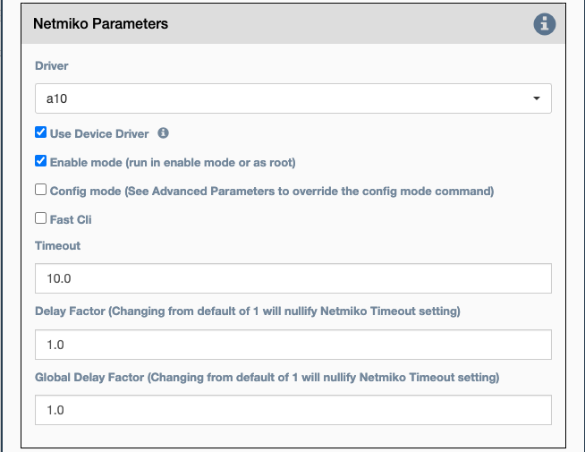

These are the Netmiko Common Parameters for all Netmiko Services.

## Common Netmiko Parameters

-   `Driver` This selects which Netmiko driver to use when connecting to
    the device. This is not used if `Use Device Driver` is checked.
-   `Use Device Driver` If checked, the driver assigned to the device in
    the inventory will be used.
-   `Enable mode` If checked, Netmiko should enter enable/privileged
    mode on the device before running the command or applying the
    configuration block. For the Linux driver, this means root/sudo.
-   `Config mode` If checked, Netmiko should enter config mode.
-   `Fast CLI` If checked, Netmiko will disable internal wait states and
    delays in order to execute the service as fast as possible.
-   `Timeout` Netmiko internal timeout in seconds to wait for a
    connection or response before declaring failure.
-   `Delay factor` Netmiko multiplier used to increase internal delays
    (defaults to 1). Delay factor is used in the send_command Netmiko
    method. See [here for more explanation](https://pynet.twb-tech.com/blog/automation/netmiko-what-is-done.html).
-   `Global delay factor` Netmiko multiplier used to increase internal
    delays (defaults to 1). Global delay factor affects delays
    beyond Netmiko send_command. Increase this for devices that have
    trouble buffering and responding quickly. Practical max value is 5.

## Connection Parameters

- `Credentials`: Select between:
    - `Device Credentials` - eNMS will select the most appropriate credential
      object for each device. If there are multiple credentials available, eNMS
      will use the `Type of Credential` and `Priority` properties as a tie
      breaker.
    - `User Credentials` - Use the user's currently logged in credentials to
      access the device.
    - `Custom Credentials` - The user provides the credentials below:

- `Custom Username` - User provided username.

- `Custom Password` - User provided password.

- `Start New Connection`: **before the service runs**, the current
  cached connection is discarded and a new one is started.
    
- `Connection Name`: If changed to something other than `default`, the
  connection will be cached as a separate connection to that same device.
  This allows for multiple simultaneous "named" connections to a single
  device, as in this example:
    
- `Close Connection`: Once the service is done running, the current
  connection will be closed.

## Jump on connect Parameters

Jump on connect is designed to allow a second connection after
connecting to the original device.

-   `Jump to remote device on connect` If checked, the config items
    below will be used to connect to the secondary device.
-   `Command that jumps to device` Command to initiate secondary
    connection.
-   `Expected username prompt` Prompt expected when connecting secondary
    connection.
-   `Device username` The username to send when the expected username
    prompt is detected.
-   `Expected password prompt` Prompt expected when connecting secondary
    connection.
-   `Device password` The password to send when the expected password
    prompt is detected.
-   `Expected prompt after login` Prompt expected after successfully
    negotiating a connection.
-   `Command to exit device back to original device` Command required to
    exit the secondary connection.

!!! note

    A number of the above colored text fields support variable substitution
   