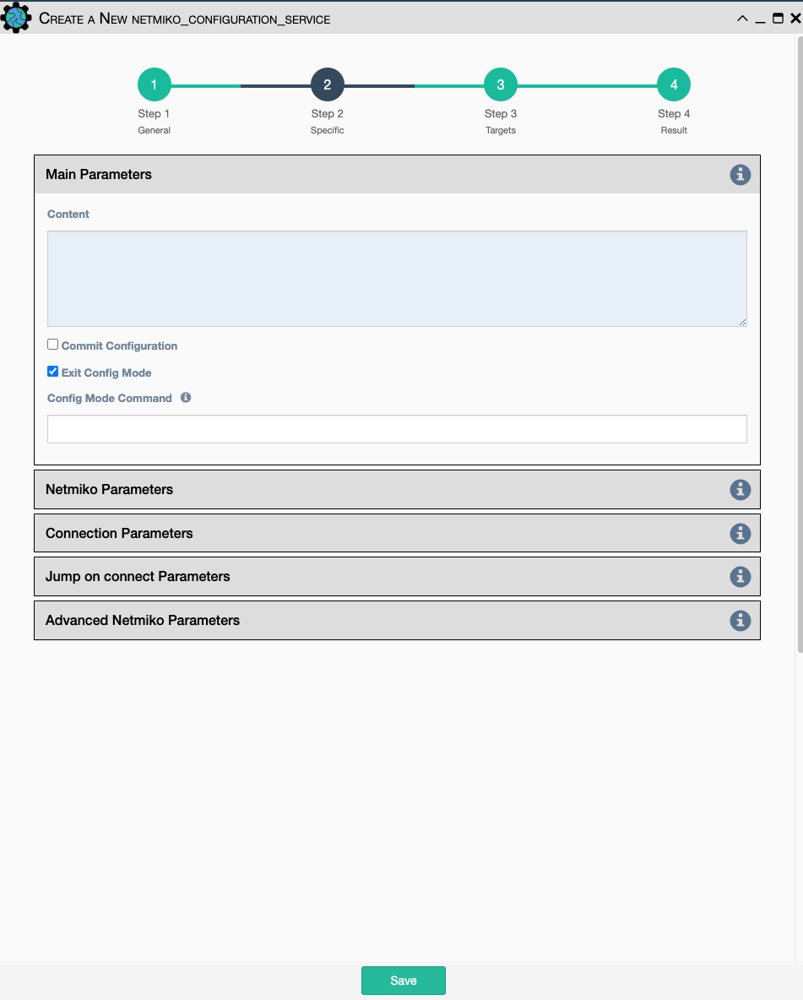
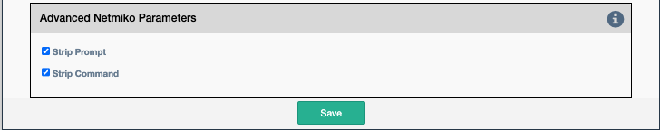

Uses Netmiko to send a list of commands to be configured on the devices.

Configuration parameters for creating this service instance:

- All [Netmiko Service Common Parameters](netmiko_common.md).
- `Content`: Paste a configuration block of text here for applying to
    the target device(s).
- `Commit Configuration`: Calls netmiko `commit` function after applying
    the configuration.
- `Exit config mode`: Determines whether or not to exit config mode
    after completion.
- `Config Mode Command`: The command that will be used to enter config
    mode.

## Advanced Netmiko Parameters

-   `Strip command`: Remove the echo of the command from the output
    (default: True).
-   `Strip prompt`: Remove the trailing router prompt from the output
    (default: True).

!!! note

    This service supports variable substitution in the `Content` input field
    of its configuration form.

