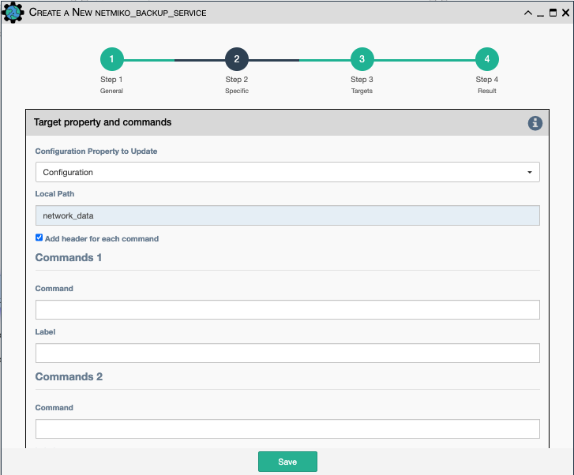

This service uses Netmiko CLI commands to retrieve and store information from
devices.

## Target Property and Commands

-   Property to update (e.g `Configuration, Operational Data, Specialized Data`).
-   `Commands` - This is a series of twelve commands that are used to
    pull data from the device.
-   `Label` - This is the label the data will be given in the results.

## Search Response and Replace

-   Up to twelve regular expression patterns used to filter out unwanted information.
-   `Pattern` - The pattern to search through the retrieved data to
    replace.
-   `Replace With` - This is what will be substituted when the `Pattern`
    is found.
