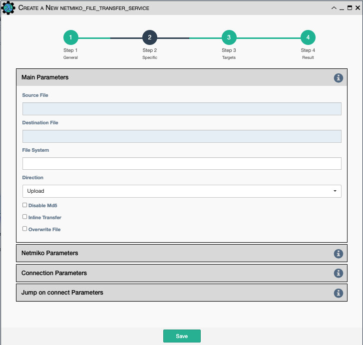

Uses Netmiko to send a file to a device or retrieve a file from a
device. Only Cisco IOS and some Juniper devices are supported at this
time for SCP file transfer.

Configuration parameters for creating this service instance:

- All [Netmiko Service Common Parameters](netmiko_common.md).
-   `Source File` - Source absolute path and filename of the file to send.
-   `Destination File` - Destination absolute path and filename to
    send the file to.
-   `File System` - Mounted filesystem for storage on the default. For
    example, disk1:
-   `Direction` - Upload or Download from the perspective of running on
    the device.
-   `Disable Md5` - Disable checksum validation following the transfer
-   `Inline Transfer` - Cisco-specific method of transferring files
    between internal components of the device.
-   `Overwrite File` - If checked, overwrite the file at the destination
    if it exists.
