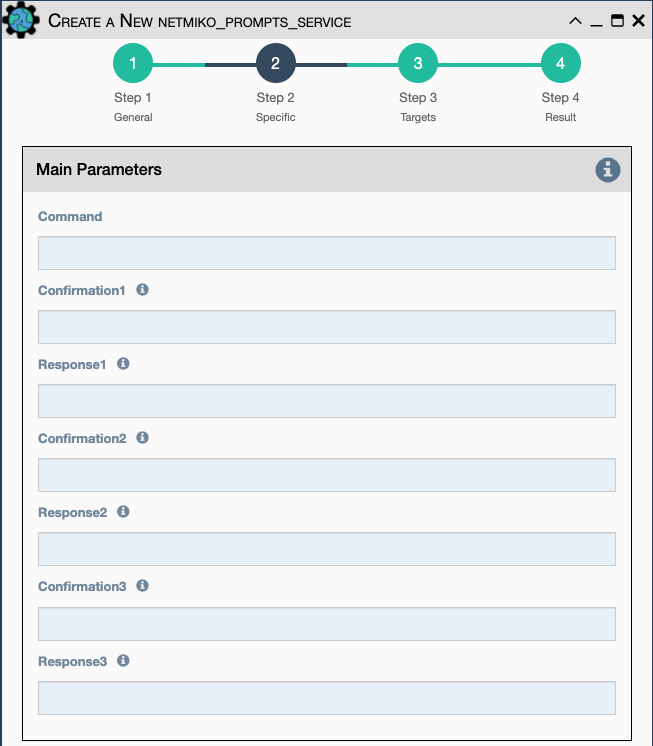

Similar to Netmiko Validation Service, but expects up to 3 interactive
prompts for your remote command, such as 'Are you sure? Y/N'. This
service allows the user to specify the expected prompt and response to
send for it.

Configuration parameters for creating this service instance:

- All [Netmiko Service Common Parameters](netmiko_common.md).
-   `Command` CLI command to send to the device.
-   `Confirmation1` Regular expression to match first expected
    confirmation question prompted by the device.
-   `Response1` Response to first confirmation question prompted by the
    device.
-   `Confirmation2` Regular expression to match second expected
    confirmation question prompted by the device.
-   `Response2` Response to second confirmation question prompted by the
    device.
-   `Confirmation3` Regular expression to match third expected
    confirmation question prompted by the device.
-   `Response3` Response to third confirmation question prompted by the
    device.

!!! note

    This Service supports variable substitution in all input fields of its
    configuration form.
