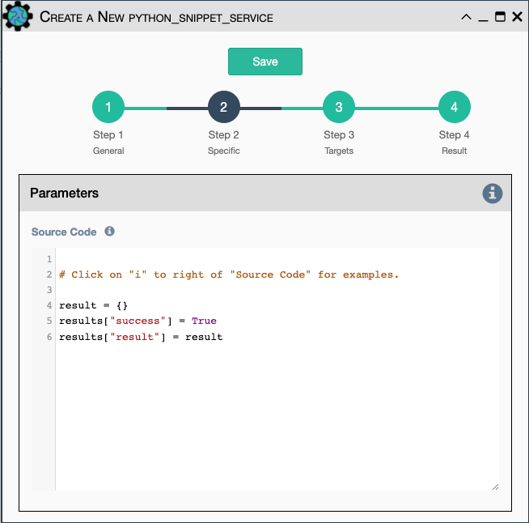

Runs any python code.

In the code, you can use the following variables / functions: 

- `log`: function to add a string to the service logs. 
- `parent`: the workflow that the python snippet service is called from. 
- `save_result`: the results of the service.

Additionally, you can use all the variables and functions described in
the \"Advanced / Python code\" section of the docs.

Configuration parameters for creating this service instance: 

- `Source code`: source code of the python script to run.
