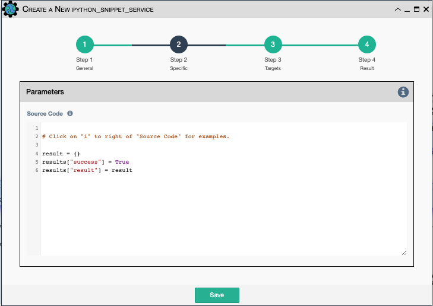

Runs any python code.

All variables and functions described in the
[Using Python in the Service Editor](../service_python_code.md)
section of the docs are also available for use in the Python Snippet code.

Configuration parameters for creating this service instance: 

- `Source code` - Source code of the python script to run.
