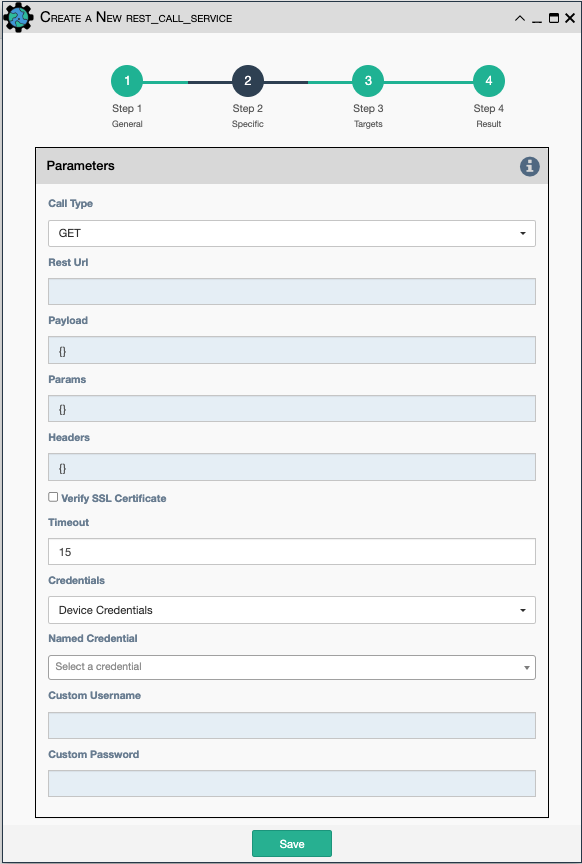

Service for sending REST CRUD (create, replace, update, delete) Http 
commands to a device that accepts them

Configuration parameters for creating this service instance:

- `Call Type` - REST type operation to be performed: GET, POST, PUT, DELETE, PATCH.
- `Rest Url` - URL to make the REST connection to.
- `Payload` - The dictionary data to be sent in POST or PUT operation.
- `Params` - Additional parameters to pass in the request. From the
  requests library, params can be a dictionary, list of tuples or
  bytes that are sent in the body of the request.
- `Headers` - Dictionary of HTTP Header information to send with the
  request, such as the type of data to be passed. For example,
  {"accept":"application/json", "content-type":"application/json"}.
- `Verify SSL Certificate` - If checked, the SSL certificate is
  verified. Default is to not verify the SSL certificate.
- `Timeout` - Requests library timeout, which is the number of seconds
  to wait on a response before giving up.
- `Credentials` - Select between:
    - `Device Credentials` - The application will select the most appropriate credential
      object for each device. If there are multiple credentials available, the 
      `Type of Credential` and `Priority` properties become a tiebreaker.
    - `Named Credentials` - Allows users to reference a specific credential for all targets. Selecting this 
      option requires additional selections below.
    - `Custom Credentials` - Allows users to store a credential against this service. Selecting this 
      option requires additional selections below.
      
!!! Advice

    `Named Credentials` selections will persist through duplicating a service, unlike `Custom Credentials`. 
    [For details on creating a `Named Credential` take a look at this page.](../../administration/credentials.md) 

- `Named Credential` - Select from a list of user created credential objects. 
- `Custom Username` - User provided username, stored against this service.
- `Custom Password` - User provided password, stored against this service.

!!! note

    This service supports variable substitution in several of the input fields
    of its configuration form.
