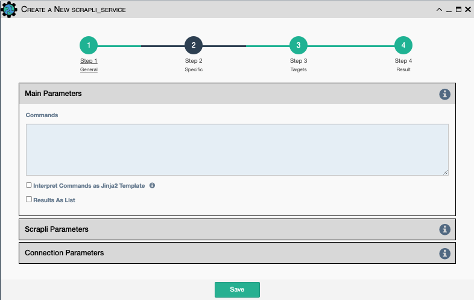

The Scrapli Commands service works similar to Netmiko Commands; but it allows
one or multiple commands to be sent to the device via Scrapli library, and
it allows for the validation of the returned result.

Scrapli Project Documentation can be reviewed
[HERE](https://carlmontanari.github.io/scrapli/user_guide/project_details/)

## Common Parameters

- All [Scrapli Common Parameters](scrapli_common.md).

## Main Parameters

- `Commands`- Commands to be send to the device, each command on a separate line.

- `Interpret Commands as Jinja2 Template`- Tell the application to interpret the Commands text as a Jinja2 template. The output of the rendered template is used as the list of commands for execution.

- `Results as List`- if checked, store the results of the commands as a list of 
   individual string results. If not checked, this is a single string.
    
