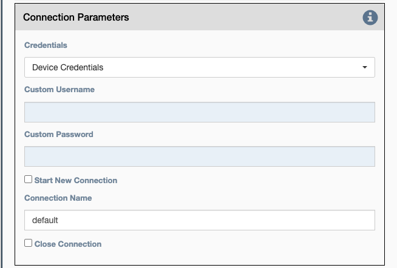

These are the common Scrapli Parameters for Scrapli Commands and Scrapli Data Backup
Services.

## Scrapli Parameters

- `Use Device Driver` If checked, the driver assigned to the device in
    the inventory will be used.
- `Driver`: Scrapli driver to use. Currently, it supports:
    - `arista_eos`.
    - `cisco_iosxe`.
    - `cisco_iosxr`.
    - `cisco_nxos`.
    - `juniper_junos`.
- `Is Configuration`:  Should the device be put in config mode before
  issuing the commands?
- `Transport`: Supports using the following transport plugins:
    - `system`: Wrapper around OpenSSH/System available SSH binary.
    - `paramiko`: Wrapper around paramiko library.
    - `ssh2`: Wrapper around ssh2-python library.
- `Socket Timeout`: When socket is created it is initially set with this timeout.
- `Transport Timeout`: When system transport is selected, this is the timeout used.
If ssh2 or paramiko are the selected the timeouts for each respective library is used.
- `Ops Timeout`: This timeout is used for individual operations (commands).
    
## Connection Parameters

- `Credentials`: Select between:
    - `Device Credentials` - eNMS will select the most appropriate credential
      object for each device. If there are multiple credentials available, eNMS
      will use the `Type of Credential` and `Priority` properties as a tie
      breaker.
    - `Named Credential` - Credential type
    - `User Credentials` - Use the user's currently logged in credentials to
      access the device.
    - `Custom Credentials` - The user provides the credentials below:
- `Custom Username` - User provided username.
- `Custom Password` - User provided password.
- `Start New Connection`: **Before the service runs**, the current
  cached connection is discarded and a new one is started.
- `Connection Name`: If changed to something other than `default`, the
  connection will be cached as a separate connection to that same device.
  This allows for multiple simultaneous "named" connections to a single
  device, as in this example:
- `Close Connection`: Once the service is done running, the current
  connection will be closed.
