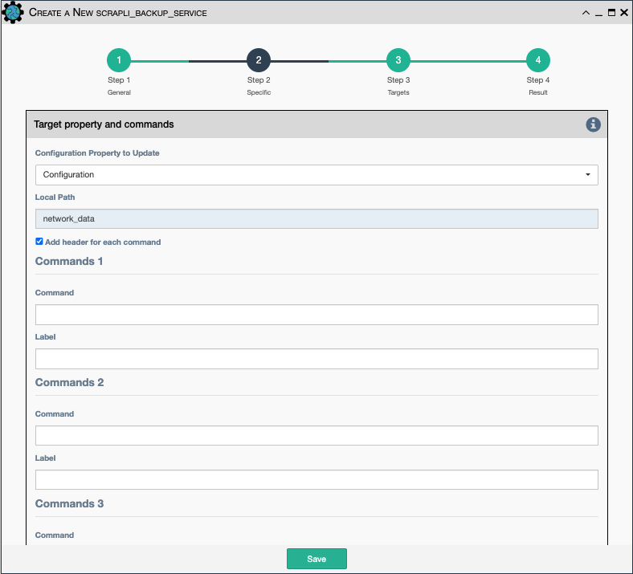
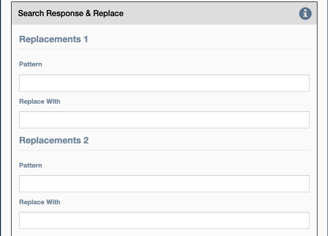

The Scrapli Data Backup service uses Scrapli CLI commands to retrieve and store 
information from devices.

## Common Parameters

- All [Scrapli Common Parameters](scrapli_common.md).

## Target Property and Commands

-   `Property to update`- Which property to update with collected data (e.g `Configuration`)
-   `Commands`- This is a series of twelve commands that are used to
    pull data from the device.
-   `Label`- This is the label the data will be given in the results

## Search Response and Replace

-   Used to filter out unwanted information
-   `Pattern`- The pattern to search through the retrieved data to
    replace
-   `Replace With`- This is what will be substituted when the `pattern`
    is found.
