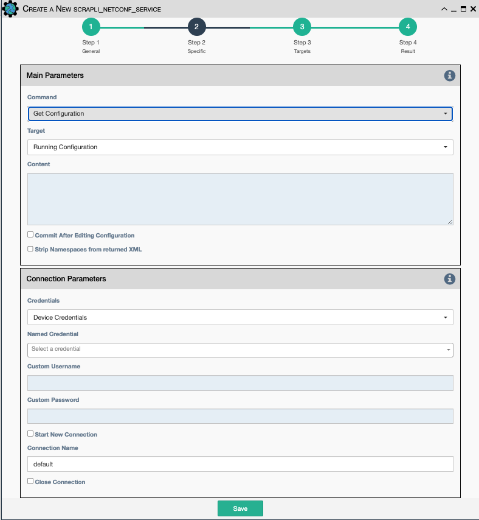

Scrapli netconf service works similar to Netconf (ncclient) Service. It allows
sending an XML payload to a device's netconf interface, and the returned
result can be validated.

Scrapli Project Documentation can be reviewed
[HERE](https://carlmontanari.github.io/scrapli/user_guide/project_details/)

## Main Parameters

- `Command`: Netconf operation to send to the device netconf interface.

    - `Get`.
    - `RPC`.
    - `Get Configuration`.
    - `Edit Configuration`.
    - `Delete Configuration`.
    - `Commit Configuration`.
    - `Discard Configuration`.
    - `Lock`.
    - `Unlock`.

- `Target`: Which device config to impact (only displayed for Get,Edit,Delete
  Configurations, Lock and Unlock).

    - `Running Configuration`.
    - `Startup Configuration`.
    - `Candidate Configuration`.

- `Content`: XML content to send as a filter to the device.

- `Commit After Editing Configuration`: Go ahead and commit, or we have more 
  edits and changes to make?

- `Strip Namespaces from returned XML`: Some device's adherence to namespaces
  is unruly so strip it off. 

## Connection Parameters

- `Credentials`: Select between:
    - `Device Credentials`: eNMS will select the most appropriate credential
      object for each device. If there are multiple credentials available, eNMS
      will use the `Type of Credential` and `Priority` properties as a tie
      breaker.
    - `Named Credentials`: Allows users to reference a specific credential for 
      all targets. Selecting this option requires additional selections below.
    - `Custom Credentials`: The user provides the credentials below:

- `Custom Username`: User provided username.

- `Custom Password`: User provided password.

- `Start New Connection`: **Before the service runs**, the current
  cached connection is discarded and a new one is started.
    
- `Connection Name`: If changed to something other than `default`, the
  connection will be cached as a separate connection to that same device.
  This allows for multiple simultaneous "named" connections to a single
  device.
    
- `Close Connection`: Once the service is done running, the current
  connection will be closed.
